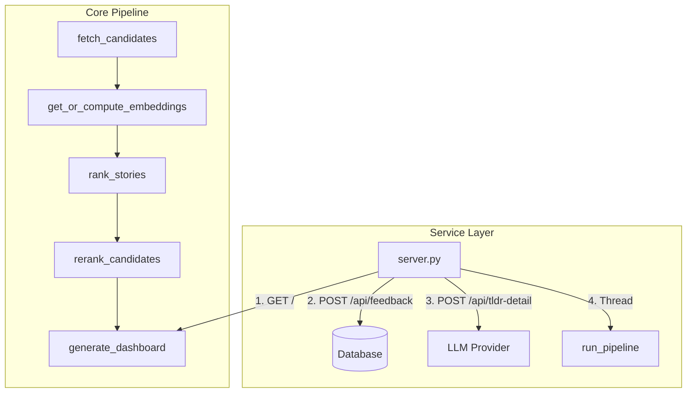

# Architecture & Design: hn-rewrite

This document outlines the architecture, core design decisions, database schema, ranking system, and maintenance instructions for the `hn-rewrite` minimalist local-first Hacker News reranking dashboard.

---

## 1. System Overview

`hn-rewrite` is a unified, resource-efficient rewrite of the original reranking system. It functions as a local-first web application that fetches stories from Hacker News and multiple RSS feeds, semantic-ranks them using a locally run sentence-embedding model and SVM, and presents them in a clean web dashboard.



---

## 2. Component Layout

The codebase consists of five primary modules:

1. **[database.py](file:///home/dev/hn-rewrite/database.py)**: Encapsulates all SQLite interactions. Manages schemas (`stories`, `embeddings`, `feedback`), cascade-deletes, pruned retention rules, and automatic schema migrations. Staging raw inputs directly inside `stories` (`self_text`, `top_comments`, `article_body`) permits on-the-fly text composition and sync-detection. The legacy `article_cache` table is dropped and migrated directly.
2. **[pipeline.py](file:///home/dev/hn-rewrite/pipeline.py)**: Orchestrates the background update sequence. Integrates RSS parsed feeds, computes text embeddings using ONNX, fits the SVM, and generates the final dashboard.
3. **[server.py](file:///home/dev/hn-rewrite/server.py)**: A multi-threaded web server serving the static dashboard, handling feedback writes, proxying detailed TLDR summaries to LLM APIs, and housing the background regeneration event thread.
4. **[templates/index.html](file:///home/dev/hn-rewrite/templates/index.html)**: Jinja2 dashboard template styled with a compact dark-theme Pico CSS layout. Presents a Tinder-style single-card deck with keyboard voting, a capped preloaded queue, and asynchronous TLDR rendering that auto-expands for the active story.
5. **[migrate_feedback.py](file:///home/dev/hn-rewrite/migrate_feedback.py)**: Imports legacy feedback data from `hn_rerank` JSON files, backfilling candidate story contents and caching embeddings.

---

## 3. Key Design Decisions

### 3.1 Normalized Schema & Data Integrity
To eliminate data redundancy, the feedback schema is strictly normalized. Metadata (`title`, `url`, `text_content`, `source`) is not duplicated in the `feedback` table. Instead, a foreign key references `stories(id)`. 
To prevent constraint violations or data loss during cleanup:
* `prune_stories` leaves feedback-associated stories intact (`id NOT IN (SELECT story_id FROM feedback)`).
* `get_all_feedback` and `get_feedback_for_training` perform a `LEFT JOIN` against `stories` to resolve attributes dynamically.

### 3.2 Embedding Model & Feature Space

#### Embedding Model Choice

We evaluated multiple embedding models for topic-level matching:

| Model | Dims | Context | Mean Sim (unrelated) | Speed | Verdict |
|-------|------|---------|---------------------|-------|---------|
| MiniLM | 384 | 256 | **0.091** | **6.6ms** | **Best** ✅ |
| BGE-small | 384 | 512 | 0.385 | ~5ms | Good |
| Nomic | 768 | 2048 | 0.381 | 34ms | Slow |
| BGE-base | 768 | 512 | 0.480 | 28ms | Moderate |
| Jina v2-small | 512 | 512 | 0.646 | 5ms | Poor ❌ |

**Key finding**: MiniLM has the best discrimination (0.091 mean similarity for unrelated texts). Longer context (512+ tokens) actually hurts discrimination by adding noise. The 256-token limit is optimal — it captures title + first paragraph without noise.

**Production embedding input**: The current production embedding is a single composed text string, centralized in `story_embedding_text()`. For normal rows this preserves the stored `text_content` exactly, keeping existing cache hashes stable; if `text_content` is empty, it recomposes from `title`, `self_text`, `article_body`, and `top_comments` as a recovery fallback.

**Field-level embedding candidate**: The eval script can test a slower field-level mode that embeds `title`, `self_text`, `article_body`, and `top_comments` separately, then averages the non-empty field vectors. This should not replace production without a new embedding `model_version`, because switching it would intentionally invalidate the existing embedding cache and change feedback-story vectors.

#### 390-Dimensional Production SVM Feature Vector

The production SVM trains on a **390-dimensional feature vector**:
* **`[0-383]` (384-d)**: MiniLM sentence embedding from the production composed text.
* **`[384]` (1-d)**: Normalized log text length: `min(log1p(len), 12.0) / 12.0`.
* **`[385-388]` (4-d)**: Similarity metrics to historical feedback:
  * Mean cosine similarity to the top-k upvoted story embeddings (`knn_k=10`, LOOCV for training).
  * Mean cosine similarity to the top-k downvoted story embeddings (`knn_k=10`, LOOCV for training).
  * Maximum cosine similarity to any upvoted story embedding.
  * Maximum cosine similarity to any downvoted story embedding.
* **`[389]` (1-d)**: Maximum cosine similarity to a 4-cluster k-means summary of the user's upvoted feedback. The runtime fits those positive-cluster centers once per render and reuses them for both feedback rows and candidate rows.

The SVM deliberately excludes engagement/source metadata: score, comment count, HN quality, comment-to-score ratio, score velocity, comment velocity, and `is_hn`. These features produced inflated archive-wide offline metrics and worse 30-day held-out ranking than the semantic/text/similarity feature set.

To prevent train-test covariate shift / feature leakage, when computing the similarity features for training stories, we explicitly exclude each story itself from its class reference set (using a self-exclusion mask to set self-similarity below the valid cosine range for $k$-NN mean calculations, and setting its entry in the similarity matrix to `-1.0` before maximum reduction).

To avoid outlier features (like fresh stories having extremely large negative z-scores like `-4.8` for points/comments, or similarity features having blown-up z-scores due to low training variance) from completely dominating the SVM ranking decision, the standard-scaled metadata features are clipped to the range `[-2.5, 2.5]`. This z-score clipping significantly improves raw ranking metrics (Raw NDCG@100 from `0.720` to `0.738`, Raw NDCG@200 from `0.691` to `0.706`) and prevents model overfitting.

### 3.3 SVM Personalization
When both upvote and downvote feedback pass the dual gate, the runtime trains a per-user `SVC` with `probability=False` and ranks candidates by the normalized one-vs-rest up-class margin:

$$\text{score} = \text{minmax01}(f_{\text{up}}(x))$$

This avoids scikit-learn's deprecated and slower `SVC(probability=True)` calibration path. The dashboard still computes approximate probability-like fields by applying a softmax over the multi-class decision margins, but ranking itself is driven by the raw up-margin ordering. Because these softmax values are not calibrated probabilities, the UI does not show exact percentages; it uses them only for uncertainty entropy to select `🤔 Unsure` candidates. Card-left color is a smooth blue→red gradient driven by the card's rank position in the current render's sorted-by-score order (rank 1 = blue, rank N = red, evenly distributed), computed client-side from `data-score` values and applied to the border-left plus a 4% tinted background. Rank-percentile mapping (rather than linear-in-score) ensures visually distinguishable colors even when the score distribution clusters — the gradient travels with each card when the user sorts by date.

**Current hyperparameters** (30-day and 365-day default-user eval, 2026-06-23): `C=0.2`, `gamma=0.03`, `kernel=rbf`, `neutral_weight=0.0`, `positive_cluster_k=4`.

#### Dual-Gate SVM Activation

The SVM trains only when **both** the upvote and downvote classes have enough examples. This prevents the SVM from over-fitting to a sparse, incoherent down class.

Configuration (`config.toml`):
- `min_up_for_svm = 20`
- `min_down_for_svm = 20`

The soft blend ramp uses `n_min = min(n_up, n_down)` as its basis:
$$\alpha = \text{clip}\left(\frac{n_{\min} - 20}{60},\ 0,\ 1\right)$$

The blend starts when both classes have at least 20 feedback entries and reaches full SVM influence when both classes have at least 80 entries. A user with 50 upvotes but only 5 downvotes sees pure tier-2 (centroid-diff) regardless of total feedback count.

### 3.4 Selection & Surfacing Passes
The default dashboard selection is direct relevance order: `rerank_candidates` takes the top ranked stories after `rank_stories` and does not remove near-duplicates. MMR remains available behind `config.model.enable_mmr`; when enabled, `mmr_filter` iterates through candidates in SVM-rank order and discards subsequent candidates with cosine similarity above `config.model.diversity_threshold` (default 0.75).

The live dashboard path does not apply a hidden top-1000 prefilter. `fast_rerank_for_user()` pulls the full active story window for the user, excludes only stories already in that user's feedback set, and hands the resulting candidate pool straight to the ranker.

The dashboard consumes the server-ranked order as a swipe deck instead of a visible list. The ranker emits 12 primary/default stories plus all generated discovery/popularity extra slots, and the template renders that whole returned pool so local modes can filter without another server round trip. The browser still shows only the first unvoted card for the active mode and refills from a freshly rendered dashboard when that mode's queue drops to 4 or fewer cards. The score-based gradient is applied client-side from `data-score`; it remains a rank-position signal over the currently loaded pool.

Discovery badges (uncertainty, novelty, talk-worthy, top, hot) are applied to any story that meets the criteria — primary or extra-slot. The **Similar badge is the exception**: it is reserved for extra-slot stories only, never for primary-ranked stories, so it always signals "surfaced from outside primary because of high semantic match" rather than a near-tautology on top-ranked stories (where score and `cand_closest_up` are correlated by construction). A primary-ranked story that crosses the talk-worthy, top, or hot percentile threshold receives that badge just as an extra-slot story would; multiple badges per card are allowed. The six discovery passes additionally source stories from the remaining candidate pool (stories not already in the primary ranked set) to surface qualifying stories that would not otherwise be shown; each pass respects its own slot cap and dedupes from later passes. The uniform badge attribution does not consume those slots:
* **Uncertainty/Entropy Surfacing**: We compute the Shannon Entropy of the model's predicted probability distribution (Down, Neutral, Up). The orchestrator adds up to 5 extra slots for the remaining candidates with the highest entropy, flagging them as `is_uncertain=True` (badge `🤔 Unsure`) to prompt active feedback. Primary stories may also receive this badge via the same entropy threshold (derived from the extra-slot selection).
* **Novel**: Top 15% least similar to feedback, flagged as `is_novel=True` (badge `✨ Novel`), up to 5 slots ranked by a percentile blend of model score (70%) and novelty distance from feedback (30%). This avoids a brittle raw SVM score cutoff while still preferring plausible stories.
* **Similar** (extra-slot only): Stories with high semantic match to upvotes (top 3% similarity, dynamic 97th percentile threshold), flagged as `is_similar=True` (badge `🎯 Similar`), up to 5 slots sorted by similarity score descending. NOT applied to primary stories.
* **Discussion-rich**: Top 2% of non-zero `comment_count` and comments > 0, flagged as `is_discussion_rich=True` (badge `💬 Talk-worthy`, 98th percentile of non-zero comments), up to 5 slots sorted by comment count descending.
* **High-engagement**: Top 2% by `story.score`, flagged as `is_high_engagement=True` (badge `🏆 Top`, 98th percentile), up to 8 slots sorted by SVM score descending.
* **Hot**: Top 0.5% by engagement velocity (points/hour), flagged as `is_hot=True` (badge `🔥 Hot`, 99.5th percentile), up to 8 slots.

The final list can therefore exceed `config.count`: the primary relevance path shows `round(config.count * 0.80)` ranked stories, then adds up to 5 uncertainty stories, up to 5 stories for each standard discovery pass, and up to 8 stories for each popularity pass (`Top` and `Hot`). With the default `count=40`, this yields 32 primary ranked stories before extras. If a pass has no remaining qualifying candidates, it contributes fewer than its cap.

### 3.5 Swipe Deck & Warm Refill
The dashboard uses Tinder-like mechanics. Only one story card is visible at a time, and its TLDR opens automatically. The first few TLDRs for the active mode are prefetched immediately so advancing is usually instant. During browser idle time, the client also prefetches the first three TLDRs for each inactive mode (`Popular`, `Explore`, and `Date` while in `Default`, etc.) so switching modes is often warm without making dashboard rendering wait on LLM calls. Keyboard shortcuts mirror the clickable side-rail legend: `ArrowUp` upvotes, `ArrowDown` downvotes, `ArrowRight` marks neutral, and `u` undoes the most recent vote. The side rail exposes four local deck modes: `Default` shows the normal ranked pool, `Popular` filters to Hot/Top/Talk-worthy stories, `Explore` filters to Unsure/Similar/Novel stories, and `Date` shows the loaded pool newest-first.

When a user votes, the visible card exits immediately and the next queued card becomes active without waiting for the feedback POST. Feedback writes always update SQLite, but the client requests a personalized ranking refresh only after every 5 non-undo votes. Undo explicitly requests a refresh after clearing the vote, and older clients that omit queue depth still refresh by default. When the server accepts a refresh request, it invalidates the user's dashboard cache, warms a new render in the background, and wakes the candidate regen thread. The browser then preloads the refreshed dashboard HTML in the background but does not merge it into the active deck until the next user action or an explicit Refresh click, so the visible queue does not shift underneath active reading. If the queue is fully exhausted, the browser refills immediately. Cache entries include the feedback version, so a stale warm render from an earlier vote cannot satisfy a later refill.

The server logs dashboard timing with stable prefixes: `dashboard_cache_invalidated`, `dashboard_warm`, and `dashboard_render`. Render logs include cache-hit vs rendered result, total elapsed time, render-lock wait time, ranking time, HTML generation time, story count, and whether the rendered HTML was written to cache. These logs are intended to diagnose cases where the floating refresh bar remains on "Refreshing ranking..." longer than expected.

### 3.6 Algolia Candidate Fetch Window
The live-window fetch (`pipeline.py:336`) queries the Algolia HN search API in 7 daily chunks. Each day's fetch collects up to **350 hits** (5 pages of 100, minus stories with `points <= 5`). This cap was raised from 150 to capture the majority of high-score stories on busy days; previously, stories on high-volume days could be dropped before the reranker evaluated them.

The configured RSS candidate pool mixes community aggregators with curated expert feeds across AI/software engineering, functional programming, infrastructure/security, FIRE/finance, urbanism/transit, health evidence, and science/culture. RSS feeds are intentionally plain feed URLs that the current pipeline can ingest directly through `feedparser`; newsletters/forums/podcasts are excluded unless they expose stable RSS or Atom items with canonical URLs. Reddit RSS feeds are fetched with a Reddit-specific User-Agent and serialized per regen to reduce `429 Too Many Requests`; their source names include the subreddit (for example `rss_reddit_haskell`) instead of collapsing every subreddit into `rss_reddit_com`.

Dashboard source badges use display labels derived from stored source IDs. Historical feed-host artifacts such as `rss_rss_slashdot_org` are rendered as readable labels like `Slashdot`, while new feeds hosted at `rss.*`, `feeds.*`, or `feed.*` strip that host prefix before storing the source ID.

### 3.7 Comment Text Refetch on Growth
By default, a story's `text_content` (the title + self-post + top-40 ranked comments baked into a single text blob) is fetched once and frozen along with its 384-dim embedding. The ranked comment subset recursively scans comments to depth 3, drops very short/low-signal text, and sorts by `-points + depth * COMMENT_DEPTH_PENALTY`; the depth penalty is 25 points per nesting level so high-voted replies can compete with shallow comments. During regen, only the integer fields (`score`, `comment_count`) are refreshed. To capture topic drift in active discussions, an opt-in growth-based refetch is applied:

- **Trigger condition** (all must hold): `comment_count` has grown by ≥ 30% since the last text fetch, story age is < 24h, the story has no user feedback, and the per-regen cap of 10 refetches has not been hit.
- **Action**: `refetch_story_text` calls the Algolia items API, recomposes the top-40 ranked comment list (stored up to 10K chars, with `text_content` still embedding only the first 6K comment chars), recomposes `text_content`, re-embeds via the ONNX MiniLM model, and persists both the new text and the new embedding. `comment_count_at_fetch` is updated to the current `comment_count` so a story will not be refetched again until it grows another 30%.
- **Safety invariants**:
  - Stories in `feedback` (1,647 voted stories) are never refetched. Their cached embeddings match the text the user has been ranking against; refetching them would silently change the ranking of voted stories.
  - Refetch is bounded to `MAX_REFETCH_PER_REGEN = 10` calls per regen, capping the Algolia rate-limit hit at ~1s.
  - If Algolia is down or the items API returns a non-story, `refetch_story_text` returns `None` and the stale data is kept. The regen does not fail.
- **Why not all stories on every regen?** Refetching changes the embedding, which changes cosine similarity to surrounding stories. For voted stories this would invalidate the training contract; for unvoted stories it would be wasteful churn. Growth-triggered refetch is a deliberate trade-off: it captures the most active discussions (where new top comments are most likely to change the topic) without affecting stories the user has already committed feedback to.

### 3.8 Stale Comment Backfill & Data Integrity

The Algolia items API (`/api/v1/items/{sid}`) returns a story's full data including top-level comments. When `fetch_story` encounters a cached story with stale or missing `top_comments`, it now falls through to the items API instead of short-circuiting:

- **Staleness detection**: `top_comments == ""` (empty from migration) OR `comment_count > comment_count_at_fetch` (comments grown). Stories with existing comments and `comment_count_at_fetch > 50` are skipped to avoid re-fetching popular threads.
- **Per-run cap**: At most 100 stale-comment stories are re-fetched per pipeline run, sorted newest-first.
- **Corruption priority**: Stories with `title=""` and `text_content != ""` (corrupted by `_empty_story`) skip the cap entirely — they get unlimited priority at the front of the queue.

**`_empty_story` vulnerability**: The error path previously called `db.upsert_story(_empty_story(sid))` unconditionally on any non-200 API response, zeroing `title`, `time`, `score`, `self_text`, `top_comments`, and `text_content`. Only `article_body` survives because `upsert_story` uses `COALESCE` exclusively on that column.

**Self-healing deadlock**: A corrupted story with `text_content == ""` (no article_body to recompose from) would never recover — `fetch_story` returned `None` for any story with empty `text_content`, so the API was never called. Fixed by checking `title == ""` as a corruption signal and falling through to the API.

**`_row_to_story` recomposition**: `text_content` is recomposed live from raw parts on every DB read. This means a corrupted row with preserved `article_body` produces non-empty `text_content` — the story passes filtering and appears in the dashboard, but with a blank title and epoch timestamp ("20624d ago").

**Error path hardening** (all four paths now preserve cached data on transient failure):
1. Non-200 response → return cached story if exists
2. Invalid item type → return cached story if exists
3. Valid API but empty composed text → return cached story if exists
4. Exception → return cached story if exists

### 3.8 Self-Healing Embedding Cache Invalidation (text_hash)
To automatically invalidate and refresh cached embeddings whenever a story's text changes (e.g. following an article body fetch, growth-triggered comment refetch, or comment backfill), we track `text_hash` within the `embeddings` table:
* **Schema Migration**: Added a `text_hash TEXT NOT NULL DEFAULT ''` column to the `embeddings` table schema (implemented as a safe, backwards-compatible, in-place migration check).
* **Validation Check**: The caching queries (`get_embedding` and `get_embeddings_batch`) enforce that the computed SHA-256 hash of `story_embedding_text(story)` matches the `text_hash` stored in the DB.
* **Self-Healing Invalidation**: Any mismatch (or default empty string `''` for pre-existing records) forces a cache miss, triggering automatic re-computation and cache-update on demand without manual table deletions.

### 3.9 Database Connection Pooling & Thread Safety
To reduce SQLite connection establishment overhead and eliminate lock contention in concurrent web environments:
* **Connection Pooling**: The `Database` class maintains an internal thread-safe queue of 5 SQLite connections (`queue.Queue`). In-memory databases automatically scale the pool size to 1 to preserve test schema isolation.
* **Safe Connection Leasing**: Method executions lease connections from the pool via the private context manager `_conn(self)` and release them in a `finally` block, ensuring no leaked connections.
* **Auto Commit/Rollback**: All database write operations wrap queries in a transaction context (`with conn:`) to ensure automatic rollback on failure and commit on success.
* **PRAGMA Settings**: Each pooled connection is initialized with `PRAGMA journal_mode=WAL` (Write-Ahead Logging), `PRAGMA foreign_keys=ON` (constraint enforcement), and `PRAGMA busy_timeout=5000` (blocking writers retry for up to 5 seconds before failing).
* **Server-Level Reuse**: The `ThreadingHTTPServer` request handlers reuse a single global `Database` instance across threads, resolving lock issues and significantly increasing throughput.
* **Longest Text Merge**: `upsert_story()` preserves the longest known `self_text`, `top_comments`, and `article_body` values for an existing story, then recomposes `text_content` from those merged raw fields. This protects dynamically fetched comments and article bodies from being overwritten by later lightweight candidate refreshes.

### 3.10 Runtime Memory Controls
The server is tuned to keep dashboard renders from stacking large transient allocations:
* **ONNX Runtime Session Options**: The local embedder disables ORT CPU memory arenas and memory-pattern caching (`enable_cpu_mem_arena=false`, `enable_mem_pattern=false`) and caps CPU execution to two intra-op threads / one inter-op thread. This trades a little throughput for lower retained RSS after embedding bursts.
* **Embedding Batch Size**: `Embedder.encode()` defaults to batches of 32 texts instead of 64, reducing peak token-embedding tensor size during candidate embedding and article-body re-embedding.
* **Per-User Render Lock**: Dynamic dashboard renders are serialized per user ID. Concurrent refreshes for the same user re-check the 5-minute dashboard cache inside the lock, preventing multiple simultaneous SVM fits and similarity-matrix allocations for the same account.
* **Top-k Similarity Selection**: k-NN similarity features use `np.partition` for top-k means instead of fully sorting every similarity row.
* **Positive Cluster Reuse**: The positive-cluster feature fits one KMeans model per dashboard render, then scores both training feedback and live candidates against the same centers. This avoids a duplicate KMeans fit on every post-vote cache miss.

### 3.11 Multi-User Architecture
The system supports multiple users with independent feedback histories and personalized rankings:
* **User Identification**: Token-based via URL path (`/u/<token>`) and cookie (`hn_token`). No passwords — the URL is the identity. Users are created on first visit.
* **Data Model**: Shared `stories` table (candidates are global), per-user `feedback` rows with `PRIMARY KEY (user_id, story_id)`. A `users` table maps tokens to user IDs and display names.
* **Dynamic Dashboard**: Each user's dashboard is rendered on-request via `fast_rerank_for_user()` → personalized SVM training → top-ranked selection (`enable_mmr=false` by default) → Jinja2 template render. Rendered HTML is cached per-user for 5 minutes.
* **Background Regen**: The background loop fetches candidates into the shared `stories` table only. It does not render per-user dashboards.
* **SVM Training**: Per-user SVM is trained lazily on uncached dashboard requests. The rendered HTML is cached for 5 minutes, but the fitted SVM model itself is not retained after the render returns.
* **Feedback API**: `POST /api/feedback` requires valid session cookie. The `user_id` is extracted from the token and passed to `upsert_feedback`.
* **Frontend**: localStorage keys are prefixed with the user token (`<token>_feedback_<story_id>`) to prevent cross-user state leakage.

### 3.12 Evaluation Scripts
Offline eval scripts resolve the `default` token through the `users` table and pass that `user_id` explicitly to `get_feedback_for_training()`. This keeps personalized metrics scoped to the default user's labels instead of pooling all users' feedback.

The leakage-safe variant evaluator is `scripts/eval_ranker_variants.py`. By default it uses the configured live window (`days = 30`), removes training-feedback stories from each fold's candidate pool, leaves held-out feedback stories in the pool as unknown candidates, and computes all feedback-similarity features from the training fold only. Use `--window-days N` to widen the candidate story-age window for offline evaluation without changing production dashboard behavior.

A 365-day smoke eval on 2026-06-23 (`--window-days 365 --folds 3 --variants margin3_up`) had 4,417 candidates and 1,744 valid feedback labels. Candidate recall rose to 93.3% for upvotes, 100.0% for downvotes, and 100.0% for neutrals, confirming that the 30-day eval's low upvote recall is mostly an intentional recency-window effect rather than missing stories or empty text.

Latest 5-fold default-user evals (2026-06-23, `knn_k=10`, MMR disabled in production):

| Variant | Window | Raw NDCG@100 | Raw MAP | P@40 | Down@40 | Median upvote rank |
|---------|--------|--------------|---------|------|---------|--------------------|
| Previous margin SVM (`C=0.1`, `gamma=0.08`, no cluster feature) | 30d | 0.431 | 0.242 | 0.315 | 0.015 | 147.8 |
| Positive-cluster SVM (`C=0.2`, `gamma=0.03`, `positive_cluster_k=4`) | 30d | 0.456 | 0.263 | 0.350 | 0.035 | 134.6 |
| Previous margin SVM (`C=0.1`, `gamma=0.08`, no cluster feature) | 365d | 0.411 | 0.305 | 0.450 | 0.015 | 246.0 |
| Positive-cluster SVM (`C=0.2`, `gamma=0.03`, `positive_cluster_k=4`) | 365d | 0.447 | 0.338 | 0.495 | 0.015 | 218.2 |

The promoted change is the positive-cluster SVM. It keeps the leakage-safe semantic/text/similarity surface, adds a user-local positive-cluster similarity feature, and retunes the RBF SVM for the changed feature geometry. The tradeoff is a worse 30-day Down@40 guardrail versus the previous baseline.

The evaluator now also reports `NDCG@40` alongside `NDCG@100`, `NDCG@200`, `P@40`, and `Down@40` so the scoreboard matches the fixed dashboard window more closely.

Simple-model eval variants are available as `linear_svc_up`, `logreg_up`, and `sgd_log_up`. A 5-fold 30-day default-user run on 2026-06-23 compared them against the current RBF margin baseline on the same rolling candidate window:

| Variant | Raw NDCG@40 | Raw NDCG@100 | Raw MAP | P@40 | Down@40 | Median upvote rank |
|---------|-------------|--------------|---------|------|---------|--------------------|
| `margin3_up` (RBF SVC) | 0.416 | 0.419 | 0.253 | 0.355 | 0.020 | 159.4 |
| `linear_svc_up` | 0.352 | 0.366 | 0.198 | 0.325 | 0.010 | 196.1 |
| `logreg_up` | 0.380 | 0.392 | 0.225 | 0.330 | 0.010 | 166.1 |
| `sgd_log_up` | 0.178 | 0.203 | 0.110 | 0.165 | 0.000 | 356.8 |

Conclusion: logistic regression is the least-bad faster candidate, but it still gives up meaningful `NDCG@40`, MAP, and P@40 versus the RBF SVC. Do not promote a simpler classifier without either a substantial latency requirement or another feature/scoring change that recovers the quality gap.

A follow-up logistic-regression `C` sweep on the same 5-fold 30-day setup tested `C={0.01,0.03,0.05,0.1,0.2,0.4,0.8,1.5,3.0,10.0}`. Best `NDCG@40` was `C=0.1` (`NDCG@40=0.385`, `P@40=0.335`, `Down@40=0.015`, MAP `0.223`, median `167.3`). Best MAP/NDCG@100/median was `C=0.2` (`NDCG@40=0.380`, `NDCG@100=0.392`, MAP `0.225`, `P@40=0.330`, `Down@40=0.010`, median `166.1`). Larger `C` values degraded sharply. The sweep does not change the conclusion: tuned logistic regression remains below the RBF SVC baseline (`NDCG@40=0.416`, MAP `0.253`, `P@40=0.355`, median `159.4`).

MLP classifier variants are available only in eval as `mlp_32_a1e-3`, `mlp_64_a1e-3`, and `mlp_64_16_a1e-3`. A 5-fold 30-day run on 2026-06-23 reused the standard leakage-safe feature matrix, kept raw embedding dimensions unscaled, scaled/clipped only metadata columns, and applied the same balanced sample weights as the simpler classifiers:

| Variant | Raw NDCG@40 | Raw NDCG@100 | Raw MAP | P@40 | Down@40 | Median upvote rank |
|---------|-------------|--------------|---------|------|---------|--------------------|
| `margin3_up` (same run) | 0.404 | 0.403 | 0.229 | 0.345 | 0.025 | 174.5 |
| `mlp_32_a1e-3` | 0.270 | 0.282 | 0.139 | 0.250 | 0.020 | 312.7 |
| `mlp_64_a1e-3` | 0.306 | 0.331 | 0.177 | 0.265 | 0.025 | 237.1 |
| `mlp_64_16_a1e-3` | 0.215 | 0.235 | 0.109 | 0.160 | 0.010 | 426.4 |

Conclusion: the tested MLPs substantially underperform the RBF SVC on the main eyeball metric (`NDCG@40`), P@40, MAP, and median rank. The best MLP (`64` hidden units) is also below tuned logistic regression, so neural classifiers are not a promising replacement without a materially different architecture or much more feedback data.

For expensive field-level embedding experiments, use `--max-feedback-per-class N` and `--max-candidates N` first. The evaluator keeps sampled valid feedback stories in the candidate pool and fills the rest with deterministic random background candidates, which makes small field-level smoke tests practical before attempting a full uncached field embedding run. Field-level eval embeddings use cleaned, production-budgeted field text (`title`, `self_text[:6000]`, `article_body[:4000]`, `top_comments[:6000]`) and reuse candidate field vectors for feedback stories already present in the candidate pool.

Field-level embedding smoke tests on 2026-06-23 were mixed but worth further measurement: a tiny 45-label / 120-candidate sample lost to composed embeddings, while a 90-label / 300-candidate sample improved raw `NDCG@40` from `0.211` to `0.298`, `P@40` from `0.050` to `0.083`, and `Down@40` from `0.042` to `0.025`. This is not enough to promote production, but it justifies a cached full eval.

Full 5-fold 30-day eval on 2026-06-23 did not support averaged field embeddings. Against `margin3_up`, `field_margin3_up` dropped raw `NDCG@40` from `0.418` to `0.301`, raw `NDCG@100` from `0.422` to `0.305`, MAP from `0.243` to `0.155`, `P@40` from `0.345` to `0.235`, and median upvote rank from `155.0` to `391.7`. It did reduce `Down@40` from `0.025` to `0.005`, but the relevance loss is too large to promote.

Per-field similarity features are available in eval as `field_sims_margin3_up`. This keeps the normal composed embedding as the base vector and appends 16 metadata features: for each of `title`, `self_text`, `article_body`, and `top_comments`, top-k up similarity, top-k down similarity, closest-up similarity, and closest-down similarity. Small samples were mixed: the 45-label / 120-candidate sample improved `NDCG@100` and MAP but worsened `NDCG@40`, `P@40`, and `Down@40`; the 90-label / 300-candidate sample improved over baseline but underperformed averaged field embeddings on `NDCG@40`, MAP, median rank, and `Down@40`.

A focused full 5-fold eval on 2026-06-23 tested source/domain preference features, pairwise ranking, SVM/tier2 rank blending, and action-weight tweaks. None beat the baseline `margin3_up` on the main raw metrics. The least bad variant was `source_domain_margin3_up` (`NDCG@40=0.408`, `P@40=0.325`, `Down@40=0.015`, MAP `0.220`, median upvote rank `205.5`) versus baseline (`NDCG@40=0.418`, `P@40=0.345`, `Down@40=0.025`, MAP `0.243`, median `155.0`). The source/domain and tier2-blend variants reduced `Down@40`, but at the cost of relevance and rank quality. Pairwise variants were much worse and should not be pursued in their current form.

An SVM grid over `C={0.05,0.1,0.2,0.4}` and `gamma={0.01,0.02,0.03,0.05}` on 2026-06-23 did not justify a production hyperparameter change. Within that grid, the current setting (`C=0.2`, `gamma=0.03`) was near the Pareto front (`NDCG@40=0.436`, `P@40=0.365`, `Down@40=0.025`, MAP `0.254`, median `150.3`). The highest `NDCG@40` was `C=0.2`, `gamma=0.01` (`NDCG@40=0.440`, `P@40=0.355`, `Down@40=0.040`, MAP `0.261`, median `154.6`), which trades away the Down@40 guardrail and P@40 for a very small NDCG gain. `C=0.4`, `gamma=0.01` and `C=0.2`, `gamma=0.02` were close but not clearly better. Treat these as within-run comparisons only: the rolling 30-day cutoff moved by a few stories during the grid.

---

## 4. LLM Detailed Analysis

### 4.1 Article Body Enrichment & Proactive Fetching

The `/api/tldr-detail` endpoint enriches the LLM prompt with the full article body when the story's HN-provided text is thin (<500 chars) and a URL is available. 

To improve semantic ranking quality and render TLDRs instantly, the background pipeline executes a **strategic proactive fetching loop** in two passes:
1. **First-Pass Ranking**: Candidates are ranked using existing metadata, comments, and titles.
2. **Proactive Scrapes**: Identifies top stories that do not yet have an `article_body` (specifically the top 40 recommendations, or any top 150 candidate crossing popularity/velocity triggers like score > 150, score velocity > 30/hour, or comment velocity > 20/hour).
3. **Parallel Fetch & Re-Rank**: Fetches their article bodies in parallel using `_fetch_article_body`, updates the SQLite `stories.article_body` field, re-embeds their newly composed text, and executes a second-pass ranking with updated vectors.

Fetch flow (server.py `_fetch_article_body`):
1. **Cache lookup**: Directly reads `story.article_body` (invalidated or refreshed when story URL changes).
2. **Fetch** (if cache miss): HTTP GET with Chrome 131 browser-grade headers. Single retry on 429/503 after 1s sleep.
3. **Extraction chain**: `trafilatura.extract()` first (robust against 100+ site templates); falls back to `BeautifulSoup` (strips non-content tags, prefers `<article>`/`<main>` containers).
4. **Cache write**: Stores up to 15,000 characters of extracted text inside the `stories.article_body` column.

Reddit RSS stories are treated differently. On `/api/tldr-detail`, `rss_reddit_*` rows with missing author text or comments fetch the per-post `.rss` feed and cache the first entry's Markdown body in `self_text` and up to 40 selected comment entries in `top_comments` (10K chars total). Generic article scraping is skipped for Reddit comments pages so Reddit block/error pages are not cached as `article_body`. The Reddit RSS enrichment reuses the same `top_comments` field as HN stories, so prompt construction, embeddings, and discussion-rich surfacing see Reddit discussion text through the existing schema.

### 4.2 Prompt Construction

The detailed summary endpoint `/api/tldr-detail` proxies requests to Mistral or Groq. If both article text and stored discussion comments are present, it sends two focused LLM requests in parallel: one article summary request and one discussion summary request, then combines the returned Markdown under `Article` and `Discussion` headings. If only one side is present, it falls back to a single structured prompt.

Detailed TLDR output is cached in SQLite in `tldr_cache` after any dynamic HN comment fetch, Reddit RSS enrichment, or article-body scrape has completed. The cache is keyed by story ID plus a SHA-256 fingerprint of the prompt/model identity and prompt-truncated text inputs (`title`, `self_text`, `top_comments`, and `article_body`). Wall-clock age and engagement metadata are intentionally excluded so cached TLDRs remain reusable as time passes and scores change; refreshed comments, article bodies, or prompt/model versions naturally miss the cache. Only the newest cache entry for a story is retained.

The prompts are built from structured sections of the raw story fields (passed separately, not pre-composed):

- Title
- Author's text (`self_text`, up to 8K chars)
- Article body (up to 15K chars)
- Discussion comments (`top_comments`, up to 12K chars; currently stored up to 10K chars)

Each section is only included if non-empty, giving the LLM clearly separated content. Engagement metadata is not included in the prompt, so score/comment-count churn does not force TLDR regeneration. Previously the prompt used a single 30K-char blob of pre-composed `text_content` — this caused the article body to appear twice (once raw, once truncated inside the composed blob). The structured approach avoids duplication and lets the LLM distinguish article content from discussion.

The returned Markdown is normalized before display with format-oriented rules only: short plain heading lines are upgraded to Markdown headings, short `Label: text` lines become bold-label bullets, and inline ` - ` bullet runs are split onto separate lines. The same generic cleanup exists in the browser renderer so older malformed responses still render as readable bullets without hardcoding story-specific labels.

### 4.3 Client-side Rendering

The raw Markdown response is formatted on the fly using a robust, line-by-line parser (`parseSimpleMarkdown`) to render headers, bold text, and lists safely.

---

## 5. Maintenance Guide

### 5.1 Service Control
The server runs as a systemd user service.
```bash
# Manage the service
systemctl --user {status|start|stop|restart} hn_rewrite.service

# View active logs
journalctl --user -u hn_rewrite.service -f -n 100
```

### 5.2 Verification Suite
Ruff and Pytest are configured for standard validation.
```bash
# Run all unit tests
uv run pytest tests/

# Check styling and types
uv run ruff check .
```
