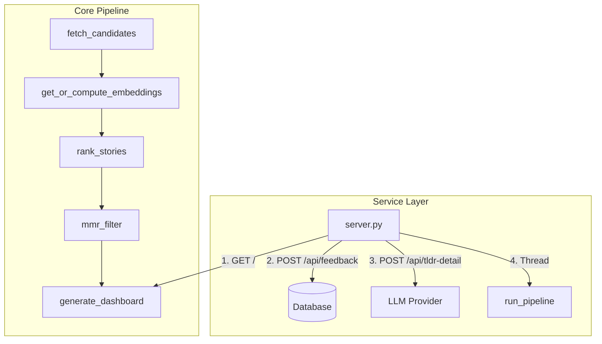

# Architecture & Design: hn-rewrite

This document outlines the architecture, core design decisions, database schema, ranking system, and maintenance instructions for the `hn-rewrite` minimalist local-first Hacker News reranking dashboard.

---

## 1. System Overview

`hn-rewrite` is a unified, resource-efficient rewrite of the original reranking system. It functions as a local-first web application that fetches stories from Hacker News and multiple RSS feeds, semantic-ranks them using a locally run sentence-embedding model and SVM, and presents them in a clean web dashboard.



---

## 2. Component Layout

The codebase consists of five primary modules:

1. **[database.py](file:///home/dev/hn-rewrite/database.py)**: Encapsulates all SQLite interactions. Manages schemas (`stories`, `embeddings`, `feedback`), cascade-deletes, pruned retention rules, and automatic schema migrations. Staging raw inputs directly inside `stories` (`self_text`, `top_comments`, `article_body`) permits on-the-fly text composition and sync-detection. The legacy `article_cache` table is dropped and migrated directly.
2. **[pipeline.py](file:///home/dev/hn-rewrite/pipeline.py)**: Orchestrates the background update sequence. Integrates RSS parsed feeds, computes text embeddings using ONNX, fits the SVM, and generates the final dashboard.
3. **[server.py](file:///home/dev/hn-rewrite/server.py)**: A multi-threaded web server serving the static dashboard, handling feedback writes, proxying detailed TLDR summaries to LLM APIs, and housing the background regeneration event thread.
4. **[templates/index.html](file:///home/dev/hn-rewrite/templates/index.html)**: Jinja2 dashboard template styled with a compact dark-theme Pico CSS layout. Includes client-side sorting, autohide transitions, and asynchronous detailed analysis rendering.
5. **[migrate_feedback.py](file:///home/dev/hn-rewrite/migrate_feedback.py)**: Imports legacy feedback data from `hn_rerank` JSON files, backfilling candidate story contents and caching embeddings.

---

## 3. Key Design Decisions

### 3.1 Normalized Schema & Data Integrity
To eliminate data redundancy, the feedback schema is strictly normalized. Metadata (`title`, `url`, `text_content`, `source`) is not duplicated in the `feedback` table. Instead, a foreign key references `stories(id)`. 
To prevent constraint violations or data loss during cleanup:
* `prune_stories` leaves feedback-associated stories intact (`id NOT IN (SELECT story_id FROM feedback)`).
* `get_all_feedback` and `get_feedback_for_training` perform a `LEFT JOIN` against `stories` to resolve attributes dynamically.

### 3.2 Embedding Model & Feature Space

#### Embedding Model Choice

We evaluated multiple embedding models for topic-level matching:

| Model | Dims | Context | Mean Sim (unrelated) | Speed | Verdict |
|-------|------|---------|---------------------|-------|---------|
| MiniLM | 384 | 256 | **0.091** | **6.6ms** | **Best** ✅ |
| BGE-small | 384 | 512 | 0.385 | ~5ms | Good |
| Nomic | 768 | 2048 | 0.381 | 34ms | Slow |
| BGE-base | 768 | 512 | 0.480 | 28ms | Moderate |
| Jina v2-small | 512 | 512 | 0.646 | 5ms | Poor ❌ |

**Key finding**: MiniLM has the best discrimination (0.091 mean similarity for unrelated texts). Longer context (512+ tokens) actually hurts discrimination by adding noise. The 256-token limit is optimal — it captures title + first paragraph without noise.

**Field-level embedding**: Each story's text is embedded as 4 separate fields (title, self_text, article_body, comments), then averaged with equal weights. This avoids truncation issues and lets each field contribute independently.

#### 395-Dimensional Feature Vector

The SVM trains on a **395-dimensional feature vector**:
* **`[0-383]` (384-d)**: MiniLM sentence embedding (concatenated text).
* **`[384-387]` (4-d)**: Similarity metrics to historical feedback:
  * Mean cosine similarity to upvoted story embeddings (global mean, LOOCV for training).
  * Mean cosine similarity to downvoted story embeddings (global mean, LOOCV for training).
  * Maximum cosine similarity to any upvoted story embedding.
  * Maximum cosine similarity to any downvoted story embedding.
* **`[388]` (1-d)**: Normalized log points: `min(log1p(score), 8.0) / 8.0`.
* **`[389]` (1-d)**: Normalized log comment count: `min(log1p(comments), 7.0) / 7.0`.
* **`[390]` (1-d)**: Normalized log text length: `min(log1p(len), 12.0) / 12.0`.
* **`[391]` (1-d)**: Normalized engagement quality (points per hour since submission): `min(log1p(quality), 8.0) / 8.0`.
* **`[392]` (1-d)**: Normalized comment-to-score ratio: `min(log1p(comments / max(score, 1)), 3.0) / 3.0`.
* **`[393]` (1-d)**: Normalized score velocity (points per hour, floored at 6 min): `min(log1p(score / max(hours, 0.1)), 8.0) / 8.0`.
* **`[394]` (1-d)**: Normalized comment velocity (comments per hour, floored at 6 min): `min(log1p(comments / max(hours, 0.1)), 8.0) / 8.0`.
* **`[395]` (1-d)**: Binary indicator `is_hn` (`1.0` if `source == "hn"`, else `0.0`).
* **`[396]` (1-d)**: Hour of day (0-1, normalized).

To prevent train-test covariate shift / feature leakage, when computing the similarity features for training stories, we explicitly exclude each story itself from its class reference set (e.g. using a self-exclusion mask to set self-similarity to `-999.0` for $k$-NN mean calculations, and setting its entry in the similarity matrix to `-1.0` before maximum reduction).

To avoid outlier features (like fresh stories having extremely large negative z-scores like `-4.8` for points/comments, or similarity features having blown-up z-scores due to low training variance) from completely dominating the SVM ranking decision, the 11 standard-scaled metadata features are clipped to the range `[-2.5, 2.5]`. This z-score clipping significantly improves raw ranking metrics (Raw NDCG@100 from `0.720` to `0.738`, Raw NDCG@200 from `0.691` to `0.706`) and prevents model overfitting.

### 3.3 Fast SVM Personalization & Numerically Stable Softmax
To enable fast, synchronous reranking when a user submits feedback, we avoid the slow Platt calibration path (`probability=True` in scikit-learn's `SVC`), which relies on 5-fold cross-validation and takes **~2.0s**. Instead, we train the SVM with `probability=False` (**~150ms** fit time) and approximate the class probabilities by running a numerically stable `softmax` over the raw multi-class decision values:

$$p_i = \frac{e^{f_i - \max(f)}}{\sum_j e^{f_j - \max(f)}}$$

This configuration drops overall fitting and scoring latency from **~3.0s** to **~800ms** (or **~280ms** if candidate pruning is applied) while preserving almost identical personalization quality.

**Optimal hyperparameters** (grid search 2026-06-21): `C=0.3`, `gamma=0.21`, `kernel=rbf`, `neutral_weight=0.0`.

### 3.4 MMR & Surfacing Passes
Standard MMR (Maximal Marginal Relevance) strictly penalizes topic duplication based on similarity. The `mmr_filter` function iterates through candidates in SVM-rank order; for each unselected candidate, it selects that candidate and discards all subsequent candidates with cosine similarity above the threshold (`config.model.diversity_threshold`, default 0.50). The highest-SVM-scored member of each similarity cluster is always the representative — cluster selection is fully driven by the personalized SVM, not HN engagement. The final set is sorted back to match original SVM relative rank order.

All candidates are evaluated for discovery badges in a single decoration pass. Thus, any story on the dashboard (whether from the default MMR path or surfaced extra slots) that meets the badge criteria will display the corresponding badge. The orchestrator then surfaces extra recommending slots from the decorated candidates not selected by the default MMR path (the remaining candidates pool) to guarantee coverage of different discovery signals:
* **Uncertainty/Entropy Surfacing**: We compute the Shannon Entropy of the model's predicted probability distribution (Down, Neutral, Up). The orchestrator reserves up to 3 slots for the remaining candidates with the highest entropy, flagging them as `is_uncertain=True` (badge `🤔 Unsure`) to prompt active feedback.
* **Novel**: Top 15% least similar to feedback with SVM score > 0.5, flagged as `is_novel=True` (badge `✨ Novel`), up to 5 slots sorted by SVM score.
* **Similar**: Stories with high semantic match to upvotes (top 10% similarity, dynamic 90th percentile threshold), flagged as `is_similar=True` (badge `🎯 Similar`), up to 5 slots sorted by similarity score descending.
* **Discussion-rich**: Top 7% by `comment_count` and comments > 0, flagged as `is_discussion_rich=True` (badge `💬 Talk-worthy`, 93rd percentile), up to 5 slots sorted by comment count descending.
* **High-engagement**: Top 5% by `story.score`, flagged as `is_high_engagement=True` (badge `🏆 Top`, 95th percentile), up to 5 slots sorted by SVM score descending.
* **Hot**: Top 2% by engagement velocity (points/hour), flagged as `is_hot=True` (badge `🔥 Hot`, 98th percentile).

Each discovery pass selects from the decorated remaining candidates and deduplicates against previously selected IDs before appending. These default path badges do not count toward the budget of the extra recommends slots.

### 3.5 Client-side Autohide & DOM Swap
When a user upvotes/downvotes a card, the UI writes the current card height inline, triggers a CSS collapse transition (`max-height: 0 !important; opacity: 0;`), and removes the card from the DOM after 400ms. Synchronously, the web server runs a fast, in-memory re-ranking and re-rendering pass (`fast_rerank_and_render`) in under 300ms, writing the newly ordered dashboard to disk. Once the card fade-out finishes, the client performs a background fetch of the updated HTML page and swaps the `#stories` card container in-place to present the recalculated, personalized rankings instantly without a full page reload.

### 3.6 Algolia Candidate Fetch Window
The live-window fetch (`pipeline.py:336`) queries the Algolia HN search API in 7 daily chunks. Each day's fetch collects up to **350 hits** (5 pages of 100, minus stories with `points <= 5`). This cap was raised from 150 to capture the majority of high-score stories on busy days; previously, stories on high-volume days could be dropped before the reranker evaluated them.

### 3.7 Comment Text Refetch on Growth
By default, a story's `text_content` (the title + self-post + top-24 comments baked into a single text blob) is fetched once and frozen along with its 384-dim embedding. During regen, only the integer fields (`score`, `comment_count`) are refreshed. To capture topic drift in active discussions, an opt-in growth-based refetch is applied:

- **Trigger condition** (all must hold): `comment_count` has grown by ≥ 30% since the last text fetch, story age is < 24h, the story has no user feedback, and the per-regen cap of 10 refetches has not been hit.
- **Action**: `refetch_story_text` calls the Algolia items API, recomposes the top-24 comment list, recomposes `text_content`, re-embeds via the ONNX MiniLM model, and persists both the new text and the new embedding. `comment_count_at_fetch` is updated to the current `comment_count` so a story will not be refetched again until it grows another 30%.
- **Safety invariants**:
  - Stories in `feedback` (1,647 voted stories) are never refetched. Their cached embeddings match the text the user has been ranking against; refetching them would silently change the ranking of voted stories.
  - Refetch is bounded to `MAX_REFETCH_PER_REGEN = 10` calls per regen, capping the Algolia rate-limit hit at ~1s.
  - If Algolia is down or the items API returns a non-story, `refetch_story_text` returns `None` and the stale data is kept. The regen does not fail.
- **Why not all stories on every regen?** Refetching changes the embedding, which changes cosine similarity to surrounding stories. For voted stories this would invalidate the training contract; for unvoted stories it would be wasteful churn. Growth-triggered refetch is a deliberate trade-off: it captures the most active discussions (where new top comments are most likely to change the topic) without affecting stories the user has already committed feedback to.

### 3.8 Stale Comment Backfill & Data Integrity

The Algolia items API (`/api/v1/items/{sid}`) returns a story's full data including top-level comments. When `fetch_story` encounters a cached story with stale or missing `top_comments`, it now falls through to the items API instead of short-circuiting:

- **Staleness detection**: `top_comments == ""` (empty from migration) OR `comment_count > comment_count_at_fetch` (comments grown). Stories with existing comments and `comment_count_at_fetch > 50` are skipped to avoid re-fetching popular threads.
- **Per-run cap**: At most 100 stale-comment stories are re-fetched per pipeline run, sorted newest-first.
- **Corruption priority**: Stories with `title=""` and `text_content != ""` (corrupted by `_empty_story`) skip the cap entirely — they get unlimited priority at the front of the queue.

**`_empty_story` vulnerability**: The error path previously called `db.upsert_story(_empty_story(sid))` unconditionally on any non-200 API response, zeroing `title`, `time`, `score`, `self_text`, `top_comments`, and `text_content`. Only `article_body` survives because `upsert_story` uses `COALESCE` exclusively on that column.

**Self-healing deadlock**: A corrupted story with `text_content == ""` (no article_body to recompose from) would never recover — `fetch_story` returned `None` for any story with empty `text_content`, so the API was never called. Fixed by checking `title == ""` as a corruption signal and falling through to the API.

**`_row_to_story` recomposition**: `text_content` is recomposed live from raw parts on every DB read. This means a corrupted row with preserved `article_body` produces non-empty `text_content` — the story passes filtering and appears in the dashboard, but with a blank title and epoch timestamp ("20624d ago").

**Error path hardening** (all four paths now preserve cached data on transient failure):
1. Non-200 response → return cached story if exists
2. Invalid item type → return cached story if exists
3. Valid API but empty composed text → return cached story if exists
4. Exception → return cached story if exists

### 3.8 Self-Healing Embedding Cache Invalidation (text_hash)
To automatically invalidate and refresh cached embeddings whenever a story's text changes (e.g. following an article body fetch, growth-triggered comment refetch, or comment backfill), we track `text_hash` within the `embeddings` table:
* **Schema Migration**: Added a `text_hash TEXT NOT NULL DEFAULT ''` column to the `embeddings` table schema (implemented as a safe, backwards-compatible, in-place migration check).
* **Validation Check**: The caching queries (`get_embedding` and `get_embeddings_batch`) enforce that the computed SHA-256 hash of the current `text_content` matches the `text_hash` stored in the DB.
* **Self-Healing Invalidation**: Any mismatch (or default empty string `''` for pre-existing records) forces a cache miss, triggering automatic re-computation and cache-update on demand without manual table deletions.

### 3.9 Database Connection Pooling & Thread Safety
To reduce SQLite connection establishment overhead and eliminate lock contention in concurrent web environments:
* **Connection Pooling**: The `Database` class maintains an internal thread-safe queue of 5 SQLite connections (`queue.Queue`). In-memory databases automatically scale the pool size to 1 to preserve test schema isolation.
* **Safe Connection Leasing**: Method executions lease connections from the pool via the private context manager `_conn(self)` and release them in a `finally` block, ensuring no leaked connections.
* **Auto Commit/Rollback**: All database write operations wrap queries in a transaction context (`with conn:`) to ensure automatic rollback on failure and commit on success.
* **PRAGMA Settings**: Each pooled connection is initialized with `PRAGMA journal_mode=WAL` (Write-Ahead Logging), `PRAGMA foreign_keys=ON` (constraint enforcement), and `PRAGMA busy_timeout=5000` (blocking writers retry for up to 5 seconds before failing).
* **Server-Level Reuse**: The `ThreadingHTTPServer` request handlers reuse a single global `Database` instance across threads, resolving lock issues and significantly increasing throughput.

### 3.10 Multi-User Architecture
The system supports multiple users with independent feedback histories and personalized rankings:
* **User Identification**: Token-based via URL path (`/u/<token>`) and cookie (`hn_token`). No passwords — the URL is the identity. Users are created on first visit.
* **Data Model**: Shared `stories` table (candidates are global), per-user `feedback` rows with `PRIMARY KEY (user_id, story_id)`. A `users` table maps tokens to user IDs and display names.
* **Dynamic Dashboard**: Each user's dashboard is rendered on-request via `fast_rerank_for_user()` → personalized SVM training → MMR → Jinja2 template render. Rendered HTML is cached per-user for 5 minutes.
* **Background Regen**: The background loop fetches candidates into the shared `stories` table only. It does not render per-user dashboards.
* **SVM Training**: Per-user SVM is trained lazily on first dashboard request. Model is cached in memory (dict keyed by user_id, 5-minute TTL, max 50 entries).
* **Feedback API**: `POST /api/feedback` requires valid session cookie. The `user_id` is extracted from the token and passed to `upsert_feedback`.
* **Frontend**: localStorage keys are prefixed with the user token (`<token>_feedback_<story_id>`) to prevent cross-user state leakage.

---

## 4. LLM Detailed Analysis

### 4.1 Article Body Enrichment & Proactive Fetching

The `/api/tldr-detail` endpoint enriches the LLM prompt with the full article body when the story's HN-provided text is thin (<500 chars) and a URL is available. 

To improve semantic ranking quality and render TLDRs instantly, the background pipeline executes a **strategic proactive fetching loop** in two passes:
1. **First-Pass Ranking**: Candidates are ranked using existing metadata, comments, and titles.
2. **Proactive Scrapes**: Identifies top stories that do not yet have an `article_body` (specifically the top 40 recommendations, or any top 150 candidate crossing popularity/velocity triggers like score > 150, score velocity > 30/hour, or comment velocity > 20/hour).
3. **Parallel Fetch & Re-Rank**: Fetches their article bodies in parallel using `_fetch_article_body`, updates the SQLite `stories.article_body` field, re-embeds their newly composed text, and executes a second-pass ranking with updated vectors.

Fetch flow (server.py `_fetch_article_body`):
1. **Cache lookup**: Directly reads `story.article_body` (invalidated or refreshed when story URL changes).
2. **Fetch** (if cache miss): HTTP GET with Chrome 131 browser-grade headers. Single retry on 429/503 after 1s sleep.
3. **Extraction chain**: `trafilatura.extract()` first (robust against 100+ site templates); falls back to `BeautifulSoup` (strips non-content tags, prefers `<article>`/`<main>` containers).
4. **Cache write**: Stores up to 15,000 characters of extracted text inside the `stories.article_body` column.

### 4.2 Prompt Construction

The detailed summary endpoint `/api/tldr-detail` proxies requests to Mistral or Groq. The prompt is built from structured sections of the raw story fields (passed separately, not pre-composed):

- Title
- Author's text (`self_text`, up to 6K chars)
- Article body (up to 15K chars)
- HN comments (`top_comments`, up to 10K chars)

Each section is only included if non-empty, giving the LLM clearly separated content. If engagement is low (<20 points or <5 comments), the LLM uses cautious hedging language. Previously the prompt used a single 30K-char blob of pre-composed `text_content` — this caused the article body to appear twice (once raw, once truncated inside the composed blob). The structured approach avoids duplication and lets the LLM distinguish article content from discussion.

### 4.3 Client-side Rendering

The raw Markdown response is formatted on the fly using a robust, line-by-line parser (`parseSimpleMarkdown`) to render headers, bold text, and lists safely.

---

## 5. Maintenance Guide

### 5.1 Service Control
The server runs as a systemd user service.
```bash
# Manage the service
systemctl --user {status|start|stop|restart} hn_rewrite.service

# View active logs
journalctl --user -u hn_rewrite.service -f -n 100
```

### 5.2 Verification Suite
Ruff and Pytest are configured for standard validation.
```bash
# Run all unit tests
uv run pytest tests/

# Check styling and types
uv run ruff check .
```
