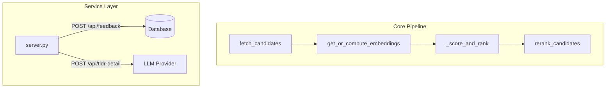

# Architecture & Design: hn-rewrite

This document outlines the architecture, core design decisions, database schema, ranking system, and maintenance instructions for the `hn-rewrite` minimalist local-first Hacker News reranking dashboard.

---

## 1. System Overview

`hn-rewrite` is a unified, resource-efficient rewrite of the original reranking system. It functions as a local-first web application that fetches stories from Hacker News and multiple RSS feeds, semantic-ranks them using a locally run sentence-embedding model and SVM, and presents them in a clean web dashboard.

---

## 2. Component Layout

The codebase consists of six primary modules:

1. **[database.py](database.py)**: Encapsulates all SQLite interactions. Manages schemas (`stories`, `embeddings`, `feedback`), cascade-deletes, pruned retention rules, and automatic schema migrations. Staging raw inputs directly inside `stories` (`self_text`, `top_comments`, `article_body`) permits on-the-fly text composition and sync-detection. The legacy `article_cache` table is dropped and migrated directly.
2. **[pipeline.py](pipeline.py)**: Orchestrates the background update sequence. Integrates RSS parsed feeds, computes text embeddings using ONNX, fits the SVM, and generates the final dashboard.
3. **[server.py](server.py)**: A Flask-routed, threaded local web service serving the dashboard, handling feedback writes, proxying detailed TLDR summaries to LLM APIs, and housing the background regeneration event thread. The `Handler` class owns runtime state (dashboard cache, warm timers, render locks, limiter state), while Flask owns all HTTP routing, request parsing, cookies, redirects, CORS/options, and response construction.
4. **[templates/index.html](templates/index.html)**: Jinja2 dashboard template styled with a compact dark-theme Pico CSS layout. Presents a Tinder-style single-card deck with keyboard voting, a capped preloaded queue, and asynchronous TLDR rendering that auto-expands for the active story.
5. **[migrate_feedback.py](migrate_feedback.py)**: Imports legacy feedback data from `hn_rerank` JSON files, backfilling candidate story contents and caching embeddings.
6. **[scripts/seed_hn_from_clickhouse.py](scripts/seed_hn_from_clickhouse.py)** (primary) / **[scripts/seed_hn_from_bq.py](scripts/seed_hn_from_bq.py)** (backup): One-off archive seeders. The ClickHouse variant queries the public Playground over HTTP (no auth) against `hackernews_history FINAL` (defaults: 6 months, score ≥ 200); the BigQuery backup uses the authenticated `bq` CLI against `bigquery-public-data.hacker_news.full`. Both import common logic from `_seed_common` — they import high-score HN stories as `source="ch_seed"` or `source="bq_seed"` rows, hydrate selected Algolia comments when available, and compute embeddings without fetching article bodies.

---

## 3. Key Design Decisions

### 3.1 Normalized Schema & Data Integrity
To eliminate data redundancy, the feedback schema is strictly normalized. Metadata (`title`, `url`, `text_content`, `source`) is not duplicated in the `feedback` table. Instead, a foreign key references `stories(id)`. 
To prevent constraint violations or data loss during cleanup:
* `prune_stories` leaves feedback-associated stories intact (`id NOT IN (SELECT story_id FROM feedback)`).
* `get_all_feedback` and `get_feedback_for_training` perform a `LEFT JOIN` against `stories` to resolve attributes dynamically.

### 3.2 Embedding Model & Feature Space

#### Embedding Model Choice

We evaluated multiple embedding models for topic-level matching:

| Model | Dims | Context | Mean Sim (unrelated) | Speed | Verdict |
|-------|------|---------|---------------------|-------|---------|
| MiniLM | 384 | 256 | **0.091** | **6.6ms** | **Best** ✅ |
| BGE-small | 384 | 512 | 0.385 | ~5ms | Good |
| Nomic | 768 | 2048 | 0.381 | 34ms | Slow |
| BGE-base | 768 | 512 | 0.480 | 28ms | Moderate |
| Jina v2-small | 512 | 512 | 0.646 | 5ms | Poor ❌ |

**Key finding**: MiniLM has the best discrimination (0.091 mean similarity for unrelated texts). Longer context (512+ tokens) actually hurts discrimination by adding noise. The 256-token limit is optimal — it captures title + first paragraph without noise.

**Production embedding input**: The current production embedding is a single composed text string, centralized in `story_embedding_text()`. For normal rows this preserves the stored `text_content` exactly, keeping existing cache hashes stable; if `text_content` is empty, it recomposes from `title`, `self_text`, `article_body`, and `top_comments` as a recovery fallback.

**Field-level embedding candidate**: The eval script can test a slower field-level mode that embeds `title`, `self_text`, `article_body`, and `top_comments` separately, then averages the non-empty field vectors. This should not replace production without a new embedding `model_version`, because switching it would intentionally invalidate the existing embedding cache and change feedback-story vectors.

#### 390-Dimensional Production SVM Feature Vector

The production SVM trains on a **394-dimensional feature vector**:
* **`[0-383]` (384-d)**: MiniLM sentence embedding from the production composed text.
* **`[384]` (1-d)**: Normalized log text length: `min(log1p(len), 12.0) / 12.0`.
* **`[385-388]` (4-d)**: Similarity metrics to historical feedback:
  * Mean cosine similarity to the top-k upvoted story embeddings (`knn_k=10`, LOOCV for training).
  * Mean cosine similarity to the top-k downvoted story embeddings (`knn_k=10`, LOOCV for training).
  * Maximum cosine similarity to any upvoted story embedding.
  * Maximum cosine similarity to any downvoted story embedding.
* **`[389]` (1-d)**: Maximum cosine similarity to a 4-cluster k-means summary of the user's upvoted feedback. The runtime fits those positive-cluster centers once per render and reuses them for both feedback rows and candidate rows.
* **`[390-393]` (4-d)**: 4-binary source category one-hot: `is_hn_live`, `is_archive`, `is_reddit`, `is_rss` (from `source_category_onehot()` in `pipeline.py:127`). "Other" sources (Slashdot without the `rss_` prefix, Tildes, etc.) get the all-zero vector and inherit the implicit "other" prior from absence of all four bits. Bumped from a single `is_hn` flag in 2026-06-28 so the model can learn distinct per-source priors — archive candidates (`bq_seed`/`ch_seed`) used to share a feature bit with live HN, so the SVM had no way to demote the ~70%-of-pool archive contamination.

The SVM deliberately excludes engagement metadata: score, comment count, HN quality, comment-to-score ratio, score velocity, comment velocity. These features produced inflated archive-wide offline metrics and worse 30-day held-out ranking than the semantic/text/similarity feature set. The 4-binary source features are kept because the model needs the per-source prior to handle the heterogeneous candidate pool, and the `strip_hn` formula in the eval (zeroing these features at inference) gives a clean ablation: ~0.38 NDCG@100 lift comes from the source features, ~0.22 NDCG@100 comes from the rest.

To prevent train-test covariate shift / feature leakage, when computing the similarity features for training stories, we explicitly exclude each story itself from its class reference set (using a self-exclusion mask to set self-similarity below the valid cosine range for $k$-NN mean calculations, and setting its entry in the similarity matrix to `-1.0` before maximum reduction).

To avoid outlier features (like fresh stories having extremely large negative z-scores like `-4.8` for points/comments, or similarity features having blown-up z-scores due to low training variance) from completely dominating the SVM ranking decision, the standard-scaled metadata features are clipped to the range `[-2.5, 2.5]`. This z-score clipping significantly improves raw ranking metrics (Raw NDCG@100 from `0.720` to `0.738`, Raw NDCG@200 from `0.691` to `0.706`) and prevents model overfitting.

**Raw embeddings must not be standard-scaled.** The 384-d MiniLM vectors are L2-normalized — each dimension is on the same unit scale by construction. StandardScaler is applied only to metadata columns (from `emb_dim:` onward in the feature vector). Scaling raw embedding dimensions independently breaks their cosine similarity structure and collapses ranking performance, because a dimension with small-magnitude signal across the training set gets inflated to the same variance as a dimension with genuine semantic signal.

### 3.3 SVM Personalization
When both upvote and downvote feedback pass the dual gate, the runtime trains a per-user `SVC` with `probability=False` and ranks candidates by the normalized one-vs-rest up-class margin:

$$\text{score} = \text{minmax01}(f_{\text{up}}(x))$$

This avoids scikit-learn's deprecated and slower `SVC(probability=True)` calibration path. The dashboard still computes approximate probability-like fields by applying a softmax over the multi-class decision margins, but ranking itself is driven by the raw up-margin ordering. Because these softmax values are not calibrated probabilities, the UI does not show exact percentages; it uses them only for uncertainty entropy to select `🤔 Unsure` candidates. Card-left color is a smooth blue→red gradient driven by the card's rank position in the current render's sorted-by-score order (rank 1 = blue, rank N = red, evenly distributed), computed client-side from `data-score` values and applied to the border-left plus a 4% tinted background. Rank-percentile mapping (rather than linear-in-score) ensures visually distinguishable colors even when the score distribution clusters — the gradient travels with each card when the user sorts by date.

**Current hyperparameters** (30-day default-user eval, 2026-06-28): `C=0.5`, `gamma=0.03`, `kernel=rbf`, `neutral_weight=0.0`, `positive_cluster_k=4`. Re-tuned on the 4-binary source feature set; the previous 2026-06-23 setting (`C=0.2, gamma=0.03, kernel=rbf`) was measured on the pre-4-binary-source feature set and is no longer optimal. A wide RBF sweep (49 (C, γ) combos) confirmed `C=0.5, gamma=0.03` sits in a broad plateau spanning `C∈{0.3-1.0}` × `γ∈{0.01-0.03}`, all within 1σ of each other. The plateau is also robust to a linear kernel fallback at the same hyperparams — linear at `C=0.1` gives 0.45 NDCG@40, RBF at the plateau gives 0.49-0.50, a +0.05 lift on the production 394-d feature set. The final-queue (post-13-discovery-passes) lift is even larger: linear 0.493 → RBF 0.596 = +0.10.

#### Per-User SVM Model Cache (Schema-Versioned)

The trained `(SVC, StandardScaler)` tuple is cached in-process in `_MODEL_CACHE` (a lock-guarded `cachetools.LRUCache`, max 20 active entries by default) keyed on `(user_id, feedback_signature, _MODEL_SCHEMA_VERSION)`. The signature is a SHA-256 of the user's feedback story IDs + actions + update timestamps; the schema version is bumped whenever the feature schema changes. Bumping `_MODEL_SCHEMA_VERSION = 2` (2026-06-28, 4-binary source categories) invalidates every active user's cached model on next request — the correct behavior, since a stale scaler fit on 6 meta columns would be applied to a 10-column input and produce NaN scores. Schema version is the only viable invalidation key: the cache is in-memory only, so a runtime dim check would mask future schema bugs.

#### Dual-Gate SVM Activation

The SVM trains only when **both** the upvote and downvote classes have enough examples. This prevents the SVM from over-fitting to a sparse, incoherent down class.

Configuration (`config.toml`):
- `min_up_for_svm = 20`
- `min_down_for_svm = 20`

The soft blend ramp uses `n_min = min(n_up, n_down)` as its basis:
$$\alpha = \text{clip}\left(\frac{n_{\min} - 20}{60},\ 0,\ 1\right)$$

The blend starts when both classes have at least 20 feedback entries and reaches full SVM influence when both classes have at least 80 entries. A user with 50 upvotes but only 5 downvotes sees pure tier-2 (centroid-diff) regardless of total feedback count.

### 3.4 Selection & Surfacing Passes
The default dashboard selection is direct relevance order: `rerank_candidates` takes the top ranked stories after `_score_and_rank` and does not remove near-duplicates. MMR remains available behind `config.model.enable_mmr`; when enabled, `mmr_filter` iterates through candidates in SVM-rank order and discards subsequent candidates with cosine similarity above `config.model.diversity_threshold` (default 0.75).

#### 3.4.1 Cross-source URL & title dedup
The same article can arrive from multiple sources — two HN submissions of the same Verge article (the well-known "[dupe]" pattern), an HN story linking a Reddit thread plus a Reddit RSS feed catching the same thread, etc. Without explicit handling, the same URL would render twice in the deck. Cross-source dedup lives in `dedup.py` and runs at the very end of `fast_rerank_for_user` (after `rerank_candidates`), so it covers all primary-ranked and extra-slot stories, including ones that arrived in different regen cycles.

* **URL normalization** (`dedup.normalize_url`): strips scheme, lowercases host, drops `www.`, normalizes trailing slash, drops ~30 known tracking query parameters (`utm_*`, `fbclid`, `gclid`, `ref`, `ref_src`, etc.), drops fragment, sorts remaining query params. Idempotent and total.
* **Domain approximation** (`dedup.canonical_domain`): poor-man's eTLD+1 (last two host labels). Used to gate the optional title-fuzzy layer; deliberately avoids a Public Suffix List dep.
* **Source preference** (`_source_preference_rank`): within a duplicate bucket, the winner is the highest-preference source: HN live > HN archive > Reddit RSS > LessWrong RSS > other RSS. Same-source collisions tiebreak on `score desc`, then `id asc` for determinism.
* **Feedback URL exclusion**: any story whose normalized URL matches a feedback record's normalized URL is dropped, but **only for feedback actions in `dedup_exclude_actions`** (default `("up", "neutral")` per design call — a downvote on one version of an article is intentionally NOT propagated to the alternate source, since the user may still want to see the HN version of an article whose Reddit thread they disliked).
* **Title fuzzy dedup** (off by default, gated by `dedup_title_fuzzy_enabled`): when two stories have *different* URLs (e.g. aggregator vs canonical) but their normalized titles are within `dedup_title_fuzzy_hamming` bits of SimHash distance (default 2), the lower-preference one is dropped. A `require_same_domain_for_fuzzy` guard prevents accidental cross-domain collapses. The same gate extends the feedback title-exclusion: an upvoted title can suppress near-identical future titles on the same canonical domain.

The fetch path no longer does any URL dedup (the old within-fetch-run block was removed; see `pipeline.py` comment at the section that used to hold it). The user's `feedback` URLs still flow into `fetch_rss_feeds.exclude_urls` so we don't re-pull RSS entries the user has voted on — that is a network-cost guard, not a dedup policy.

Configurable via `[hn_rewrite.model] dedup_*` knobs in `config.toml`; defaults are conservative (URL dedup on, title fuzzy off).

**Logging.** The `dedup` module emits a single INFO summary line per call (key=value, grep-friendly: `dedup user_id=42 in=75 out=57 suppressed=18 url_dups=4 fb_url=2 title_fuzzy=off ...`) and one DEBUG line per suppressed story (`dedup-suppress user_id=42 reason=url_dup dropped_id=… kept_id=…`). INFO is on by default in the server; switch the `dedup` logger to DEBUG to see per-story forensics: `logging.getLogger("dedup").setLevel(logging.DEBUG)`.

#### 3.4.2 Reddit RSS rate limiting
Reddit's unauthenticated IP rate limit is approximately 1 request per 2 seconds. Two code paths hit Reddit: (a) the subreddit topfeed path in `pipeline.fetch_rss_feeds` (~50 feeds per regen cycle) and (b) the per-story comments-RSS path in `server._fetch_reddit_rss_context` (called from `prewarm_reddit_top_stories`, ~50 stories per cycle, plus the lazy tldr-detail fallback). Both paths were issued back-to-back with no spacing and no 429 handling — measured at 110 429s in 15 minutes (109 from path a, 99 from path b, observed in the 30-min window before this fix).

A shared `RedditRateLimiter` singleton in `reddit_limiter.py` is consulted by both paths before each Reddit request:
* **Inter-request delay** (`INTER_REQUEST_DELAY = 2.0`): `acquire()` blocks until `time.monotonic() >= _next_allowed_at`. On success, `_next_allowed_at` is bumped to `now + 2.0`; on 429, to `now + backoff`.
* **Exponential backoff** on 429: `BACKOFF = (2, 4, 8, 16, 32, 60)` seconds, capped at 60s. Index by `min(_consecutive_429 - 1, len(BACKOFF) - 1)`. Honors `Retry-After` header when present (the server.py path passes `_parse_retry_after`; the pipeline.py topfeed path uses the backoff table since the headers aren't surfaced through `fetch_with_urllib_fallback`).
* **Circuit breaker** (`MAX_CONSECUTIVE_429 = 3`): after 3 consecutive 429s, `acquire()` returns `False` immediately (no sleep) and the caller's loop short-circuits — remaining Reddit feeds this regen are skipped; next regen the limiter resets (state persists in-process across cycles but is wiped on server restart).
* **State persists** across regen cycles: cumulative backoff is the intent (consecutive 429s across regens continue to escalate the delay).
* **One bucket for all of reddit.com**: Reddit's limit is IP-wide, not per-subreddit, so a single shared gate is correct. A hot subreddit's 429 slows down unrelated subreddits — that's the right behavior since they'd 429 anyway.
* **Half-open probe**: when the circuit opens, `acquire()` admits one probe request every `CIRCUIT_COOLDOWN` (default 300s). A successful probe clears the circuit; a failed probe resets the cooldown clock. Prevents the limiter from being stuck open until service restart.
* **Jitter**: `on_success()` adds `random.uniform(-JITTER_SECONDS, +JITTER_SECONDS)` (default ±0.5s) to `INTER_REQUEST_DELAY` to break robotic timing patterns. Jitter applies only to success; the 429 backoff sequence is unchanged.
* **Server-driven 429 backoff (2026-06-28)**: when Reddit sends `x-ratelimit-reset` on a 429, the limiter uses that value (capped at 120s) as the next delay instead of the hardcoded BACKOFF table. Precedence: `x-ratelimit-reset` > `Retry-After` > BACKOFF table. Matches the server's actual reset window and avoids the 2s-too-short backoff that re-triggers 429s in tight loops.
* **Thread-safe**: all state mutations are guarded by a `threading.Lock` because the queue worker thread (driving scheduled fetches) and the HTTP request threads (driving on-demand fetches) now both call the limiter concurrently. The lock is released during `asyncio.sleep` in `acquire()` so other threads can proceed.
* **Slot-reservation under the lock (2026-06-28)**: `acquire()` reserves the next slot by bumping `_next_allowed_at = max(now, _next_allowed_at) + INTER_REQUEST_DELAY + jitter` *inside* the lock. The next caller entering the lock immediately after sees the bumped value and staggers itself correctly, even when it's a different OS thread (queue worker vs HTTP handler on a TLDR click). Previously `_next_allowed_at` was advanced only in `on_success`/`on_429` (post-HTTP), so two concurrent `acquire()` callers both saw the same stale value, both slept 0, and both fired HTTP simultaneously — re-introducing the burst pattern that originally caused the 2026-06-28 37-consecutive-429s incident. The invariant is asserted by `test_concurrent_acquire_staggers_reservations` in `tests/test_reddit_limiter.py`. `on_success()` no longer advances `_next_allowed_at` — it only resets circuit state. `on_429()` uses `max(self._next_allowed_at, now + delay)` to push the next slot further out, but never earlier than what `acquire()` already reserved, so callers mid-`asyncio.sleep` are not invalidated. Companion change in `pipeline.py`: `build_reddit_prewarm_factories` factory used to call `acquire()` redundantly (the inner `_fetch_reddit_rss_context → acquire` is the actual rate-limit gate). Replaced the outer call with a cheap `reddit_limiter.circuit_open` property check to short-circuit early without reserving a second slot per HTTP.
* **Fetch queue (coordinator refactor 2026-06-28; bounded two-phase flow 2026-06-29)**: Reddit fetches are scheduled through a `RedditFetchQueue` singleton that spreads them across the regen cycle instead of bursting them at the start. The current flow runs topfeed first, persists its rows, then hydrates a bounded set of missing comment threads from that same topfeed output:
  - **Phase 1 — topfeed (fixed 50s stride, 41 tasks):** All 41 subreddit topfeeds are enqueued via `queue.enqueue_spread(n, base_at, kind=TOPFEED, factories, window_seconds=2100.0)` and drained with `wait_until_empty(timeout=5400.0)`. The factory writes parsed `Story` rows to `reddit_feed_cache` in the order Reddit returned them (hot/score-desc; RSS doesn't carry `score` so the order is the only signal).
  - **Phase 1.5 — persist:** cached topfeed stories are upserted before prewarm factories are built. This is required because prewarm factories load the story row from SQLite.
  - **Phase 2 — prewarm (configurable stride, capped at 80 tasks by default):** Read `reddit_feed_cache` for each `reddit_feed_url`; consider the first `config.reddit_prewarm_top_per_sub` (default 10) stories per sub, skip rows whose DB copy already has `top_comments`, and stop at `config.reddit_prewarm_max_per_cycle` (default 80). Per-post RSS fetches for their comments are enqueued and drained with a 90-min timeout. At the default 30s stride, the capped phase is about 40 minutes before retry/backoff overhead. The phase is skipped when `prewarm_reddit_full=False`, the cache is empty, or the cap is non-positive.
  - **Stride knobs:** `reddit_min_fetch_spacing_seconds` (default 30.0s) sets the prewarm phase's per-task stride; the topfeed phase uses a hardcoded 50s stride (one subreddit per fetch at the limiter's natural 2s+jitter cadence, but the queue spreads them out at 50s for 429-backoff headroom).
  - **Why two phases instead of interleave?** The prewarm IDs depend on phase 1's output (topfeed writes to cache; phase 2 reads from cache). True interleaving on a single shared window was the 2026-06-28 design, but it had to do a DB prewarm-ID query before any fetches, so brand-new topfeed stories from the current cycle missed their prewarm.
  - **Bounded work:** `reddit_prewarm_max_per_cycle` replaced the attempted 410-task full sweep because hourly or 3-6h refresh intervals cannot reliably absorb 410 per-post Reddit RSS requests plus 41 topfeeds under current rate limits.
  - **`urllib_fetch` HTTPError handling (2026-06-29):** the `http_fetch.urllib_fetch` helper catches `urllib.error.HTTPError` and returns `(e.code, "")` instead of raising. `URLError` (network/DNS/timeout) still propagates. Without this, an IP block on Reddit returned unhandled `HTTPError` to the queue worker's broad `except Exception`, which logged and dropped the task — the worker kept dequeuing topfeeds that all immediately failed, and the live service went 25+ min with zero Reddit fetches. The 5-test `tests/test_http_fetch.py` suite covers 200/403/429/500/URLError paths.
* **`?t=week&limit=25` consistency (2026-06-29)**: All 41 Reddit topfeed URLs in `config.toml` use the same `top/.rss?t=week&limit=25` pattern. 28 URLs were converted from 2 `?t=month` variants and 26 bare `r/X/.rss` (which is the "new" sort, not "top of the week"). This unifies the content window so all 41 topfeeds return "top of the week" stories of consistent freshness. No code change — pure config.
* **New Reddit stories this cycle** are eligible for same-cycle prewarm only after phase 1.5 persists them. Stories that fit within the per-cycle cap can land with `top_comments` before the regen completes; uncapped tail stories remain usable from feed self text and still hydrate on `/api/tldr-detail` when opened.

Logging: a WARNING per 429 (`reddit_limiter 429 consecutive=N next_delay=Ns`), an INFO when the loop short-circuits (`fetch_rss_feeds: reddit circuit open, skipping remaining N feeds` / `prewarm_reddit: circuit open, skipping remaining N stories`), and an INFO when the half-open probe is admitted / when a successful probe closes the circuit. The state attributes (`_next_allowed_at`, `_consecutive_429`, `_circuit_opened_at`, `_probing`) are reset by an autouse `tests/conftest.py` fixture between tests to prevent pollution; tests that exercise the limiter run with a fake monotonic clock and a recording-but-no-op `asyncio.sleep`.

Trade-off: ~100s added per regen (50 feeds × 2s), well within the 3h cycle budget.

#### 3.4.3 Reddit topfeed RSS cache

Added 2026-06-28. An in-memory `RedditFeedCache` singleton in
`reddit_feed_cache.py` sits in front of the limiter in the Reddit topfeed factories:
before each Reddit feed's `reddit_limiter.acquire()`, the cache is queried
by feed URL.  On hit (`list[Story]` within TTL), the stories are appended
directly to `feed_results` and the loop continues to the next feed — no
HTTP request, no limiter consultation, no 429 risk.  On miss, the normal
fetch + limiter flow runs and the result is stored for `TTL_SECONDS=14400`
(4h). The cache uses a lock-guarded `cachetools.TTLCache`, so expiry and
LRU overflow are handled by a standard library object while the wrapper keeps
copy-in/copy-out story-list semantics and hit/miss counters.

**Impact**: topfeed HTTP requests are bounded to about 41 per 4-hour cache
window, plus at most `reddit_prewarm_max_per_cycle` per-post comment RSS
requests when Reddit prewarm is enabled. Misses occur when the feed list
expires or on server restart.

**Design constants**: `TTL_SECONDS=14400` (4h, aligned with the default regen cadence),
`MAX_ENTRIES=100` (lazy-eviction on overflow by insertion timestamp).
`get()` logs one DEBUG line per query (`hit|miss|expired feed=<url>
age=<s>`).  `reset()` clears all entries and counters — wired into the
`conftest.py` autouse `reset_reddit_singletons` fixture (renamed from
`reset_reddit_limiter` to cover both limiter and cache).

The per-story comments-RSS path (server.py `_fetch_reddit_rss_context`,
called from `prewarm_reddit_top_stories`) does NOT use the cache — each
story's comment RSS is fetched at most once per lifetime (prewarm filter
is `not s.top_comments`), so a cache would have near-zero hit rate.

The live dashboard path applies a **two-leg recent candidate cap** to bound the work the ranker does on each request. The recent candidate fetch is split:
- **HN leg** (`source='hn'`): ordered by tier-1 gravity `score / age^1.8` (mirrors the cold-start blend in `_score_and_rank`), capped at `recent_candidate_hn_limit` (default 1500). This keeps the highest-scoring HN candidates in the pool.
- **RSS leg** (`source != 'hn' AND NOT IN archive`): ordered by `time DESC` only. RSS sources carry no engagement score in the DB, so tier-1 is uninformative there; recency is the most honest SQL-only signal and preserves representation for the `is_non_hn` discovery pass. Capped at `recent_candidate_rss_limit` (default 500).

The archive leg (BQ/CH archive sources) is unchanged and capped at 4000. Total recent + archive rows scored per rank ≈ 6000 (down from ~10,400 for the heaviest user). On the heaviest user the warm rank path dropped from ~9.4s p50 to ~6.3s p50 (33% faster), driven mostly by `decision_function` running on 5,000 fewer rows. The `is_uncertain` discovery pass is orthogonal to the SQL ordering and may be slightly affected; impact was small in practice.

The dashboard consumes the server-ranked order as a swipe deck instead of a visible list. The ranker emits 12 primary/default stories plus all generated discovery/popularity extra slots, and the template renders that whole returned pool so local modes can filter without another server round trip. The browser still shows only the first unvoted card for the active mode and refills from a freshly rendered dashboard when that mode's queue drops to 4 or fewer cards. The score-based gradient is applied client-side from `data-score`; it remains a rank-position signal over the currently loaded pool.

Discovery badges (uncertainty, novelty, talk-worthy, top, hot) are applied to any story that meets the criteria — primary or extra-slot. The **Similar badge is the exception**: it is reserved for extra-slot stories only, never for primary-ranked stories, so it always signals "surfaced from outside primary because of high semantic match" rather than a near-tautology on top-ranked stories (where score and `cand_closest_up` are correlated by construction). A primary-ranked story that crosses the talk-worthy, top, or hot percentile threshold receives that badge just as an extra-slot story would; multiple badges per card are allowed. The discovery passes additionally source stories from the remaining candidate pool (stories not already in the primary ranked set) to surface qualifying stories that would not otherwise be shown; each pass respects its own slot cap and dedupes from later passes. The uniform badge attribution does not consume those slots.

**Rank-based cascade badge model (2026-06-28).** All badge attribution is pure rank: for each badge, take the top X stories in each cohort by that badge's metric, in order. No percentile thresholds, no min-score floors. The X is the only knob (and it's a constant, not a config). The five non-Hot badges split into two groups that run in sequence:

* **Cascade group (mutually exclusive).** Hot → Top → Talk run sequentially. Each pass excludes prior picks from its pool, so a story with 🔥 never also has 🏆, and a story with 🏆 never has 💬. The Hot pass runs first against the **full** `ranked` pool (not `remaining_decorated`) so a primary-ranked high-velocity story also gets the badge; when a Hot pick is already in `final` (from primary), the loop OR's `is_hot=True` into the existing entry. Top and Talk run against `remaining_decorated` so the mutual-exclusion is preserved.
* **Parallel group (stackable).** Novel, Similar, Unsure run against the same shrunk `remaining_decorated` after the cascade. They can stack with each other (a story can be ✨+🎯, ✨+🤔, 🎯+🤔, or all three) and with the cascade group (Top+Unsure is allowed: "high score but model uncertain"). Picks are accumulated in a `dict[story_id, RankedStory]` so multiple parallel passes can update the same entry with `replace(... is_novel=True)` then `replace(... is_similar=True)`. After all parallel passes run, the dict is merged into `final`: existing entries (from primary or cascade) get the parallel flag OR'd in; new entries are appended.

**Slot counts.** All non-Hot per-cohort passes use `slot_limit=5` (`UNCERTAIN_DISCOVERY_*_SLOTS`, `NOVEL_DISCOVERY_*_SLOTS`, `SIMILAR_DISCOVERY_*_SLOTS`, `DISCUSSION_DISCOVERY_*_SLOTS`, `HIGH_ENGAGEMENT_DISCOVERY_*_SLOTS`). Hot is 5 slots global (`HOT_DISCOVERY_SLOT_LIMIT=5`, recent-only by velocity). Non-HN is up to 8 slots (`NON_HN_DISCOVERY_SLOT_LIMIT=8`). Archive-top is **removed** — the cascade's Top-archive (top 5 archive by score) and Talk-archive (top 5 by comment_count, which overlaps rank 5-10 by score due to the score/comment correlation) capture 7-10 of the top 12 archive by score with badges; the 2-5 that fall out are the trade for a simpler pipeline (no `attr=None` pass, no separate 12-slot knob, no Enrichment re-attribution).

**No knobs.** All percentile/min knobs are gone from `ModelConfig` and `config.toml`: `top_badge_percentile`, `top_badge_min_score`, `discussion_badge_percentile`, `discussion_badge_min_comments`, `novel_badge_percentile`, `similar_badge_percentile`. The per-bucket threshold arrays (`engagement_thresholds`, `discussion_thresholds`, `sim_thresholds`, `uncertain_entropy_thresholds`) and the `_bucket_pct` helper are deleted. Hot still has `hot_badge_percentile` (the velocity p99.5 threshold for the Hot predicate gate).

**🔥 Hot is the sole global exception.** Its metric is engagement velocity (`score / age_hours`), which is structurally near-zero for archive stories (months of accumulation divide today's score), so a global threshold correctly preserves Hot's rarity and the `HOT_MIN_SCORE=20` floor keeps old stories from qualifying. Per-bucketing Hot would wrongly mark high-score archive stories as "hot" (their velocities cluster near zero, so the archive p99.5 of near-zero is a tiny number). **Archive cards never carry 🔥 by design**, and the UX needs no special handling: the `data-sort-popular` filter OR-s `is_hot OR is_high_engagement OR is_discussion_rich`, so the Popular sort still returns archive cards via 🏆/💬. There is no Hot-only filter.

* **Uncertainty/Entropy Surfacing (🤔 Unsure)**: Shannon Entropy of the model's predicted probability distribution (Down, Neutral, Up). Two parallel passes: `uncertain-recent` (5) + `uncertain-archive` (5), each taking the top-5-by-entropy in its cohort from the post-cascade `remaining_decorated` (predicate: `r.prob_down is not None`). Both require the SVM to have fit (`n_up >= min_up_for_svm=20` AND `n_down >= min_down_for_svm=20`); with insufficient feedback, `prob_down is None` and the Unsure badge is absent.
* **Novel (✨)**: Top-5-by-`1 - max_sim` in each cohort. `novel-recent` (5) + `novel-archive` (5). No score blend — "novel" means semantically distant from anything voted on, independent of model score.
* **Similar (🎯, extra-slot only)**: Top-5-by-`cand_closest_up` in each cohort. `similar-recent` (5) + `similar-archive` (5). Pass-only by design (the Similar badge signals "surfaced because of high semantic match" rather than a near-tautology on top-ranked stories). Since the parallel group can also pick a primary-ranked story's `cand_closest_up`, the Similar badge can technically appear on a primary-ranked story now — the original "primary-vs-extra-slot" distinction is no longer enforced at the badge layer. (Worth revisiting if this becomes a UX problem.)
* **Discussion-rich (💬 Talk-worthy)**: Top-5-by-`comment_count` in each cohort (cascade), with `comment_count > 0` guard. `discussion-recent` (5) + `discussion-archive` (5). Mutually exclusive with Hot and Top within the cascade.
* **High-engagement (🏆 Top)**: Top-5-by-`story.score` in each cohort (cascade). `high-engagement-recent` (5) + `high-engagement-archive` (5). Mutually exclusive with Hot and Talk within the cascade.
* **Hot (🔥)**: Top 5 by engagement velocity (points/hour, p99.5 global), `HOT_MIN_SCORE=20` floor. Single global pass, `age=None`. Runs against the full `ranked` pool (not `remaining_decorated`); primary-ranked high-velocity stories get the badge via OR into their existing `final` entry. Recent-only by velocity definition; archive never carries 🔥.
* **Non-HN**: Stories with `source` not in `{hn, bq_seed, ch_seed}` (all RSS feeds), up to 8 slots sorted by SVM score descending. The `is_non_hn=True` flag is applied to primary non-HN stories as well; the existing source-label badge (`source-badge`) already distinguishes them visually without a new badge.

The final list can therefore exceed `config.count`: the primary relevance path is capped at `DASHBOARD_QUEUE_SIZE=12` stories, then the cascade group adds 5 Hot (recent only) + 5+5 Top + 5+5 Talk = up to 20, the parallel group adds up to 5+5+5+5+5+5 = 30 (with overlap reducing the unique count), and the non-hn pass adds up to 8. With the default `count=40`, this yields 12 primary ranked stories before extras. A story can have at most 1 cascade badge (from Hot/Top/Talk) plus any combination of the 3 parallel badges (Novel/Similar/Unsure), for a max of 4 badges per card.

### 3.5 Swipe Deck & Warm Refill
The dashboard uses two orthogonal axes: **Sort** (Recommended/Popular/Explore/Date) and **Age** (Recent/Archive). Only one story card is visible at a time, and its TLDR opens automatically. The first few TLDRs for the active mode are prefetched immediately so advancing is usually instant. During browser idle time, the client also prefetches the first three TLDRs for each inactive mode (`Popular`, `Explore`, `Archive`, and `Date` while in `Default`, etc.) so switching modes is often warm without making dashboard rendering wait on LLM calls. Keyboard shortcuts mirror the clickable side-rail legend: `k` upvotes, `j` downvotes, `l` skips (neutral), and `u` undoes the most recent vote (the `u` keybinding is preserved but the visual hint is hidden). Beyond voting, `o` opens the active story's article URL and `c` opens the comments URL in a new tab; both silently no-op when the corresponding URL is missing. Arrow keys now scroll inside the open TLDR instead of voting. The global `keydown` guard only blocks true text-input controls (`input`, `textarea`, `select`, `[contenteditable]`) and rejects modifier-accelerated keys (`Ctrl`/`Cmd`/`Alt`) to avoid browser shortcut collisions; `<button>` and `<a>` focus does not suppress shortcuts, so clicking a mode tab or vote button and then pressing `j`/`k`/`l` immediately registers the vote. A 3-way source filter (`Mixed` / `HN` / `Non-HN`) A 3-way source filter (`Mixed` / `HN` / `Non-HN`) narrows the deck by story source: `Mixed` is the default (full pool), `HN` shows only `hn` or `bq_seed` stories, and `Non-HN` shows only `rss_*` stories. The source filter stacks on top of the active mode. The side rail exposes two orthogonal axes: **Sort** (Recommended, Popular, Explore, Date) and **Age** (Recent, Archive). The default view is Recommended + Recent (replaces the old `Default` tab). `Recommended` ranks by model score, `Popular` filters to Hot/Top/Talk-worthy cards and shuffles, `Explore` filters to Unsure/Similar/Novel cards and shuffles, `Date` sorts chronologically. `Recent` shows stories <30d old; `Archive` shows older stories (surfaced by the `archive-top` discovery pass, sorted by score desc, no shuffle). During idle time the browser prefetches the first three TLDRs for the *other* age bucket so switching Recent/Archive is warm. Cards carry `data-is-recent="1|0"`, `data-sort-popular="1|0"`, and `data-sort-explore="1|0"` attributes; the JS axis filter checks age first, then the sort-specific badge attribute. The age filter is determined by `story.time >= now - 30d` (inclusive boundary), set on `RankedStory.is_recent` at the end of `rerank_candidates`.

When a user votes, the visible card exits immediately and the next queued card becomes active on a 150 ms local timer without waiting for the feedback POST. The server invalidates the user's dashboard cache and kicks a personalized warm render on every successful vote, then returns `ranking_refresh_queued: true` plus `target_version` in the response. The client routes refreshes through `scheduleDeckRefresh()`: vote and undo success use the warm-poll lane (`waitForWarm: true`, `advance: false`), while sort/age/source tab clicks and empty-queue recovery use the serialized refill lane (`advance: true`). The warm-poll lane polls `GET /api/ranking-ready?min_version=M&target_version=N`, which reports `ready_version` when rendered dashboard HTML is present in `_dashboard_cache` at or beyond the minimum useful version; an advanced version counter alone is not enough. Once any useful version is ready, it waits for the local vote-removal path, then enqueues a non-advancing `refillQueue({advance: false})`, so the background refresh cannot advance or flash the active card. Warm polling is separate from refill serialization: an immediate tab/source/empty refill can run while a vote readiness poll is sleeping. If readiness times out, the client does not fetch for that version. If newer vote versions arrive while an older warm poll is active, the client keeps the earliest useful version as its minimum and separately tracks the latest target. A ready intermediate warm is loaded as the best available completed deck, then the poll loop continues only if newer vote versions still need warming. There is no timer-based speculative readiness fallback: the client uses warm output only after the server has actually committed HTML for that version. The persisted per-user `votedStoryIds` set in `index.html` is the defense-in-depth — if that early deck or a stale reload does not include the newest vote yet, `refillQueue` and startup seeding from `localStorage` still suppress any incoming card whose `storyId` was voted by that browser. Same-user warm renders use a trailing 1.0s quiet-window debounce keyed by user: multiple votes before a warm starts coalesce to the latest version, while duplicate same-version readiness polls and stale older requests do not extend it. Renders are still serialized by a per-user render lock. Once a warm starts, it may commit HTML for its requested version even if a newer dashboard version is requested mid-rank; a newer cached version is never overwritten, and `/api/ranking-ready?version=N+1` remains false while only version `N` is cached. If a newer version arrives while a rank is already running, the latest requested version is scheduled after the active warm finishes. See `WORKLOG.md` 2026-06-28 through 2026-06-30 for the full history.

The server logs dashboard timing with stable prefixes: `dashboard_cache_invalidated`, `dashboard_warm`, `dashboard_render`, and `rank_perf`. Render logs include cache-hit/stale/skeleton results, cache age, ranking time, HTML generation time, and story count. `rank_perf` is emitted once per completed warm render and carries the stage breakdown for personalized ranking: candidate SQL, candidate embedding lookup/compute, feedback embedding lookup/compute, SVM feature preparation, `SVC.fit` when the model cache misses, `decision_function`, tier-2 centroid scoring, badge similarity work, dedup, total rank time, feedback counts by class, candidate counts, and `model_cache=hit|miss|skipped`. These logs are intended to diagnose cases where a silent refill is taking longer than the typical warm-cache path.

For offline timing, run `uv run python scripts/benchmark_rank_cold_cache.py`. By default it opens `hn_rewrite.db` read-only, selects the user with the most feedback, clears the in-process SVM model cache before cold runs, and then repeats warm runs against the same process cache. If read-only ranking would need to compute missing embeddings, the script exits with a preflight summary instead of writing to the live DB; run `uv run python scripts/embed_remaining.py` first or pass `--allow-writes` explicitly.

**Heavy-vote reload finding (2026-06-29).** The current bottleneck is not
warm-cache `SVC.fit`; it is scoring the full candidate pool with the RBF
SVM. A live benchmark for user 1 with 2,517 feedback rows and 8,915
candidates measured warm-cache reloads at ~6.5s, with
`decision_function` alone at ~4.3s and candidate SVM feature prep at
~1.5s. Exact-path cleanup brought `candidate_sql` down to ~100ms and
badge similarity to ~30ms, but cannot make reloads sub-3s while every
candidate is sent through the RBF SVM.

The saved follow-up options are:

* **Bounded RBF shortlist**: use a cheap first pass over the full pool,
  keep a deterministic ~2k candidate shortlist with recent/archive/non-HN
  coverage, then run RBF SVM and discovery passes on that shortlist. This
  is the largest compute lever but changes ranking semantics and needs
  offline eval before becoming default.
* **Vote coalescing / stale-while-revalidate**: preserve instant card
  removal in the browser, but avoid forcing a full server rerank after
  every vote. Return the current deck immediately when acceptable and warm
  the updated deck in the background.
* **Candidate policy reduction**: shrink the 30-day render window, lower
  archive caps, or add source quotas. Simple, but it directly changes what
  can surface.
* **Richer per-user cache**: cache candidate feature matrices or
  candidate-feedback dot products keyed by the feedback signature and
  candidate-pool signature. Useful for reloads without fresh feedback,
  less useful for one-rerank-per-vote behavior.
* **Approximate/capped model**: evaluate Random Fourier Features or
  class-balanced training/support-vector caps. Simpler linear/logistic
  replacements have already measured worse, so this needs quality eval.

### 3.6 ClickHouse Candidate Fetch Window
The live-window fetch (`pipeline.fetch_candidates`) uses `ch_client.query_live_window(days=30, min_score=5, limit=5000)` to pull all live HN stories from the past 30 days. This single SQL query returns every story with title, url, score, descendants, time, and self-text — no pagination, no per-story items call needed. Stories with `score < 5` are filtered at the query level. Result count is typically 2000-5000 rows; query time <2s on CH Playground. The 30-day window (widened from 7d on 2026-06-29) gives 7-30d HN stories a "second chance" to be re-discovered, re-scored, and re-ranked on every regen; without it, stories that fell out of the live window would stay frozen in the DB with stale scores and never re-enter the candidate pool.

The same function reads `bq_seed` and `ch_seed` archive rows from the SQLite DB (no network) ordered by `score DESC, time DESC` and capped at 4,000 total (2,000 per source). Both archive sources are HN-compatible for ranking gravity, TLDR comment fetching, and eval/source features. Source label `BQ Seed` or `CH Seed` is preserved for provenance. Normal age pruning skips both.

**Why CH instead of Algolia for the live window**: the previous implementation used Algolia's `/api/v1/search` for live discovery (7 daily chunks × up to 4 pages of 100 hits = ~25 calls/regen) plus Algolia's `/api/v1/items/{id}` for each missing/stale candidate (~100 calls/regen). Consolidating both into one CH SQL query removes ~125 third-party HTTP calls per regen, drops the search-loop complexity, and removes one of two real-time external dependencies. Tradeoff: CH has 1-24h latency for new content (vs Algolia's real-time), so a brand-new story posted in the last hour may not surface until the next regen cycle (3h).

**ClickHouse response cache**: `ch_client.py` keeps process-local CH responses in
a lock-guarded `cachetools.TLRUCache`, capped at 128 entries. Bulk story/comment
queries keep a 1h TTL; single-story lazy fallback entries keep a 15m TTL. The
cache is performance-only and is cleared on process restart.

**Candidate filter — `is_summarizable`**: after live + archive + RSS candidates are merged and deduped, `fetch_candidates` filters out stories with no text content (self_text, top_comments, article_body all empty) and no path to content (HN/LessWrong stories with zero comments, or non-HN/non-LessWrong sources). The `is_summarizable(story)` invariant ensures every shown story can produce a meaningful TLDR — either from inline content, from prewarmed/on-demand HN/LessWrong comments, or from already-hydrated top_comments. Stories with `comment_count > 0` (HN or LessWrong) survive the filter even if text fields are empty, because the regen prewarm or the on-demand tldr-detail path will fetch comments.

**Archive seeders**: `uv run python scripts/seed_hn_from_clickhouse.py` (ClickHouse, primary) and `uv run python scripts/seed_hn_from_bq.py` (BigQuery, backup) populate `ch_seed` / `bq_seed` rows. Both use the same shared logic in `_seed_common`: skeleton → bulk CH hydration (`ch_client.query_stories_with_comments`, one query for the entire set) → DB upsert → embedding. Comment hydration no longer uses Algolia — it's a single bulk CH SQL query. If CH fails, the skeleton is preserved (the previous per-story parallel Algolia path is archived in `scripts/_archive/algolia/hydrate_comments_algolia.py` as a fallback).

**Comment text refetch**: removed in the 2026-06-26 CH consolidation. The previous per-regen growth check (`comment_count` grew ≥30% and story is <24h old) is now handled by the regen-time prewarm (see below): all HN candidates with `comment_count > 0` and empty `top_comments` get fresh comment text every regen cycle (`prewarm_hn_full=true`, set to false to revert to top-N). Reddit and LessWrong RSS candidates are prewarmed on the same cycle when `prewarm_reddit_full=true` / `prewarm_lesswrong_full=true`.

**Regen-time prewarm**: `pipeline.prewarm_top_stories(story_ids, db, embedder)` runs once per regen cycle inside `fetch_candidates_only` (not on every dashboard render). When `prewarm_hn_full=true` (default), it selects all HN candidates with `comment_count > 0` and empty `top_comments` and calls `ch_client.query_stories_with_comments` in one bulk CH query, writing `top_comments`, `comment_count`, and `text_content` back to the DB. When false, it falls back to the top-N by score (default 50). Every user's first dashboard render finds the candidate rows fully populated — no render-time prewarm call. Reddit RSS and LessWrong RSS candidates follow the same pattern with their respective config knobs.

**Algolia fallback**: single-story items calls via `pipeline.fetch_story` remain for `ch_seed` / `bq_seed` lazy fetches (cards outside the prewarm top-20) and as a hard fallback if CH fails. Real-time, no 1-24h lag. Low frequency: only the long tail of stories the user actually clicks outside the prewarmed set.

The configured RSS candidate pool mixes community aggregators with curated expert feeds across AI/software engineering, functional programming, infrastructure/security, FIRE/finance, urbanism/transit, health evidence, and science/culture. RSS feeds are intentionally plain feed URLs that the current pipeline can ingest directly through `feedparser`; newsletters/forums/podcasts are excluded unless they expose stable RSS or Atom items with canonical URLs. Reddit RSS feeds are fetched with a Reddit-specific User-Agent and serialized per regen to reduce `429 Too Many Requests`; their source names include the subreddit (for example `rss_reddit_haskell`) instead of collapsing every subreddit into `rss_reddit_com`.

Dashboard source badges use display labels derived from stored source IDs. Historical feed-host artifacts such as `rss_rss_slashdot_org` are rendered as readable labels like `Slashdot`, while new feeds hosted at `rss.*`, `feeds.*`, or `feed.*` strip that host prefix before storing the source ID.

### 3.7 Comment Text Refetch on Growth
By default, a story's `text_content` (the title + self-post + selected comments baked into a single text blob) is fetched once and frozen along with its 384-dim embedding. The comment subset recursively scans the full comment tree (from CH bulk or Algolia items), drops very short/low-signal text, and selects up to 40 comments / 10K chars for both embeddings and TLDR context. HN comment points are not exposed by the APIs used here, and tree order does not match rendered HN order, so selection uses local structural signals instead of pretending score order is available: up to four top-level threads with the most descendants are treated as discussion cores, each can contribute its root plus several replies, and remaining slots are filled with broad top-level coverage while capping each thread at six comments. During regen, only the integer fields (`score`, `comment_count`) are refreshed.

**Re-embedding on regen**: `pipeline.prewarm_top_stories` is called once per regen cycle (inside `fetch_candidates_only`) for all HN candidates needing fresh comments (or top-N by score, depending on `prewarm_hn_full`). If `text_content` changed (because new top comments were fetched), the story gets re-embedded. Stories that grow fast but stay outside the prewarm scope will have a slightly stale embedding for up to one regen cycle (3h). Stories in `feedback` (voted by the user) are protected from any re-embedding by the `text_hash` check in `get_or_compute_embeddings`, which forces a fresh computation only when the text content changes — not when the score or comment count changes.

### 3.8 Stale Comment Backfill & Data Integrity

The Algolia items API (`/api/v1/items/{sid}`) returns a story's full data including top-level comments. When `fetch_story` encounters a cached story with stale or missing `top_comments`, it now falls through to the items API instead of short-circuiting:

- **Staleness detection**: `top_comments == ""` (empty from migration) OR `comment_count > comment_count_at_fetch` (comments grown). Stories with existing comments and `comment_count_at_fetch > 50` are skipped to avoid re-fetching popular threads.
- **Per-run cap**: At most 100 stale-comment stories are re-fetched per pipeline run, sorted newest-first.
- **Corruption priority**: Stories with `title=""` and `text_content != ""` (corrupted by `_empty_story`) skip the cap entirely — they get unlimited priority at the front of the queue.

**`_empty_story` vulnerability**: The error path previously called `db.upsert_story(_empty_story(sid))` unconditionally on any non-200 API response, zeroing `title`, `time`, `score`, `self_text`, `top_comments`, and `text_content`. Only `article_body` survives because `upsert_story` uses `COALESCE` exclusively on that column.

**Self-healing deadlock**: A corrupted story with `text_content == ""` (no article_body to recompose from) would never recover — `fetch_story` returned `None` for any story with empty `text_content`, so the API was never called. Fixed by checking `title == ""` as a corruption signal and falling through to the API.

**`_row_to_story` recomposition**: `text_content` is recomposed live from raw parts on every DB read. This means a corrupted row with preserved `article_body` produces non-empty `text_content` — the story passes filtering and appears in the dashboard, but with a blank title and epoch timestamp ("20624d ago").

**Error path hardening** (all four paths now preserve cached data on transient failure):
1. Non-200 response → return cached story if exists
2. Invalid item type → return cached story if exists
3. Valid API but empty composed text → return cached story if exists
4. Exception → return cached story if exists

### 3.9 Self-Healing Embedding Cache Invalidation (text_hash)
To automatically invalidate and refresh cached embeddings whenever a story's text changes (e.g. following an article body fetch, growth-triggered comment refetch, or comment backfill), we track `text_hash` within the `embeddings` table:
* **Schema Migration**: Added a `text_hash TEXT NOT NULL DEFAULT ''` column to the `embeddings` table schema (implemented as a safe, backwards-compatible, in-place migration check).
* **Validation Check**: The caching queries (`get_embedding` and `get_embeddings_batch`) enforce that the computed SHA-256 hash of `story_embedding_text(story)` matches the `text_hash` stored in the DB.
* **Self-Healing Invalidation**: Any mismatch (or default empty string `''` for pre-existing records) forces a cache miss, triggering automatic re-computation and cache-update on demand without manual table deletions.

### 3.10 Database Connection Pooling & Thread Safety
To reduce SQLite connection establishment overhead and eliminate lock contention in concurrent web environments:
* **Connection Pooling**: The `Database` class maintains an internal thread-safe queue of 5 SQLite connections (`queue.Queue`). In-memory databases automatically scale the pool size to 1 to preserve test schema isolation.
* **Safe Connection Leasing**: Method executions lease connections from the pool via the public context manager `conn(self)` and release them in a `finally` block, ensuring no leaked connections.
* **Auto Commit/Rollback**: All database write operations wrap queries in a transaction context (`with conn:`) to ensure automatic rollback on failure and commit on success.
* **PRAGMA Settings**: Each pooled connection is initialized with `PRAGMA journal_mode=WAL` (Write-Ahead Logging), `PRAGMA foreign_keys=ON` (constraint enforcement), and `PRAGMA busy_timeout=5000` (blocking writers retry for up to 5 seconds before failing).
* **Server-Level Reuse**: The Flask app reuses a single global `Database` instance through the `Handler` runtime state across threaded requests, resolving lock issues and significantly increasing throughput.
* **Longest Text Merge**: `upsert_story()` preserves the longest known `self_text`, `top_comments`, and `article_body` values for an existing story, then recomposes `text_content` from those merged raw fields. This protects dynamically fetched comments and article bodies from being overwritten by later lightweight candidate refreshes.

### 3.11 Runtime Memory Controls
The server is tuned to keep dashboard renders from stacking large transient allocations:
* **ONNX Runtime Session Options**: The local embedder disables ORT CPU memory arenas and memory-pattern caching (`enable_cpu_mem_arena=false`, `enable_mem_pattern=false`) and caps CPU execution to two intra-op threads / one inter-op thread. This trades a little throughput for lower retained RSS after embedding bursts.
* **Embedding Batch Size**: `Embedder.encode()` defaults to batches of 32 texts instead of 64, reducing peak token-embedding tensor size during candidate embedding and article-body re-embedding.
* **Per-User Render Lock**: Dynamic dashboard renders are serialized per user ID. Concurrent refreshes for the same user re-check the 5-minute dashboard cache inside the lock, preventing multiple simultaneous SVM fits and similarity-matrix allocations for the same account.
* **Top-k Similarity Selection**: k-NN similarity features use `np.partition` for top-k means instead of fully sorting every similarity row.
* **Positive Cluster Reuse**: The positive-cluster feature fits one KMeans model per dashboard render, then scores both training feedback and live candidates against the same centers. This avoids a duplicate KMeans fit on every post-vote cache miss.

### 3.12 Multi-User Architecture
The system supports multiple users with independent feedback histories and personalized rankings:
* **Public edge**: The public demo is served behind Tailscale Funnel and the local Caddy route under `/hn/*`, while `server.py` binds to `127.0.0.1`. Caddy caps request bodies at 950KB on both bare `/api/*` and public `/hn/*` proxy paths as an edge defense-in-depth layer; the application still enforces its own 1MB POST cap and owns all rate limiting because the installed Caddy build does not depend on a rate-limit module.
* **HTTP layer**: Flask owns routing, request bodies, cookies, JSON responses, redirects, CORS/options responses, dashboard/session/profile-link requests, feedback POSTs, ranking-ready polling, TLDR detail requests, and threaded request handling. The current `Handler` class is not a `BaseHTTPRequestHandler`; it is the runtime-state owner for dashboard cache versions, warm scheduling, render locks, rate limiters, and the shared DB/embedder.
* **User Identification**: Token-based via the `hn_token` cookie. Anonymous dashboard visits create the user row, set the cookie, and serve the dashboard in one response. `/u/<token>` remains an import-only profile link for opening an existing profile on another device; unknown profile-link tokens return 404 and do not create users. Anonymous session creation and profile-link attempts are IP-throttled in the app, preferring the leftmost `X-Forwarded-For` value and falling back to the socket address.
* **Data Model**: Shared `stories` table (candidates are global), per-user `feedback` rows with `PRIMARY KEY (user_id, story_id)`. A `users` table maps tokens to user IDs and display names.
* **Dynamic Dashboard**: Each user's dashboard is rendered on-request via `fast_rerank_for_user()` → personalized SVM training → top-ranked selection (`enable_mmr=false` by default) → Jinja2 template render. Rendered HTML is cached per-user for 5 minutes. If no exact or stale per-user HTML exists yet, the server renders a global cold deck from existing SQLite stories ordered by raw score (`build_cold_deck`, capped at 500 summarizable stories) with `dashboard_version=0`, then schedules the personalized warm render; the skeleton is now only an emergency fallback when that cold deck is empty.
* **Background Regen**: The background loop fetches candidates into the shared `stories` table only. It does not render per-user dashboards.
* **SVM Training**: Per-user SVM is trained lazily on uncached dashboard requests. The rendered HTML is cached for 5 minutes, but the fitted SVM model itself is not retained after the render returns.
* **Feedback API**: `POST /api/feedback` requires valid session cookie. The `user_id` is extracted from the token and passed to `upsert_feedback`. The endpoint rejects cross-site POSTs (`Sec-Fetch-Site: cross-site`, or an `Origin` that does not match the forwarded request origin), keeps the existing 1MB body cap, and applies in-memory fixed-window public-demo throttles before writing feedback (`feedback_per_user_limit = 120` per 10 minutes and `feedback_global_limit = 2000` per hour by default). The endpoint explicitly accepts only integer `story_id` values and `action` in `up`, `neutral`, `down`, or `clear`; malformed payloads return 400 without cache invalidation or regen. Every successful vote (including `action: "clear"`) invalidates the user's dashboard cache, kicks a personalized warm render, and returns the bumped dashboard version as `target_version`. The authenticated `GET /api/ranking-ready?min_version=M&target_version=N` endpoint returns `ready_version` for any cached rendered HTML at version `M` or newer, and nudges `_trigger_warm(user, current_version)` when the server's current dashboard version is at or beyond `M` but the cache is behind. The legacy `version=N` query remains a compatibility alias for `min_version=N`. The previous "defer until queue low / every 5 votes" gating was removed on 2026-06-28 because the SWR stale-hit path could re-inject an already-voted story into the deck via `refillQueue` for up to ~9s after each vote; see `WORKLOG.md` 2026-06-28 for the full bug. The warm worker uses a trailing quiet-window debounce (`_WARM_DEBOUNCE_S=1.0`) and is coalesced per user: one warm state tracks the latest requested dashboard version, the last distinct request time, the pending timer, and whether ranking is running, while the render lock serializes per-user renders.
* **Frontend**: `localStorage` stores the first-time tip overlay flag and a per-user list of story IDs voted by this browser (`hnRewrite:votedStoryIds:<user_id>`). This persisted voted-ID set is only a stale-cache suppression layer; SQLite feedback remains authoritative for ranking and personalization. Same-story feedback writes are serialized through a per-story promise chain, preserving user intent order for quick `vote -> undo -> revote` sequences. `lastVote` carries a unique vote ID plus `undone` and count-applied flags, so stale failed-save handlers cannot clear newer undo state, remove newer `votedStoryIds`, or double-decrement the visible counts. On page load, the client seeds `votedStoryIds` from `localStorage` before initial card selection and removes matching cards from the DOM. `refillQueue` filters incoming cards against this set so that an SWR stale-fetch or stale reload cannot append a just-voted story back into the deck — belt for the server-side cache invalidation. The DOM `card.dataset.voted` attribute is set on the active card only (for post-vote UI animation) or briefly while removing persisted stale cards. Vote and undo success handlers schedule a ready-gated background refill that calls `refillQueue({advance: false})`; sort/age/source tab changes and empty-queue recovery call `scheduleDeckRefresh({advance: true})`.

### 3.13 Evaluation Scripts
Offline eval scripts resolve the `default` token through the `users` table and pass that `user_id` explicitly to `get_feedback_for_training()`. This keeps personalized metrics scoped to the default user's labels instead of pooling all users' feedback.

The leakage-safe variant evaluator is `scripts/eval_ranker_variants.py`. By default it uses the configured live window (`days = 30`), removes training-feedback stories from each fold's candidate pool, leaves held-out feedback stories in the pool as unknown candidates, and computes all feedback-similarity features from the training fold only. Use `--window-days N` to widen the candidate story-age window for offline evaluation without changing production dashboard behavior.

A 365-day smoke eval on 2026-06-23 (`--window-days 365 --folds 3 --variants margin3_up`) had 4,417 candidates and 1,744 valid feedback labels. Candidate recall rose to 93.3% for upvotes, 100.0% for downvotes, and 100.0% for neutrals, confirming that the 30-day eval's low upvote recall is mostly an intentional recency-window effect rather than missing stories or empty text.

Latest 5-fold default-user evals (2026-06-23, `knn_k=10`, MMR disabled in production):

| Variant | Window | Raw NDCG@100 | Raw MAP | P@40 | Down@40 | Median upvote rank |
|---------|--------|--------------|---------|------|---------|--------------------|
| Previous margin SVM (`C=0.1`, `gamma=0.08`, no cluster feature) | 30d | 0.431 | 0.242 | 0.315 | 0.015 | 147.8 |
| Positive-cluster SVM (`C=0.2`, `gamma=0.03`, `positive_cluster_k=4`) | 30d | 0.456 | 0.263 | 0.350 | 0.035 | 134.6 |
| Previous margin SVM (`C=0.1`, `gamma=0.08`, no cluster feature) | 365d | 0.411 | 0.305 | 0.450 | 0.015 | 246.0 |
| Positive-cluster SVM (`C=0.2`, `gamma=0.03`, `positive_cluster_k=4`) | 365d | 0.447 | 0.338 | 0.495 | 0.015 | 218.2 |

The promoted change is the positive-cluster SVM. It keeps the leakage-safe semantic/text/similarity surface, adds a user-local positive-cluster similarity feature, and retunes the RBF SVM for the changed feature geometry. The tradeoff is a worse 30-day Down@40 guardrail versus the previous baseline.

The evaluator now also reports `NDCG@40` alongside `NDCG@100`, `NDCG@200`, `P@40`, and `Down@40` so the scoreboard matches the fixed dashboard window more closely.

Simple-model eval variants are available as `linear_svc_up`, `logreg_up`, and `sgd_log_up`. A 5-fold 30-day default-user run on 2026-06-23 compared them against the current RBF margin baseline on the same rolling candidate window:

| Variant | Raw NDCG@40 | Raw NDCG@100 | Raw MAP | P@40 | Down@40 | Median upvote rank |
|---------|-------------|--------------|---------|------|---------|--------------------|
| `margin3_up` (RBF SVC) | 0.416 | 0.419 | 0.253 | 0.355 | 0.020 | 159.4 |
| `linear_svc_up` | 0.352 | 0.366 | 0.198 | 0.325 | 0.010 | 196.1 |
| `logreg_up` | 0.380 | 0.392 | 0.225 | 0.330 | 0.010 | 166.1 |
| `sgd_log_up` | 0.178 | 0.203 | 0.110 | 0.165 | 0.000 | 356.8 |

Conclusion: logistic regression is the least-bad faster candidate, but it still gives up meaningful `NDCG@40`, MAP, and P@40 versus the RBF SVC. Do not promote a simpler classifier without either a substantial latency requirement or another feature/scoring change that recovers the quality gap.

A follow-up logistic-regression `C` sweep on the same 5-fold 30-day setup tested `C={0.01,0.03,0.05,0.1,0.2,0.4,0.8,1.5,3.0,10.0}`. Best `NDCG@40` was `C=0.1` (`NDCG@40=0.385`, `P@40=0.335`, `Down@40=0.015`, MAP `0.223`, median `167.3`). Best MAP/NDCG@100/median was `C=0.2` (`NDCG@40=0.380`, `NDCG@100=0.392`, MAP `0.225`, `P@40=0.330`, `Down@40=0.010`, median `166.1`). Larger `C` values degraded sharply. The sweep does not change the conclusion: tuned logistic regression remains below the RBF SVC baseline (`NDCG@40=0.416`, MAP `0.253`, `P@40=0.355`, median `159.4`).

MLP classifier variants are available only in eval as `mlp_32_a1e-3`, `mlp_64_a1e-3`, and `mlp_64_16_a1e-3`. A 5-fold 30-day run on 2026-06-23 reused the standard leakage-safe feature matrix, kept raw embedding dimensions unscaled, scaled/clipped only metadata columns, and applied the same balanced sample weights as the simpler classifiers:

| Variant | Raw NDCG@40 | Raw NDCG@100 | Raw MAP | P@40 | Down@40 | Median upvote rank |
|---------|-------------|--------------|---------|------|---------|--------------------|
| `margin3_up` (same run) | 0.404 | 0.403 | 0.229 | 0.345 | 0.025 | 174.5 |
| `mlp_32_a1e-3` | 0.270 | 0.282 | 0.139 | 0.250 | 0.020 | 312.7 |
| `mlp_64_a1e-3` | 0.306 | 0.331 | 0.177 | 0.265 | 0.025 | 237.1 |
| `mlp_64_16_a1e-3` | 0.215 | 0.235 | 0.109 | 0.160 | 0.010 | 426.4 |

Conclusion: the tested MLPs substantially underperform the RBF SVC on the main eyeball metric (`NDCG@40`), P@40, MAP, and median rank. The best MLP (`64` hidden units) is also below tuned logistic regression, so neural classifiers are not a promising replacement without a materially different architecture or much more feedback data.

For expensive field-level embedding experiments, use `--max-feedback-per-class N` and `--max-candidates N` first. The evaluator keeps sampled valid feedback stories in the candidate pool and fills the rest with deterministic random background candidates, which makes small field-level smoke tests practical before attempting a full uncached field embedding run. Field-level eval embeddings use cleaned, production-budgeted field text (`title`, `self_text[:6000]`, `article_body[:4000]`, `top_comments[:6000]`) and reuse candidate field vectors for feedback stories already present in the candidate pool.

Field-level embedding smoke tests on 2026-06-23 were mixed but worth further measurement: a tiny 45-label / 120-candidate sample lost to composed embeddings, while a 90-label / 300-candidate sample improved raw `NDCG@40` from `0.211` to `0.298`, `P@40` from `0.050` to `0.083`, and `Down@40` from `0.042` to `0.025`. This is not enough to promote production, but it justifies a cached full eval.

Full 5-fold 30-day eval on 2026-06-23 did not support averaged field embeddings. Against `margin3_up`, `field_margin3_up` dropped raw `NDCG@40` from `0.418` to `0.301`, raw `NDCG@100` from `0.422` to `0.305`, MAP from `0.243` to `0.155`, `P@40` from `0.345` to `0.235`, and median upvote rank from `155.0` to `391.7`. It did reduce `Down@40` from `0.025` to `0.005`, but the relevance loss is too large to promote.

Per-field similarity features are available in eval as `field_sims_margin3_up`. This keeps the normal composed embedding as the base vector and appends 16 metadata features: for each of `title`, `self_text`, `article_body`, and `top_comments`, top-k up similarity, top-k down similarity, closest-up similarity, and closest-down similarity. Small samples were mixed: the 45-label / 120-candidate sample improved `NDCG@100` and MAP but worsened `NDCG@40`, `P@40`, and `Down@40`; the 90-label / 300-candidate sample improved over baseline but underperformed averaged field embeddings on `NDCG@40`, MAP, median rank, and `Down@40`.

A focused full 5-fold eval on 2026-06-23 tested source/domain preference features, pairwise ranking, SVM/tier2 rank blending, and action-weight tweaks. None beat the baseline `margin3_up` on the main raw metrics. The least bad variant was `source_domain_margin3_up` (`NDCG@40=0.408`, `P@40=0.325`, `Down@40=0.015`, MAP `0.220`, median upvote rank `205.5`) versus baseline (`NDCG@40=0.418`, `P@40=0.345`, `Down@40=0.025`, MAP `0.243`, median `155.0`). The source/domain and tier2-blend variants reduced `Down@40`, but at the cost of relevance and rank quality. Pairwise variants were much worse and should not be pursued in their current form.

An SVM grid over `C={0.05,0.1,0.2,0.4}` and `gamma={0.01,0.02,0.03,0.05}` on 2026-06-23 did not justify a production hyperparameter change. Within that grid, the current setting (`C=0.2`, `gamma=0.03`) was near the Pareto front (`NDCG@40=0.436`, `P@40=0.365`, `Down@40=0.025`, MAP `0.254`, median `150.3`). The highest `NDCG@40` was `C=0.2`, `gamma=0.01` (`NDCG@40=0.440`, `P@40=0.355`, `Down@40=0.040`, MAP `0.261`, median `154.6`), which trades away the Down@40 guardrail and P@40 for a very small NDCG gain. `C=0.4`, `gamma=0.01` and `C=0.2`, `gamma=0.02` were close but not clearly better. Treat these as within-run comparisons only: the rolling 30-day cutoff moved by a few stories during the grid.

---

## 4. LLM Detailed Analysis

### 4.1 Article Body Enrichment & Proactive Fetching

The `/api/tldr-detail` endpoint enriches the LLM prompt with the full article body when the story's HN-provided text is thin (<500 chars) and a URL is available. Public-demo protection is app-local and dependency-free: same-origin POST checks run before body parsing, cached TLDR rows return without consuming quota, and only uncached cache misses acquire fixed-window quota before HN/Reddit/LessWrong/article enrichment or LLM generation. Defaults allow 8 uncached TLDRs per session per hour and 60 uncached TLDRs globally per hour; exhausted quotas return JSON `429` with `Retry-After`.

To improve semantic ranking quality and render TLDRs instantly, the background pipeline executes a **strategic proactive fetching loop** in two passes:
1. **First-Pass Ranking**: Candidates are ranked using existing metadata, comments, and titles.
2. **Proactive Scrapes**: Builds a bounded priority queue over ranked candidates that do not yet have `article_body`. Dashboard-selected stories are always considered first, then remaining budget is filled from high-priority extras using rank, model score, HN score, comment count, score velocity, and comment velocity. Defaults are `article_fetch_max_per_run = 100`, `article_fetch_concurrency = 10`, and `article_fetch_max_age_days = 30`.
3. **Failure Memory**: Failed article-body fetches are recorded in `article_fetch_failures`. Transient failures back off exponentially; 404/410 and repeated empty extraction results are marked permanent and skipped by future proactive runs. A later `/api/tldr-detail` request remains the fallback path for stories outside the proactive budget.
4. **Parallel Fetch & Re-Rank**: Fetches selected article bodies in parallel using `_fetch_article_body`, updates the SQLite `stories.article_body` field, re-embeds their newly composed text, and executes a second-pass ranking with updated vectors.

Fetch flow (server.py `_fetch_article_body`):
1. **Cache lookup**: Directly reads `story.article_body` (invalidated or refreshed when story URL changes).
2. **Fetch** (if cache miss): HTTP GET with Chrome 131 browser-grade headers. Single retry on 429/503 after 1s sleep.
3. **Extraction chain**: `trafilatura.extract()` first (robust against 100+ site templates); falls back to `BeautifulSoup` (strips non-content tags, prefers `<article>`/`<main>` containers).
4. **Cache write**: Stores up to 15,000 characters of extracted text inside the `stories.article_body` column.

Reddit RSS stories are treated differently. On `/api/tldr-detail`, `rss_reddit_*` rows with missing author text or comments fetch the per-post `.rss` feed and cache the first entry's Markdown body in `self_text` and up to 40 selected comment entries in `top_comments` (10K chars total). Generic article scraping is skipped for Reddit comments pages so Reddit block/error pages are not cached as `article_body`. The Reddit RSS enrichment reuses the same `top_comments` field as HN stories, so prompt construction, embeddings, and discussion-rich surfacing see Reddit discussion text through the existing schema.

LessWrong RSS stories (`rss_lesswrong_com`) follow the same lazy-enrichment pattern but use LessWrong's public GraphQL endpoint (`https://www.lesswrong.com/graphql`) instead of RSS feeds. On `/api/tldr-detail`, the post ID is extracted from the URL (`/posts/<postId>/<slug>`), then a single GraphQL request fetches both the post body (`contents.html`) and top-voted comments (`view: "postCommentsTop"`) in parallel. Results are cached in `self_text`, `top_comments`, and `comment_count`. Generic article scraping is skipped for LessWrong stories since there's no standalone article URL to scrape.

### 4.2 Prompt Construction

The detailed summary endpoint `/api/tldr-detail` proxies requests to Mistral or Groq. It uses four different prompt paths depending on what content is available:

| Input | Path | Output format |
|---|---|---|
| Article text + comments | **Dual** (two parallel LLM calls) | `### Article` (120w max, 2-3 bullets) + `### Discussion` (150w max, 2-4 bullets) |
| Only comments | **Discussion-only** (one call) | `### Discussion` (150w max, 3-5 bullets) — no article section |
| Only article text | **Article-only** (one call) | `### Article` (120w max, 3-5 bullets) — no discussion section |
| Neither | **Stub** (no LLM call) | `"No article body or discussion available to summarize for this story."` |

The dual path sends two focused LLM requests in parallel: one article summary and one discussion summary. The discussion budget was raised from 100w to 150w to give richer comment threads more room. The discussion-only path uses the same discussion prompt as the dual path but omits the article call entirely, preventing fabrication of article content from the title alone.

Detailed TLDR output is cached in SQLite in `tldr_cache` after any dynamic HN comment fetch, Reddit RSS enrichment, or article-body scrape has completed. The cache is keyed by story ID plus a SHA-256 fingerprint of the prompt/model identity and prompt-truncated text inputs (`title`, `self_text`, `top_comments`, and `article_body`). Wall-clock age and engagement metadata are intentionally excluded so cached TLDRs remain reusable as time passes and scores change; refreshed comments, article bodies, or prompt/model versions naturally miss the cache. The request path checks the stored-field cache key before quota/enrichment, then checks the enriched cache key after any successful dynamic context fetch. Only the newest cache entry for a story is retained.

The prompts are built from structured sections of the raw story fields (passed separately, not pre-composed):

- Title
- Author's text (`self_text`, up to 8K chars)
- Article body (up to 15K chars)
- Discussion comments (`top_comments`, up to 12K chars; currently stored up to 10K chars)

Each section is only included if non-empty, giving the LLM clearly separated content. Engagement metadata is not included in the prompt, so score/comment-count churn does not force TLDR regeneration. Previously the prompt used a single 30K-char blob of pre-composed `text_content` — this caused the article body to appear twice (once raw, once truncated inside the composed blob). The structured approach avoids duplication and lets the LLM distinguish article content from discussion.

The returned Markdown is normalized before display with format-oriented rules only: short plain heading lines are upgraded to Markdown headings, short `Label: text` lines become bold-label bullets, and inline ` - ` bullet runs are split onto separate lines. The same generic cleanup exists in the browser renderer so older malformed responses still render as readable bullets without hardcoding story-specific labels.

### 3.5.1 Mobile layout & vote buttons
On viewports ≤ 640px (or coarse pointers), the side rail is reordered above
the cards and stacks vertically: a full-width queue progress bar, a 4-column
mode tab row, a 3-column source tab row, and a thin bottom border. The
keyboard-shortcut legend is hidden — it is meaningless on touch.

Vote buttons (▲ / ✓ / ▼) gain larger touch targets on mobile
(`padding: 0.6rem 0.9rem`, `min-height: 2.75rem` for 44px WCAG compliance)
and stay inside the `.story-header`. The card area is a flex child of the
viewport so it fills remaining vertical space and scrolls internally via
`.story-card.active { overflow: auto; max-height: 100%; }`.

### 4.3 Client-side Rendering

The raw Markdown response is formatted on the fly using a robust, line-by-line parser (`parseSimpleMarkdown`) to render headers, bold text, and lists safely.
