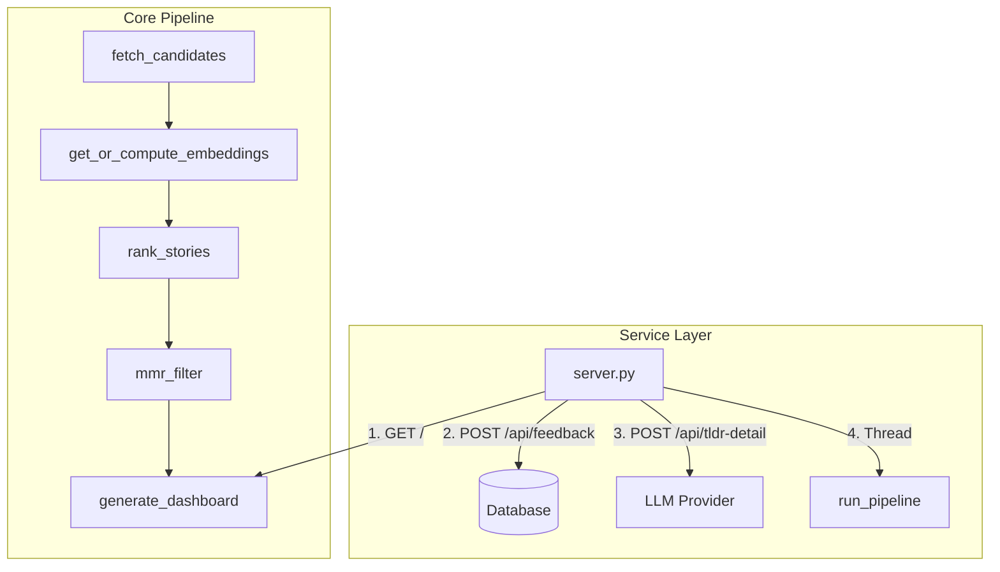

# Architecture & Design: hn-rewrite

This document outlines the architecture, core design decisions, database schema, ranking system, and maintenance instructions for the `hn-rewrite` minimalist local-first Hacker News reranking dashboard.

---

## 1. System Overview

`hn-rewrite` is a unified, resource-efficient rewrite of the original reranking system. It functions as a local-first web application that fetches stories from Hacker News and multiple RSS feeds, semantic-ranks them using a locally run sentence-embedding model and SVM, and presents them in a clean web dashboard.



---

## 2. Component Layout

The codebase consists of five primary modules:

1. **[database.py](file:///home/dev/hn-rewrite/database.py)**: Encapsulates all SQLite interactions. Manages schemas (`stories`, `embeddings`, `feedback`, `article_cache`), cascade-deletes, pruned retention rules, and automatic schema migrations. The `article_cache` table stores fetched article bodies for LLM enrichment, keyed by `story_id` with a 7-day TTL.
2. **[pipeline.py](file:///home/dev/hn-rewrite/pipeline.py)**: Orchestrates the background update sequence. Integrates RSS parsed feeds, computes text embeddings using ONNX, fits the SVM, and generates the final dashboard.
3. **[server.py](file:///home/dev/hn-rewrite/server.py)**: A multi-threaded web server serving the static dashboard, handling feedback writes, proxying detailed TLDR summaries to LLM APIs, and housing the background regeneration event thread.
4. **[templates/index.html](file:///home/dev/hn-rewrite/templates/index.html)**: Jinja2 dashboard template styled with a compact dark-theme Pico CSS layout. Includes client-side sorting, autohide transitions, and asynchronous detailed analysis rendering.
5. **[migrate_feedback.py](file:///home/dev/hn-rewrite/migrate_feedback.py)**: Imports legacy feedback data from `hn_rerank` JSON files, backfilling candidate story contents and caching embeddings.

---

## 3. Key Design Decisions

### 3.1 Normalized Schema & Data Integrity
To eliminate data redundancy, the feedback schema is strictly normalized. Metadata (`title`, `url`, `text_content`, `source`) is not duplicated in the `feedback` table. Instead, a foreign key references `stories(id)`. 
To prevent constraint violations or data loss during cleanup:
* `prune_stories` leaves feedback-associated stories intact (`id NOT IN (SELECT story_id FROM feedback)`).
* `get_all_feedback` and `get_feedback_for_training` perform a `LEFT JOIN` against `stories` to resolve attributes dynamically.

### 3.2 392-Dimensional Feature Space
Rather than mixing semantic matches with engagement counts using arbitrary manual weights, we feed them directly into the Support Vector Machine (SVM). The model trains on a **392-dimensional feature vector**:
* **`[0-383]` (384-d)**: MiniLM sentence embedding of `text_content`.
* **`[384]` (1-d)**: Normalized log points: `min(log1p(score), 8.0) / 8.0`.
* **`[385]` (1-d)**: Normalized log comment count: `min(log1p(comments), 7.0) / 7.0`.
* **`[386]` (1-d)**: Normalized log text length: `min(log1p(len), 12.0) / 12.0`.
* **`[387]` (1-d)**: Normalized engagement quality (points per hour since submission): `min(log1p(quality), 8.0) / 8.0`.
  * **Quality formula**: `score / (hours_since_submission + 1)`. Raw standalone age is not directly appended, but is utilized here.
* **`[388-391]` (4-d)**: Normalized similarity metrics to historical feedback:
  * Mean cosine similarity to upvoted story embeddings.
  * Mean cosine similarity to downvoted story embeddings.
  * Maximum cosine similarity to any upvoted story embedding.
  * Maximum cosine similarity to any downvoted story embedding.

To prevent train-test covariate shift / feature leakage, when computing the similarity features for training stories, we explicitly exclude each story itself from its class centroid/reference set (e.g. subtracting its contribution from the mean vector and setting its entry in the similarity matrix to `-1.0` before maximum reduction).

### 3.3 MMR & Surfacing Passes
Standard MMR (Maximal Marginal Relevance) strictly penalizes topic duplication based on similarity. The `mmr_filter` function iterates through candidates in SVM-rank order; for each unselected candidate, it selects that candidate and discards all subsequent candidates with cosine similarity above the threshold (`config.model.diversity_threshold`, default 0.50). The highest-SVM-scored member of each similarity cluster is always the representative — cluster selection is fully driven by the personalized SVM, not HN engagement. The final set is sorted back to match original SVM relative rank order.

After the default MMR path (which selects stories without badges), the remaining candidates are evaluated for discovery badges in a single decoration pass. Top stories selected through the default path never receive badges. The orchestrator then surfaces extra recommending slots from these decorated, remaining candidates:
* **Uncertainty/Entropy Surfacing**: We compute the Shannon Entropy of the model's predicted probability distribution (Down, Neutral, Up). The orchestrator reserves up to 3 slots *within* the count limit for the remaining candidates with the highest entropy, flagging them as `is_uncertain=True` (badge `🤔 Unsure`) to prompt active feedback.
* **Novel**: Top 15% least similar to feedback with SVM score > 0.5, flagged as `is_novel=True` (badge `✨ Novel`), up to 5 slots sorted by SVM score.
* **Similar**: Stories with high semantic match to upvotes (`closest_upvoted > 0.55`), flagged as `is_similar=True` (badge `🎯 Similar`), up to 5 slots sorted by similarity score descending.
* **Discussion-rich**: Top 10% by `comment_count` and comments > 0, flagged as `is_discussion_rich=True` (badge `💬 Talk-worthy`), up to 5 slots sorted by comment count descending.
* **High-engagement**: Top 10% by `story.score`, flagged as `is_high_engagement=True` (badge `🔥 Trending`), up to 5 slots sorted by SVM score descending.

Each discovery pass selects from the remaining decorated candidates and deduplicates against previously selected IDs before appending.

### 3.4 Client-side Autohide
When a user upvotes/downvotes a card, the UI writes the current card height inline, triggers a CSS collapse transition (`max-height: 0 !important; opacity: 0;`), and removes the card from the DOM after 400ms. The background thread updates the actual static page asynchronously.

### 3.5 Algolia Candidate Fetch Window
The live-window fetch (`pipeline.py:336`) queries the Algolia HN search API in 7 daily chunks. Each day's fetch collects up to **350 hits** (5 pages of 100, minus stories with `points <= 5`). This cap was raised from 150 to capture the majority of high-score stories on busy days; previously, stories on high-volume days could be dropped before the reranker evaluated them.

### 3.6 Comment Text Refetch on Growth
By default, a story's `text_content` (the title + self-post + top-24 comments baked into a single text blob) is fetched once and frozen along with its 384-dim embedding. During regen, only the integer fields (`score`, `comment_count`) are refreshed. To capture topic drift in active discussions, an opt-in growth-based refetch is applied:

- **Trigger condition** (all must hold): `comment_count` has grown by ≥ 30% since the last text fetch, story age is < 24h, the story has no user feedback, and the per-regen cap of 10 refetches has not been hit.
- **Action**: `refetch_story_text` calls the Algolia items API, recomposes the top-24 comment list, recomposes `text_content`, re-embeds via the ONNX MiniLM model, and persists both the new text and the new embedding. `comment_count_at_fetch` is updated to the current `comment_count` so a story will not be refetched again until it grows another 30%.
- **Safety invariants**:
  - Stories in `feedback` (1,647 voted stories) are never refetched. Their cached embeddings match the text the user has been ranking against; refetching them would silently change the ranking of voted stories.
  - Refetch is bounded to `MAX_REFETCH_PER_REGEN = 10` calls per regen, capping the Algolia rate-limit hit at ~1s.
  - If Algolia is down or the items API returns a non-story, `refetch_story_text` returns `None` and the stale data is kept. The regen does not fail.
- **Why not all stories on every regen?** Refetching changes the embedding, which changes cosine similarity to surrounding stories. For voted stories this would invalidate the training contract; for unvoted stories it would be wasteful churn. Growth-triggered refetch is a deliberate trade-off: it captures the most active discussions (where new top comments are most likely to change the topic) without affecting stories the user has already committed feedback to.

---

## 4. LLM Detailed Analysis

### 4.1 Article Body Enrichment

The `/api/tldr-detail` endpoint enriches the LLM prompt with the full article body when the story's HN-provided text is thin (<500 chars) and a URL is available.

Fetch flow (server.py `_fetch_article_body`):
1. **Cache lookup**: checks `article_cache` table (keyed by `story_id`, invalidated if URL changes).
2. **Fetch** (if cache miss): HTTP GET with Chrome 131 browser-grade headers. Single retry on 429/503 after 1s sleep.
3. **Extraction chain**: `trafilatura.extract()` first (robust against 100+ site templates); falls back to `BeautifulSoup` (strips non-content tags, prefers `<article>`/`<main>` containers).
4. **Cache write**: successful extractions are stored in `article_cache` with a 7-day TTL. Empty/failed fetches are never cached; retried on next request.

### 4.2 Prompt Construction

The detailed summary endpoint `/api/tldr-detail` proxies requests to Mistral or Groq. It compiles the story title, engagement context (points, comments, age), article body (when available), and up to **30,000 characters** of HN discussion text (~45K effective prompt size with surrounding system/user scaffolding). The prompt includes hedging rules: if engagement is low (<20 points or <5 comments), the LLM uses cautious language like "the article describes...". If the article body was unavailable, it notes that explicitly.

### 4.3 Client-side Rendering

The raw Markdown response is formatted on the fly using a robust, line-by-line parser (`parseSimpleMarkdown`) to render headers, bold text, and lists safely.

---

## 5. Maintenance Guide

### 5.1 Service Control
The server runs as a systemd user service.
```bash
# Manage the service
systemctl --user {status|start|stop|restart} hn_rewrite.service

# View active logs
journalctl --user -u hn_rewrite.service -f -n 100
```

### 5.2 Verification Suite
Ruff and Pytest are configured for standard validation.
```bash
# Run all unit tests
uv run pytest tests/

# Check styling and types
uv run ruff check .
```
