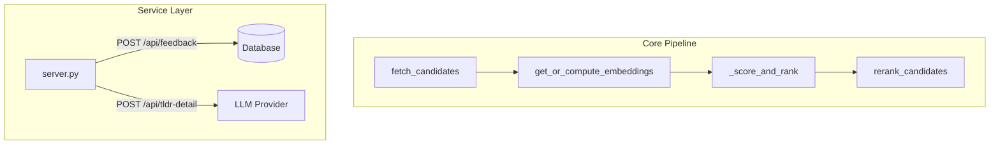

# Architecture & Design: hn-rewrite

This document outlines the architecture, core design decisions, database schema, ranking system, and maintenance instructions for the `hn-rewrite` minimalist local-first Hacker News reranking dashboard.

---

## 1. System Overview

The web card's **Why this story** expander and the TUI's `w` panel show
the active feed's ordering rule, badge signals, and up to three distinct
related upvote titles. Extra neighbours are computed only for deck stories
during attribution; all pairs share the existing centering pass. Both raw
and centered similarity floors apply, and popularity/exploration badges
retain the stricter raw floor. The optional `FeedStory.related_upvotes`
field defaults to an empty list for older servers; older clients ignore it.
Optional `ranking_factors` describes each active linear-blend component's
candidate-pool percentile and actual weight. Display names are **Nonlinear
preference model** (base/RBF SVM), **Linear preference model** (dense logistic
regression), and **Word preference model** (TF-IDF logistic regression).
The first two share feature inputs and differ in how they learn.
Helped/hurt is the sign of
`weight * (percentile - 0.5)`, ordered by its absolute value; disabled terms
are omitted. These are effects relative to a middle-of-pool component,
before deck discovery and Explore shuffle, not feature-level causal claims.
Popular hides the preference decomposition because its order uses gravity.
Decks without an active blend have no component breakdown.
The original single attribution stays available. Similarities are evidence,
not causal explanations of the complete model score. Opening the panel
does not fetch content or call an LLM; cold or weak matches are explicitly
reported as unavailable. Ranking, votes, and database schema are unchanged.

`hn-rewrite` is a unified, resource-efficient rewrite of the original reranking system. It functions as a local-first web application that fetches stories from Hacker News and multiple RSS feeds, semantic-ranks them using a locally run sentence-embedding model and SVM, and presents them in a clean web dashboard.

```mermaid
graph TD
    subgraph Core Pipeline
        A[fetch_candidates] --> B[get_or_compute_embeddings]
        B --> C[_score_and_rank]
        C --> D[rerank_candidates]
    end

    subgraph Service Layer
        F[server.py] -->|POST /api/feedback| G[(Database)]
        F -->|POST /api/tldr-detail| H[LLM Provider]
    end
```

---

## 2. Component Layout

The codebase consists of six primary modules plus the `pipeline/` package:

1. **[database.py](database.py)**: Encapsulates all SQLite interactions. Manages schemas (`stories`, `embeddings`, `feedback`), cascade-deletes, pruned retention rules, and automatic schema migrations. Staging raw inputs directly inside `stories` (`self_text`, `top_comments`, `article_body`) permits on-the-fly text composition and sync-detection. The legacy `article_cache` table is dropped and migrated directly.
2. **[pipeline/](pipeline/)** — package split from the original `pipeline.py`:
   - **[pipeline/__init__.py](pipeline/__init__.py)** — Conductor: candidate orchestration (`fetch_candidates`, `fetch_candidates_only`), cold-deck assembly (`build_cold_deck`), per-user dashboard entry point (`fast_rerank_for_user`), dedup filter (`_apply_dedup_to_ranked`). Re-exports the full flat namespace so all `from pipeline import X` callers remain unchanged.
   - **[pipeline/candidate_cache.py](pipeline/candidate_cache.py)** — Process-wide `CandidatePool` cache (stories + embedding matrix, masked per user for feedback exclusion) shared across `build_cold_deck`/`fast_rerank_for_user`; see §3.3.1.
   - **[pipeline/config.py](pipeline/config.py)** — Configuration dataclasses (`Config`, `ModelConfig`, `RssConfig`), TOML loader (`Config.load`), config overlay helper, archive/CH source constants, `is_hn_source`.
   - **[pipeline/ranking.py](pipeline/ranking.py)** — Text utilities (`clean_text`, `compose_story_text`, `story_embedding_text`), comment extraction/selection, ONNX `Embedder`, embedding cache (`get_or_compute_embeddings`), SVM model cache, similarity kernels, feature assembly, `_score_and_rank`, `mmr_filter` (eval only), `rerank_candidates` / `assemble_window_deck` (time-window views and badges), `serve_window`, `RankedStory`/`WindowDeck`/`RankTrace` dataclasses.
   - **[pipeline/enrichment.py](pipeline/enrichment.py)** — RSS feed parsing, Algolia fallback fetch (`fetch_story`), HN/Reddit/LessWrong comment prewarm, Reddit topfeed builders, article-body fetch pipeline. Holds the 3 late `from server import ...` sites that dissolve the pipeline↔server import cycle.
   - **[pipeline/render.py](pipeline/render.py)** — View dataclasses (`BadgeView`, `TabView`, `DashboardCardView`, etc.), the `source_label` Jinja2 filter, the feed JSON (`build_feed`) and dashboard HTML generation (`generate_dashboard_bytes`), badge/card/tab builders.
3. **[server.py](server.py)**: A Flask-routed, threaded local web service serving the dashboard, handling feedback writes, proxying detailed TLDR summaries to LLM APIs, and housing the background regeneration event thread. The `Handler` class owns runtime state (per-user `DeckState` cache, dashboard versions, the bounded warm scheduler, limiter state), while Flask owns all HTTP routing, request parsing, cookies, redirects, CORS/options, and response construction.
4. **[templates/index.html](templates/index.html)**: Jinja2 dashboard template styled with a terminal-theme dark Pico CSS layout (`data-theme="dark"`, green-phosphor accents, system mono stack). Presents a Tinder-style single-card deck with keyboard voting, a capped preloaded queue, and asynchronous TLDR rendering that auto-expands for the active story.
5. **[migrate_feedback.py](migrate_feedback.py)**: Imports legacy feedback data from `hn_rerank` JSON files, backfilling candidate story contents and caching embeddings.
6. **[scripts/seed_hn_from_clickhouse.py](scripts/seed_hn_from_clickhouse.py)** (primary) / **[scripts/seed_hn_from_bq.py](scripts/seed_hn_from_bq.py)** (backup): Archive seeders. ClickHouse queries the public Playground over HTTP (no auth) against `hackernews_history FINAL` (defaults: 12 months, score ≥ 200); BigQuery uses the authenticated `bq` CLI against `bigquery-public-data.hacker_news.full`. Both import common logic from `_seed_common`, hydrate selected comments in bulk from ClickHouse, and compute embeddings without fetching article bodies. ClickHouse's explicit `--reconcile` mode safely keeps every recent HN row as `hn` (including newly discovered rows) and promotes qualifying aged HN rows to `ch_seed`; it never changes feedback or `bq_seed` rows.

---

## 3. Key Design Decisions

### 3.1 Normalized Schema & Data Integrity
To eliminate data redundancy, the feedback schema is strictly normalized. Metadata (`title`, `url`, `text_content`, `source`) is not duplicated in the `feedback` table. Instead, a foreign key references `stories(id)`. 
To prevent constraint violations or data loss during cleanup:
* `prune_stories` leaves feedback-associated stories intact (`id NOT IN (SELECT story_id FROM feedback)`). It is dormant — nothing in the live pipeline calls it; only tests exercise it today.
* `get_all_feedback` and `get_feedback_for_training` perform a `LEFT JOIN` against `stories` to resolve attributes dynamically.

HN comment hydration writes an authoritative snapshot through
`upsert_story(..., comments_authoritative=True)`: selected comments and
`comment_count_at_fetch` are replaced together, even when fresh text is shorter.
Routine ingestion preserves comments with a higher fetched-count marker and
otherwise prefers longer text; a retained comment snapshot retains its marker.
Failed or empty HN comment fetches preserve existing comments. Tap hydration
returns the persisted story; bulk hydration embeds the persisted story.
`comment_count_at_fetch` is 0 until comments were actually fetched (new CH
live-window rows start at 0). A regen prewarm that fetches a tree with nothing
usable (one-word replies) records the count with empty `top_comments`, and
`_needs_hn_prewarm` then waits for a new comment before querying it again.
Prewarm and the live-window retry stop on non-transient ClickHouse errors
(`ch_client.is_transient_error`; quota errors arrive as HTTP 500 `Code: 201`).
A pointer-thread follow re-reads the row after its fetch and writes on top of
it, or skips the write when a hydration replaced the pointer meanwhile.
`comment_count` remains an upwards-only observation, separate from the snapshot.
The preservation read, merge and UPSERT run in one `BEGIN IMMEDIATE`
transaction. SQLite reserves the writer before the read, so pooled connections
cannot overwrite a snapshot hydrated between that read and its write.

RSS URL hashes retain their existing IDs. An atomic UPSERT guard rejects a
conflicting URL on a non-positive story ID (`StoryIdentityConflict`). Ordinary
RSS and Reddit ingestion log and skip conflicts; rejected entries are excluded
from returned candidates, Reddit snapshots and prewarm. Existing story identity
and feedback remain intact. This detects collisions; it does not allocate an
alternative ID or repair historical collisions.
RSS/Atom parsed date tuples are converted as UTC, independently of the host's
local timezone.

### 3.2 Embedding Model & Feature Space

#### Embedding Model Choice

We evaluated multiple embedding models for topic-level matching:

| Model | Dims | Context | Mean Sim (unrelated) | Speed | Verdict |
|-------|------|---------|---------------------|-------|---------|
| MiniLM | 384 | 256 | **0.091** | **6.6ms** | **Best** ✅ |
| BGE-small | 384 | 512 | 0.385 | ~5ms | Good |
| Nomic | 768 | 2048 | 0.381 | 34ms | Slow |
| BGE-base | 768 | 512 | 0.480 | 28ms | Moderate |
| Jina v2-small | 512 | 512 | 0.646 | 5ms | Poor ❌ |

**Key finding**: MiniLM has the best discrimination (0.091 mean similarity for unrelated texts). Longer context (512+ tokens) actually hurts discrimination by adding noise. The 256-token limit is optimal — it captures title + first paragraph without noise.

**Production embedding input**: The current production encoder is configured in `config.toml` as `mxbai-embed-xsmall-v1|mean|norm|4096` (384 dimensions, 4096-token budget). It embeds a single composed text string, centralized in `story_embedding_text()`. For normal rows this preserves the stored `text_content` exactly, keeping existing cache hashes stable; if `text_content` is empty, it recomposes from `title`, `self_text`, `article_body`, and `top_comments` as a recovery fallback. The MiniLM results in the table above are a historical benchmark, not the live encoder.

**Embedding model contract**: `setup_model.py` pins the HF revision (`MODEL_REVISION`) and records a `model_manifest.json` baseline (sha256 of the six model files) in the model dir; the first run grandfathers existing bytes. `Embedder` init re-verifies the dir against the manifest — on mismatch it logs `embedding_model_changed` and keeps serving stored vectors (warn-and-serve; setup itself refuses to re-baseline without explicit manifest deletion). The `embeddings` table carries additive `model_sha`/`dim` provenance on new rows, never in the match predicate, and rows whose byte length disagrees with the live dim are treated as misses instead of crashing the rerank (`database.py:_decode_embedding_blob`). Net effect: a swapped model dir is a loud log line, not silent garbage or a dead dashboard — and no rollout re-encodes stored rows.

**Field-level embedding candidate**: The eval script can test a slower field-level mode that embeds `title`, `self_text`, `article_body`, and `top_comments` separately, then averages the non-empty field vectors. This should not replace production without a new embedding `model_version`, because switching it would intentionally invalidate the existing embedding cache and change feedback-story vectors.

#### 394-Dimensional Production SVM Feature Vector

The production SVM trains on a **394-dimensional feature vector**:
* **`[0-383]` (384-d)**: The configured 384-d sentence embedding from the production composed text.
* **`[384]` (1-d)**: Normalized log text length: `min(log1p(len), 12.0) / 12.0`.
* **`[385-388]` (4-d)**: Similarity metrics to historical feedback:
  * Mean cosine similarity to the top-k upvoted story embeddings (`knn_k=10`, LOOCV for training).
  * Mean cosine similarity to the top-k downvoted story embeddings (`knn_k=10`, LOOCV for training).
  * Maximum cosine similarity to any upvoted story embedding.
  * Maximum cosine similarity to any downvoted story embedding.
* **`[389]` (1-d)**: Maximum cosine similarity to a 4-cluster k-means summary of the user's upvoted feedback. The runtime fits those positive-cluster centers once per render and reuses them for both feedback rows and candidate rows.
* **`[390-393]` (4-d)**: 4-binary source category one-hot: `is_hn_live`, `is_archive`, `is_reddit`, `is_rss` (from `source_category_onehot()` in `pipeline/ranking.py`). "Other" sources (Slashdot without the `rss_` prefix, Tildes, etc.) get the all-zero vector and inherit the implicit "other" prior from absence of all four bits. Bumped from a single `is_hn` flag in 2026-06-28 so the model can learn distinct per-source priors — archive candidates (`bq_seed`/`ch_seed`) used to share a feature bit with live HN, so the SVM had no way to demote the ~70%-of-pool archive contamination.

The SVM deliberately excludes engagement metadata: score, comment count, HN quality, comment-to-score ratio, score velocity, comment velocity. These features produced inflated archive-wide offline metrics and worse 30-day held-out ranking than the semantic/text/similarity feature set. The 4-binary source features are kept because the model needs the per-source prior to handle the heterogeneous candidate pool, and the `strip_hn` formula in the eval (zeroing these features at inference) gives a clean ablation: ~0.38 NDCG@100 lift comes from the source features, ~0.22 NDCG@100 comes from the rest.

To prevent train-test covariate shift / feature leakage, when computing the similarity features for training stories, we explicitly exclude each story itself from its class reference set (using a self-exclusion mask to set self-similarity below the valid cosine range for $k$-NN mean calculations, and setting its entry in the similarity matrix to `-1.0` before maximum reduction).

To avoid outlier features (like fresh stories having extremely large negative z-scores like `-4.8` for points/comments, or similarity features having blown-up z-scores due to low training variance) from completely dominating the SVM ranking decision, the standard-scaled metadata features are clipped to the range `[-2.5, 2.5]`. This z-score clipping significantly improves raw ranking metrics (Raw NDCG@100 from `0.720` to `0.738`, Raw NDCG@200 from `0.691` to `0.706`) and prevents model overfitting.

**Raw embeddings must not be standard-scaled.** The configured 384-d vectors are L2-normalized — each dimension is on the same unit scale by construction. StandardScaler is applied only to metadata columns (from `emb_dim:` onward in the feature vector). Scaling raw embedding dimensions independently breaks their cosine similarity structure and collapses ranking performance, because a dimension with small-magnitude signal across the training set gets inflated to the same variance as a dimension with genuine semantic signal.

### 3.3 SVM Personalization
When both upvote and downvote feedback pass the dual gate, the runtime trains a per-user `SVC` with `probability=False` and ranks candidates by the normalized one-vs-rest up-class margin:

$$\text{score} = \text{minmax01}(f_{\text{up}}(x))$$

This avoids scikit-learn's deprecated and slower `SVC(probability=True)` calibration path. The dashboard still computes approximate probability-like fields by applying a softmax over the multi-class decision margins, but ranking itself is driven by the raw up-margin ordering. Because these softmax values are not calibrated probabilities, the UI does not show exact percentages; it uses them only for uncertainty entropy to select `🤔 Unsure` candidates. Card-left color is a smooth blue→red gradient driven by the card's rank position in the current render's sorted-by-score order (rank 1 = blue, rank N = red, evenly distributed), computed client-side from `data-score` values and applied to the border-left plus a 4% tinted background. Rank-percentile mapping (rather than linear-in-score) ensures visually distinguishable colors even when the score distribution clusters — the gradient travels with each card when the user sorts by date.

**Current hyperparameters** (30-pt re-eval on the live tree, 2026-09-08,
`6c683cf`): `C=0.1`, `gamma=0.03`, `kernel=rbf`, `neutral_weight=0.0`,
`positive_cluster_k=4`. The old `C=0.5` plateau (measured 2026-06-28 on the
pre-4-binary-source feature set) is gone on current code — `C=0.5` is
all-negative and `gamma=0.1` degenerate. `config.toml` pins `svm_c = 0.1`
(the `Config` dataclass default is 0.2; do not read it as production).
The final-queue (post-discovery-passes) lift is even larger: linear 0.493 → RBF 0.596 = +0.10.

#### Exact Precomputed RBF Inference

Production uses an exact `SVC(kernel="precomputed")` path behind
`model.svm_precomputed_enabled`. Training materializes the feedback-by-feedback
RBF kernel, while inference constructs candidate kernels in configurable
512-row chunks (`model.svm_precomputed_chunk_size`) so the full
candidate-by-feedback matrix is never resident. The fallback remains the
original libsvm RBF path. On the 2026-07-12 live shape (7,910 candidates and
3,347 feedback rows), chunked inference reduced the decision stage from 5.83s
to 0.58s with exact top-40 ordering and `3.12e-7` maximum decision drift. Peak
process RSS increased from 730MiB to 834MiB; the host had 2.6GiB available.

#### Per-User SVM Model Cache (Schema-Versioned)

The trained classifier/scaler/cluster-centers tuple is cached in-process in
`_MODEL_CACHE` (a lock-guarded `cachetools.LRUCache`, max 20 active entries by
default) keyed on `(user_id, training_signature, _MODEL_SCHEMA_VERSION)`.
The signature includes feedback IDs/actions/update timestamps, current
feedback embedding bytes and encoder version, ordered training labels/text
lengths/sources, and model configuration. Enrichment or source reclassification
can therefore invalidate a fitted model without a new vote. Lookup occurs
after feedback embedding refresh but before LOOCV feature construction;
unchanged training inputs still reuse the fitted model. The schema version
is bumped whenever feature or classifier representation changes.
`_MODEL_SCHEMA_VERSION = 4` also invalidates models built before singleton
feedback self-exclusion was corrected.

#### Dual-Gate SVM Activation

The SVM trains only when **both** the upvote and downvote classes have enough examples. This prevents the SVM from over-fitting to a sparse, incoherent down class.

Configuration (`Config` dataclass defaults in `pipeline/config.py`, not currently overridden in `config.toml`):
- `min_up_for_svm = 20`
- `min_down_for_svm = 20`

The soft blend ramp uses `n_min = min(n_up, n_down)` as its basis:
$$\alpha = \text{clip}\left(\frac{n_{\min} - 20}{60},\ 0,\ 1\right)$$

The blend starts when both classes have at least 20 feedback entries and reaches full SVM influence when both classes have at least 80 entries. A user with 50 upvotes but only 5 downvotes sees pure tier-2 (centroid-diff) regardless of total feedback count.

#### Joined Classifier Challenger and Live Interleaving (opt-in)

`model.classifier = "joined_logistic"` (`pipeline/joined_classifier.py`)
replaces the RBF SVM and the linear blend with one logistic regression
(C `joined_c` = 4) on the SVM's scaled training rows, the embedding block
weighted by sqrt(`joined_embedding_weight` = 16), all numeric columns times
`joined_numeric_scale` = sqrt(0.1/4), joined to hashed TF-IDF words (terms
in at least two training stories). It ranks by min-max P(up) - P(down) and
keeps the fitted probabilities for Explore's Unsure entropy. A vote set
missing a class fails the fit and falls back to tiers 1-2.
`joined_features = "no_metadata"` drops the ten meta columns. These are
shortlist candidates #2 and #4 of the 2026-10-07 offline study
(docs/evaluations/model-ablation-20261007/FEATURE-REMOVALS.md); the
probabilities equal the offline adapter's exactly
(`tests/test_joined_classifier.py`). The tier blend is unchanged.

Live, the classifier serves only as an interleaving challenger. For users
in `interleave_user_ids` (empty by default), each warm also scores the
candidates with every arm in `interleave_arms` (`joined_all`,
`joined_no_metadata`), each in its own model-cache entry, reusing
production's feature build (`SharedFeatures`) and warm-starting from its
previous fit. Each window's Recommended view first holds every arm's top
32 stories; after deduplication and HN-dupe canonicalization,
`draft_recommended` team-drafts the survivors (`pipeline/interleave.py`):
every round visits production and the challengers in a fresh random order,
and each adds its best story not already listed. Drafting after those drops
keeps the served turns balanced (drafting before them left 3/2/7 splits in
the first live deck). Cards keep production's score, probabilities and
explanation; only `RankedStory.arm` records who drafted them, and clients
never see it. Popular and Explore are unchanged, apart from Explore
excluding the interleaved Recommended stories. If any challenger fails to
fit, that deck is production's alone (`interleave=off` in the rank trace).
Each challenger adds a full feature build and fit to the warm
(`challenger_<arm>_ms`).

Before the deck can be served, the warm stores each window's Recommended
story IDs and arms under the deck version in the additive STRICT
`interleave_decks` table. `scripts/interleave_report.py` credits a vote to
an arm when the user's last impression of the story before the vote
(`interaction_events`) was in a Recommended view of a stored version and
window. It then compares each challenger with production: a sign test of
upvotes per deck version and a two-proportion test of credited upvote
rates, Bonferroni-adjusted. `scripts/simulate_interleaving.py` replays the
same procedure on judged offline blocks to estimate power.

### 3.4 Selection & Surfacing Passes
The default dashboard selection is direct relevance order: `rerank_candidates` takes the top ranked stories after `_score_and_rank` and does not remove near-duplicates. MMR remains available behind `config.model.enable_mmr`; when enabled, `mmr_filter` iterates through candidates in SVM-rank order and discards subsequent candidates with cosine similarity above `config.model.diversity_threshold` (default 0.75).

**Linear blend (`config.model.linear_blend_enabled`; code default off, `config.toml` on since 2026-09-29).** `pipeline/linear_blend.py`: after `_score_and_rank` computes the tier-blended score for a voter whose SVM fit, the final score becomes 0.5 x production + 0.2 x dense logistic regression (`linear_blend_dense_weight`; fit on the SVM's scaled feature rows, C `linear_blend_dense_c` 0.1) + 0.3 x TF-IDF logistic regression (`linear_blend_tfidf_weight`; word 1-2 grams over domain/source tokens, title and the first 5,000 characters of `text_content`, C `linear_blend_tfidf_c` 4), each as an average-rank percentile of P(up) - P(down). The dense and TF-IDF weights are multiplied by the SVM tier's weight (`alpha_2 * alpha_3`, `linear_blend_ramp`), so the blend ramps in with the SVM past the 20 up / 20 down gate instead of taking half the ranking there; a heavy voter gets the full weights. The models are fit with the SVM on a cache miss and cached in `linear_blend._CACHE`, one fit per user under its latest feedback signature (a missing entry forces the SVM refit too); that fit is also the next fit's warm start (`_LATEST`, dropped with the cache entry). Hashed TF-IDF count rows are cached per (story, text) in `_ROWS` (32k rows, ~110 MB; sized above the candidate caps plus the voters' training stories). A failed fit or score logs and keeps the production score. `scripts/eval_ranker_variants.py` shares `percentile_scores`, `tfidf_text` and the vectorizer with it. Its `production` variant runs whatever the config says (the blend, from `config.toml`); `prodlr`, `produd`, `stack` and the SVM sweeps use production without the blend, and `prodlr`'s default dense logreg is the live one (a production run with all blend weight on it, `linear_blend_ramp=false`), so `prodlr[svm_c=4;lr_weight=0.2;tfidf_weight=0.3]` equals the live blend for a heavy voter (`tests/test_eval_ranker_variants.py`). Other `lr_target`s, half-lives and skipped votes use the eval's own logreg (fewer meta columns, C `linear_blend_dense_c`).

**Side-by-side embeddings (`config.model.side_embedding_enabled`; default off, on in `config.toml` and live since 2026-10-02).** `pipeline/side_embeddings.py`: when on, `_score_and_rank` trains and scores the SVM and the linear blend on each story's stored vector joined with a second model's vector (embeddinggemma-300m, 128 tokens, task prefix `task: classification | query: `), each part scaled 1/sqrt(2), the layout the evaluation replay used (2026-10-02: AUC +0.011, top-12 upvotes +0.056 over 12 time blocks; FINDINGS.md). The score context (closest upvote and its index, closest down/neutral, upvote vectors) stays on the stored vectors, so "Because you upvoted", Explore and dedup thresholds keep their meaning. Side vectors live in the additive `side_embeddings` table (`story_id, model_version` key, matched on the same text hash as `embeddings`), are read through an in-process cache (`SideVectorCache`, one DB read per story text) and are written only by `scripts/embed_side_vectors.py` (voted stories first, then candidates newest first; 0.22 s/story on the VPS on 2 niced threads). A story without one gets a zero side part; below `side_embedding_min_coverage` (0.98) of candidates plus feedback the rerank uses the stored vectors alone (trace label `side_embeddings=off`, warning `side_embeddings_low_coverage`). The model directory is a Hugging Face snapshot (`side_embedding_model_dir`, tokenizer files plus `onnx/model.onnx`).

#### 3.4.1 Cross-source URL & title dedup
The same article can arrive from multiple sources — two HN submissions of the same Verge article (the well-known "[dupe]" pattern), an HN story linking a Reddit thread plus a Reddit RSS feed catching the same thread, etc. Without explicit handling, the same URL would render twice in the deck. Cross-source dedup lives in `dedup.py` and runs at the very end of `fast_rerank_for_user` (after `rerank_candidates`), so it covers all primary-ranked and extra-slot stories, including ones that arrived in different regen cycles.

* **URL normalization** (`dedup.normalize_url`): strips scheme, lowercases host, drops `www.`, normalizes trailing slash, drops ~30 known tracking query parameters (`utm_*`, `fbclid`, `gclid`, `ref`, `ref_src`, etc.), drops fragment, sorts remaining query params. Idempotent and total.
* **Source preference** (`_source_preference_rank`): within a duplicate bucket, the winner is the highest-preference source: HN live > HN archive > Reddit RSS > LessWrong RSS > other RSS. Same-source collisions tiebreak on `score desc`, then `id asc` for determinism.
* **Feedback URL exclusion**: any story whose normalized URL matches a feedback record's normalized URL is dropped, but **only for feedback actions in `dedup_exclude_actions`** (default `("up", "neutral")` per design call — a downvote on one version of an article is intentionally NOT propagated to the alternate source, since the user may still want to see the HN version of an article whose Reddit thread they disliked).

There is no title-fuzzy dedup layer — `dedup.py` matches only on normalized
URL. (An earlier draft of this doc described a SimHash-based title-fuzzy
pass gated by `dedup_title_fuzzy_enabled`/`dedup_title_fuzzy_hamming`/
`require_same_domain_for_fuzzy`; none of those knobs, nor a `canonical_domain`
helper, exist in the source. Removed here rather than left as aspirational.)

The fetch path no longer does any URL dedup (the old within-fetch-run block was removed; see `pipeline.py` comment at the section that used to hold it). The user's `feedback` URLs still flow into `fetch_rss_feeds.exclude_urls` so we don't re-pull RSS entries the user has voted on — that is a network-cost guard, not a dedup policy.

Configurable via `[hn_rewrite.model] dedup_*` knobs in `config.toml`; defaults are conservative (URL dedup on).

**Logging.** The `dedup` module emits a single INFO summary line per call (key=value, grep-friendly: `dedup user_id=42 in=75 out=57 suppressed=18 url_dups=4 fb_url=2 title_fuzzy=off ...`) and one DEBUG line per suppressed story (`dedup-suppress user_id=42 reason=url_dup dropped_id=… kept_id=…`). INFO is on by default in the server; switch the `dedup` logger to DEBUG to see per-story forensics: `logging.getLogger("dedup").setLevel(logging.DEBUG)`.

#### 3.4.2 Reddit RSS rate limiting
Reddit's unauthenticated IP rate limit is approximately 1 request per 2 seconds. Two code paths hit Reddit: (a) the subreddit topfeed path in `pipeline.fetch_rss_feeds` (~50 feeds per regen cycle) and (b) the per-story comments-RSS path in `server._fetch_reddit_rss_context` (called from `prewarm_reddit_top_stories`, ~50 stories per cycle, plus the lazy tldr-detail fallback). Both paths were issued back-to-back with no spacing and no 429 handling — measured at 110 429s in 15 minutes (109 from path a, 99 from path b, observed in the 30-min window before this fix).

A shared `RedditRateLimiter` singleton in `reddit_limiter.py` is consulted by both paths before each Reddit request:
* **Inter-request delay** (`INTER_REQUEST_DELAY = 2.0`): `acquire()` blocks until `time.monotonic() >= _next_allowed_at`. On success, `_next_allowed_at` is bumped to `now + 2.0`; on 429, to `now + backoff`.
* **Exponential backoff** on 429: `BACKOFF = (2, 4, 8, 16, 32, 60)` seconds, capped at 60s. Index by `min(_consecutive_429 - 1, len(BACKOFF) - 1)`. Honors `Retry-After` header when present (the server.py path passes `_parse_retry_after`; the pipeline.py topfeed path uses the backoff table since the headers aren't surfaced through `fetch_with_urllib_fallback`).
* **Circuit breaker** (`MAX_CONSECUTIVE_429 = 3`): after 3 consecutive 429s, `acquire()` returns `False` immediately (no sleep) and the caller's loop short-circuits — remaining Reddit feeds this regen are skipped; next regen the limiter resets (state persists in-process across cycles but is wiped on server restart).
* **State persists** across regen cycles: cumulative backoff is the intent (consecutive 429s across regens continue to escalate the delay).
* **One bucket for all of reddit.com**: Reddit's limit is IP-wide, not per-subreddit, so a single shared gate is correct. A hot subreddit's 429 slows down unrelated subreddits — that's the right behavior since they'd 429 anyway.
* **Half-open probe**: when the circuit opens, `acquire()` admits one probe request every `CIRCUIT_COOLDOWN` (default 300s). A successful probe clears the circuit; a failed probe resets the cooldown clock. Prevents the limiter from being stuck open until service restart.
* **Jitter**: `on_success()` adds `random.uniform(-JITTER_SECONDS, +JITTER_SECONDS)` (default ±0.5s) to `INTER_REQUEST_DELAY` to break robotic timing patterns. Jitter applies only to success; the 429 backoff sequence is unchanged.
* **Server-driven 429 backoff (2026-06-28)**: when Reddit sends `x-ratelimit-reset` on a 429, the limiter uses that value (capped at 120s) as the next delay instead of the hardcoded BACKOFF table. Precedence: `x-ratelimit-reset` > `Retry-After` > BACKOFF table. Matches the server's actual reset window and avoids the 2s-too-short backoff that re-triggers 429s in tight loops.
* **Thread-safe**: all state mutations are guarded by a `threading.Lock` because the queue worker thread (driving scheduled fetches) and the HTTP request threads (driving on-demand fetches) now both call the limiter concurrently. The lock is released during `asyncio.sleep` in `acquire()` so other threads can proceed.
* **Slot-reservation under the lock (2026-06-28)**: `acquire()` reserves the next slot by bumping `_next_allowed_at = max(now, _next_allowed_at) + INTER_REQUEST_DELAY + jitter` *inside* the lock. The next caller entering the lock immediately after sees the bumped value and staggers itself correctly, even when it's a different OS thread (queue worker vs HTTP handler on a TLDR click). Previously `_next_allowed_at` was advanced only in `on_success`/`on_429` (post-HTTP), so two concurrent `acquire()` callers both saw the same stale value, both slept 0, and both fired HTTP simultaneously — re-introducing the burst pattern that originally caused the 2026-06-28 37-consecutive-429s incident. The invariant is asserted by `test_concurrent_acquire_staggers_reservations` in `tests/test_reddit_limiter.py`. `on_success()` no longer advances `_next_allowed_at` — it only resets circuit state. `on_429()` uses `max(self._next_allowed_at, now + delay)` to push the next slot further out, but never earlier than what `acquire()` already reserved, so callers mid-`asyncio.sleep` are not invalidated. Companion change in `pipeline.py`: `build_reddit_prewarm_factories` factory used to call `acquire()` redundantly (the inner `_fetch_reddit_rss_context → acquire` is the actual rate-limit gate). Replaced the outer call with a cheap `reddit_limiter.circuit_open` property check to short-circuit early without reserving a second slot per HTTP.
* **Fetch queue (coordinator refactor 2026-06-28; bounded two-phase flow 2026-06-29)**: Reddit fetches are scheduled through a `RedditFetchQueue` singleton that spreads them across the regen cycle instead of bursting them at the start. The current flow runs topfeed first, persists its rows, then hydrates a bounded set of missing comment threads from that same topfeed output:
  - **Phase 1 — topfeed (fixed 50s stride, 41 tasks):** All 41 subreddit topfeeds are enqueued via `queue.enqueue_spread(n, base_at, kind=TOPFEED, factories, window_seconds=2100.0)` and drained with `wait_until_empty(timeout=5400.0)`. The factory writes parsed `Story` rows to `reddit_feed_cache` in the order Reddit returned them (hot/score-desc; RSS doesn't carry `score` so the order is the only signal).
  - **Phase 1.5 — persist:** cached topfeed stories are upserted before prewarm factories are built. This is required because prewarm factories load the story row from SQLite.
  - **Phase 2 — prewarm (configurable stride, capped at 80 tasks by default):** Read `reddit_feed_cache` for each `reddit_feed_url`; consider the first `config.reddit_prewarm_top_per_sub` (default 10) stories per sub, skip rows whose DB copy already has `top_comments`, and stop at `config.reddit_prewarm_max_per_cycle` (default 80). Per-post RSS fetches for their comments are enqueued and drained with a 90-min timeout. At the default 30s stride, the capped phase is about 40 minutes before retry/backoff overhead. The phase is skipped when `prewarm_reddit_full=False`, the cache is empty, or the cap is non-positive.
  - **Stride knobs:** `reddit_min_fetch_spacing_seconds` (default 30.0s) sets the prewarm phase's per-task stride; the topfeed phase uses a hardcoded 50s stride (one subreddit per fetch at the limiter's natural 2s+jitter cadence, but the queue spreads them out at 50s for 429-backoff headroom).
  - **Why two phases instead of interleave?** The prewarm IDs depend on phase 1's output (topfeed writes to cache; phase 2 reads from cache). True interleaving on a single shared window was the 2026-06-28 design, but it had to do a DB prewarm-ID query before any fetches, so brand-new topfeed stories from the current cycle missed their prewarm.
  - **Bounded work:** `reddit_prewarm_max_per_cycle` replaced the attempted 410-task full sweep because hourly or 3-6h refresh intervals cannot reliably absorb 410 per-post Reddit RSS requests plus 41 topfeeds under current rate limits.
  - **`urllib_fetch` HTTPError handling (2026-06-29):** the `http_fetch.urllib_fetch` helper catches `urllib.error.HTTPError` and returns `(e.code, "")` instead of raising. `URLError` (network/DNS/timeout) still propagates. Without this, an IP block on Reddit returned unhandled `HTTPError` to the queue worker's broad `except Exception`, which logged and dropped the task — the worker kept dequeuing topfeeds that all immediately failed, and the live service went 25+ min with zero Reddit fetches. The 5-test `tests/test_http_fetch.py` suite covers 200/403/429/500/URLError paths.
* **`?t=week&limit=25` consistency (2026-06-29)**: All 41 Reddit topfeed URLs in `config.toml` use the same `top/.rss?t=week&limit=25` pattern. 28 URLs were converted from 2 `?t=month` variants and 26 bare `r/X/.rss` (which is the "new" sort, not "top of the week"). This unifies the content window so all 41 topfeeds return "top of the week" stories of consistent freshness. No code change — pure config.
* **New Reddit stories this cycle** are eligible for same-cycle prewarm only after phase 1.5 persists them. Stories that fit within the per-cycle cap can land with `top_comments` before the regen completes; uncapped tail stories remain usable from feed self text and still hydrate on `/api/tldr-detail` when opened.

Logging: a WARNING per 429 (`reddit_limiter 429 consecutive=N next_delay=Ns`), an INFO when the loop short-circuits (`fetch_rss_feeds: reddit circuit open, skipping remaining N feeds` / `prewarm_reddit: circuit open, skipping remaining N stories`), and an INFO when the half-open probe is admitted / when a successful probe closes the circuit. The state attributes (`_next_allowed_at`, `_consecutive_429`, `_circuit_opened_at`, `_probing`) are reset by an autouse `tests/conftest.py` fixture between tests to prevent pollution; tests that exercise the limiter run with a fake monotonic clock and a recording-but-no-op `asyncio.sleep`.

Trade-off: ~100s added per regen (50 feeds × 2s), well within the 3h cycle budget.

#### 3.4.3 Reddit topfeed RSS cache

Added 2026-06-28. An in-memory `RedditFeedCache` singleton in
`reddit_feed_cache.py` sits in front of the limiter in the Reddit topfeed factories:
before each Reddit feed's `reddit_limiter.acquire()`, the cache is queried
by feed URL.  On hit (`list[Story]` within TTL), the stories are appended
directly to `feed_results` and the loop continues to the next feed — no
HTTP request, no limiter consultation, no 429 risk.  On miss, the normal
fetch + limiter flow runs and the result is stored for `TTL_SECONDS=14400`
(4h). The cache uses a lock-guarded `cachetools.TTLCache`, so expiry and
LRU overflow are handled by a standard library object while the wrapper keeps
copy-in/copy-out story-list semantics and hit/miss counters.

**Impact**: topfeed HTTP requests are bounded to about 41 per 4-hour cache
window, plus at most `reddit_prewarm_max_per_cycle` per-post comment RSS
requests when Reddit prewarm is enabled. Misses occur when the feed list
expires or on server restart.

**Design constants**: `TTL_SECONDS=14400` (4h, aligned with the default regen cadence),
`MAX_ENTRIES=100` (lazy-eviction on overflow by insertion timestamp).
`get()` logs one DEBUG line per query (`hit|miss|expired feed=<url>
age=<s>`).  `reset()` clears all entries and counters — wired into the
`conftest.py` autouse `reset_reddit_singletons` fixture (renamed from
`reset_reddit_limiter` to cover both limiter and cache).

The per-story comments-RSS path (server.py `_fetch_reddit_rss_context`,
called from `prewarm_reddit_top_stories`) does NOT use the cache — each
story's comment RSS is fetched at most once per lifetime (prewarm filter
is `not s.top_comments`), so a cache would have near-zero hit rate.

#### 3.4.4 Arctic Shift as the Reddit source

Reddit retires RSS on 2026-11-13 and already answers anonymous `.json`
and HTML with 403. `reddit_source = "arctic_shift"` (default `"rss"`)
reads both Reddit paths from the Arctic Shift archive instead
(`arctic_shift.py`; free, no key, at most a couple of requests/s). The
subreddit list is still the `/r//top/.rss?t=…&limit=…` URLs in
`rss.feeds`; `reddit_top_query` reads the subreddit, window and limit
from them.

* **Top feeds** (`_fetch_arctic_topfeed`): search returns every post in
  the window sorted by time, paged on `created_utc`; `top_posts` ranks by
  archived score locally, loads full records for the leaders, and keeps
  the top `limit`. Stories are keyed by permalink exactly as RSS entries
  are (`rss_story_id`), so ids, votes and caches carry over, and keep
  score/comment count 0 as on the RSS path. Arctic Shift scores a post
  only after ~36 h (score 1 before), so a post joins the list about
  1.5 days late. `removed_by_category` is ignored: it is a snapshot from
  archiving time, and r/ClaudeAI's AutoModerator holds nearly every post
  that moderators then approve; only `[removed]`/`[deleted]` text drops a
  post. The archive does not learn of later removals, so a subreddit with
  fewer than `limit` visible posts a week gets a few score-0/1 posts that
  Reddit hid (r/ExpatFIRE: RSS 16, Arctic Shift 25).
* **Threads** (`server._fetch_reddit_arctic_context`, used by prewarm and
  tldr-detail): the post's text plus its comment tree, top-level comments
  by score first, then replies, with the RSS path's filters and caps.
* **Pacing**: these factories skip `reddit_limiter` (it paces reddit.com
  only); `arctic_shift` spaces requests 0.5 s apart process-wide and the
  queue strides by `reddit_arctic_stride_seconds` (2 s). Overload answers
  (422 "Timeout. Maybe slow down a bit", 429, 5xx) are retried after the
  server's `x-ratelimit-reset` (capped at 30 s): up to 4 attempts for top
  lists, 2 for threads, which serve card taps. A failed feed keeps its
  stored stories and is retried on the next refresh.
* **Check before switching**: `scripts/compare_reddit_sources.py` fetches
  each feed both ways and counts matching story ids.

Arctic Shift reads the official Reddit API, so it is expected to stop by
March 2027 (Reddit's public API closure) or sooner. Evidence:
FINDINGS.md "Reddit after the RSS shutdown".

The live dashboard path applies a **two-leg recent candidate cap** to bound the work the ranker does on each request. The recent candidate fetch is split:
- **HN leg** (`source='hn'`): ordered by tier-1 gravity `score / age^1.8` (mirrors the cold-start blend in `_score_and_rank`), capped at `recent_candidate_hn_limit` (default 10,000 since 2026-09-29; 5000 had started cutting live stories). This keeps the highest-scoring HN candidates in the pool.
- **RSS leg** (`source != 'hn' AND NOT IN archive`): ordered by `time DESC` only. RSS sources carry no engagement score in the DB, so tier-1 is uninformative there; recency is the most honest SQL-only signal and preserves representation for the `is_non_hn` discovery pass. Capped at `recent_candidate_rss_limit` (default 5000, same as the HN leg since 2026-08-30 — the old 500 cap starved the RSS pool and the oldest RSS row was 93h out).

The archive leg (BQ/CH archive sources) is unchanged and capped at 4000. Total recent + archive rows scored per rank ≈ 6000 (down from ~10,400 for the heaviest user). On the heaviest user the warm rank path dropped from ~9.4s p50 to ~6.3s p50 (33% faster), driven mostly by `decision_function` running on 5,000 fewer rows. The `is_uncertain` discovery pass is orthogonal to the SQL ordering and may be slightly affected; impact was small in practice.

**Time windows and views (since 2026-09-28).** A deck is five time windows,
`12h`, `1d`, `1w` (default), `1m` and `archive`, nested by age (`1d` holds the
`12h` stories; `1m` is the last 30 days; `archive` is everything older than 30
days, in practice the `bq_seed`/`ch_seed` legs). `in_window` in
`pipeline/ranking.py` is the one predicate: age clamped at 0, boundaries
inclusive. Each window has three views, picked by `assemble_window_deck` from
the fully scored pool at one `now` for all five windows:

* **Recommended**: the top stories by model score in the window. No source
  quota (the old per-combo quotas `PRIMARY_*` are gone) and no MMR (the
  serving `enable_mmr` branch was dropped; `mmr_filter` stays for the eval).
* **Popular**: the top HN stories (`is_hn_source`) in the window by HN gravity
  on the window's clock, `points / (age_h / scale + 2) ** 1.8` (`hn_gravity`,
  `scale = GRAVITY_TIME_SCALE[window]`, a third of the window in hours (1m:
  half): 12h 4, 1d 8, 1w 56, 1m 360, archive 2920; with HN's own 1-hour clock every window
  showed the same under-a-day-old stories). No Hot/Top/Talk selection cascade.
  Badges are independent: each card gets every one it qualifies for,
  🔥 Hot when its velocity
  (points/hour) is at or above the pool's `hot_badge_percentile` and it has
  `HOT_MIN_SCORE=20` points; 🏆 Top with `TOP_MIN_SCORE=100` points; 💬 Talk
  with `TALK_MIN_COMMENTS=50` comments and at least as many comments as points.
  A card may have all three badges or none. Popular membership and order
  still depend only on HN gravity, not the badges.
* **Explore** (personalized decks only; the cold deck has none): Unsure
  (highest entropy; needs SVM probabilities), Novel (`1 - max_sim`, farthest
  from every vote) and 🎯 Interest, picked in that order, each
  excluding earlier picks and the window's Recommended picks (spares
  included, since they refill Recommended), skipping (and
  backfilling past) stories that duplicate a voted one (`is_feedback_match`,
  WORKLOG 2026-07-10). Served 5 each (`EXPLORE_PER_BADGE`), in model-score
  order. Interest (replaced 🎯 Similar, 2026-09-30): `interest_centers`
  clusters the user's upvote embeddings (KMeans, `interest_cluster_k=10`,
  cached per user and warm-started from the last centers when upvotes
  change); each candidate belongs to its nearest center. `interest_picks`
  goes round-robin over the interests, those the served Recommended (first
  `VIEW_SIZE`) covers least first, then bigger ones, taking each interest's
  best-scoring unpicked story per round, so the served five show interests
  Recommended misses. `scripts/preview_explore.py` prints a profile's picks
  from a snapshot.

Views are picked at `SELECT_MARGIN = 2` times their served size (the shared
cold deck at `COLD_DECK_MARGIN = 32`, so a voter served it less their votes
after a restart still gets full views; its background article fetch and TLDR
prefetch cover only the first `SELECT_MARGIN` multiple), then
`finalize_ranked_deck` runs URL/embedding dedup and `canonicalize_deck`
(`canonicalize_hn_dupes` via `canonical_outcomes`) once over every story of the
deck, in score order, and applies the result to each view: a dropped story
leaves every view, a canonical replacement takes its source's place and leaves
any view whose window it falls outside, and Popular is re-sorted by gravity.
`serve_window` then caps each view at request time: stories that aged out of
the window since the warm are dropped, Recommended and Popular are cut to
`VIEW_SIZE = 16` (12 shown plus 4 that slide in as cards are voted), Explore to
5 per badge. The spare picks refill views after dedup, votes and ageing; a short
window is served short, never widened. A card's badges are OR'd across the
views of its window only (`WindowViews.stories`); the view orders are
authoritative, nothing is derived from badge flags.

**No knobs.** All percentile/min knobs are gone from `ModelConfig` and `config.toml` except `hot_badge_percentile` (the velocity p99.5 threshold of the Hot predicate). Top and Talk use the fixed 100-point and 50-comment floors above (user-selected 2026-10-02). Velocity is structurally near-zero for archive stories, so archive Popular cards carry 🏆/💬, practically never 🔥. Unsure requires the SVM to have fit (`n_up >= min_up_for_svm=20` AND `n_down >= min_down_for_svm=20`); before that `prob_down is None` and Explore holds only Novel and Interest.

**Attribution (F2, `9a83ffd`).** Cards carry a "Because you upvoted …" line
populated from the already-computed KNN argmax (`cand_closest_up_idx` → the
nearest upvoted feedback title, no new matmul), shown only when the max
similarity clears `ATTRIBUTION_MIN_SIM=0.35`. A weak-match attribution is
worse than none, so cold users and sub-threshold cards show nothing. Cards
with a Hot/Top/Talk/Unsure/Novel badge from any view of their window need
`BADGED_ATTRIBUTION_MIN_SIM=0.85` (`card_attribution`, applied when the feed
is built): they are there for popularity or exploration, and full-text
similarity to the nearest upvote is 0.6-0.8 for most loosely related pairs
(the text includes comments), so 0.35 let through matches like "Ubuntu
26.04.1" <- "NInfer Qwen … RTX 5090" (0.70). Interest (🎯) keeps 0.35.
Since 2026-10-02 every card also needs the pair to stay close once centered:
`centered_pair_similarity` removes the candidate pool's mean and top
`ATTRIBUTION_CENTER_DIRECTIONS=3` principal directions from both vectors,
and the line shows only at `ATTRIBUTION_CENTERED_MIN_SIM=0.30`. Mean-pooled
long texts share a direction (a ghc-debug post and an AINews digest scored
0.64 raw, 0.20 centered); the named upvote and `best_match_sim` stay the raw
ones, and ranking, badges and Explore never see centered vectors. The
`attribution` trace stage times it (~60 ms on 11k candidates).
### 3.5 Swipe Deck & Warm Refill
The dashboard has a **Sort** (Recommended/Popular/Explore, side-rail tabs) and a **time window** (a dropdown: 12 hours, 1 day, 1 week, 1 month, Archive) that applies to all three sorts; each client reopens on the window last picked (web: `localStorage` `hnWindow`, switched to right after the embedded 1-week feed loads; terminal: a `window` file next to its `profile.json`), 1 week when nothing is saved; the Date sort and the Recent/Archive tabs were removed on 2026-09-28. Only one story card is visible at a time, and its TLDR opens automatically. The first few TLDRs for the active mode are prefetched immediately so advancing is usually instant. Keys match the terminal client (since 2026-09-26): `j`/`k` next/previous story, `1`/`2`/`3` upvote/neutral/downvote, `u` undo, `o`/`c` open article/comments, `y` copy the comments link (article link if none), `r` refresh (reload the deck and regenerate the open summary), `s`/`l` next sort, `h` previous sort, `?` the key overview, `d`/`D` (Shift+D) the next/previous time window; web-only `b` the side panel and `f` fullscreen. Arrow keys scroll inside the open TLDR. The global `keydown` guard only blocks text-input controls (`input`, `textarea`, `select`, `[contenteditable]`) and modifier-accelerated keys (`Ctrl`/`Cmd`/`Alt`); `<button>` and `<a>` focus does not suppress shortcuts. There is no source filter (the `Mixed`/`HN`/`Non-HN` selector stays disabled; interaction events record `source_filter=mixed`).

**Web client model (since 2026-09-26, matching the terminal client).** The page embeds the default window (1w) as the same JSON `/api/feed?window=1w` serves (`<script type="application/json" id="feed-data">`, Jinja `tojson`, so a title can't close the element), and every card is built from it by `feedCard` with text nodes only; there are no server-rendered cards. A view is `feed.orders[sort]` of the selected window's feed minus this session's votes, capped at 12 (`VIEW_LIMIT`); Explore is shuffled client-side per window, keeping placed stories where they are. Switching sort re-renders locally and starts at the view's first story. Switching window (the dropdown, `d` or `D`) shows that window's cached feed when one of the current deck version is cached, else an empty "Loading…" view while `reload()` fetches it. After a window is shown, `prefetchWindows` fetches its neighbours (±1 in the window list) in the background: one request at a time, each window once per deck version (`windowsTried`), never summaries. The cache (`feeds`) holds one deck version: a feed of a newer version replaces it all, an older one is ignored, and a background answer is dropped when a newer deck or a saved vote (`feedGeneration`) arrived after it was asked, or when its window is the one on screen, so a late prefetch can't overwrite the selected window or bring back pre-vote data (a cached feed never resets the vote counts either). `reload()` is the one path to the selected window's feed (`GET /api/feed?window=`): the poller calls it every 60s and when the tab becomes visible, if `ranking-ready` reports a newer version (a current deck waits for any new version; a stale one waits for its reranked deck), and `s` calls it manually (which also regenerates the open summary). A vote hides the card and moves to the next one at once; votes and undos go out one at a time in the order made (`submit`, one promise chain); a saved vote marks every cached window stale (`target_version`, `ready: false`); a failed one is reverted (the story comes back, counts undone) with an error and never retried. Voted stories are hidden in every window; undo brings the story back in each, and restores it into the window it was voted from where the server orders it (`restoreStory`: Popular by the window's gravity, the rest by rank score) until the reranked deck lands. Summaries: one request per story shared by the open card and prefetch (`summaryFor`); the next 3 cards may be generated and the next 10 are only looked up in the cache (`/api/tldr-cache`), at most 4 prefetch requests at once; misses and failures back off for 60s (or `Retry-After`), and a failed background generation pauses prefetch generation for a minute. Requests time out after 10s (150s for `tldr-detail`). Removed: server-rendered card markup (`components/story_card.html`, `badge.html`), the refill loop, the 30s warm-poll loop, the vote idle timer, the page-load version check, the localStorage voted-id list (the server no longer serves voted stories), per-story vote chains, and the inactive source filter code.

Votes never trigger a global regeneration (since 2026-09-26). A 300-second trailing timer used to start a full regen after the last vote from anyone; it dated from when a vote had to re-render one static page, and by then only re-fetched candidates early and re-ranked every cached user, while the per-user warm already covers the voter (`fetch_candidates` only uses feedback to skip refreshing voted stories, and per-user ranking excludes them itself).

The server logs dashboard timing with stable prefixes: `dashboard_version_bumped`, `dashboard_warm`, `dashboard_render`, `pool_changed`, and `rank_perf`. A stale_hit render and `/api/ranking-ready` polls request a warm with `expedite=False`: they start one if none is queued but never cut short a queued vote-debounce warm (`dashboard_warm_idle_seconds`). Render logs include `result=current|stale|skeleton`, the deck version (0 = cold deck), story count and render time; warm logs include ranking time and story count. HTML is rendered on read from the cached deck, so `rank_perf.html_ms` is 0 for warms recorded since 2026-09-25. `rank_perf` is emitted once per completed warm render and carries the stage breakdown for personalized ranking: candidate SQL, candidate embedding lookup/compute, feedback embedding lookup/compute, SVM feature preparation, `SVC.fit` when the model cache misses, `decision_function`, tier-2 centroid scoring, badge similarity work, dedup, total rank time, feedback counts by class, candidate counts, `model_cache=hit|miss|skipped`, and (since 2026-07-28) `pool_cache=hit|miss` — see 3.3.1 below. These logs are intended to diagnose cases where a silent refill is taking longer than the typical warm-cache path. Each completed warm also persists a `rank_perf` row to SQLite (`database.py`'s `insert_rank_perf`, wrapped in try/except so a telemetry failure never breaks a warm): typed columns for the always-queryable dimensions (`recorded_at`, `user_id`, `version`, `rank_total_ms`, `html_ms`, `candidates`, `feedback_total`, `model_cache`, `stories`) plus a `fields_json` column holding the full `trace.to_log_fields()` dict, so the dynamic per-stage timings survive without schema churn. `uv run python scripts/perf_report.py --window-days N` reports p50/p95/max per stage, split by `model_cache`, stages sorted by p95 descending — the before/after instrument for ranking-performance changes.

For offline timing, run `uv run python scripts/benchmark_rank_cold_cache.py`. By default it opens `hn_rewrite.db` read-only, selects the user with the most feedback, clears the in-process SVM model cache before cold runs, and then repeats warm runs against the same process cache. If read-only ranking would need to compute missing embeddings, the script exits with a preflight summary instead of writing to the live DB; run `uv run python scripts/embed_remaining.py` first or pass `--allow-writes` explicitly.

**Heavy-vote reload finding (2026-06-29, reconfirmed 2026-07-28).** The
current bottleneck is not warm-cache `SVC.fit`; it is scoring the full
candidate pool with the RBF SVM. A live benchmark for user 1 with 2,517
feedback rows and 8,915 candidates measured warm-cache reloads at ~6.5s, with
`decision_function` alone at ~4.3s and candidate SVM feature prep at
~1.5s. Exact-path cleanup brought `candidate_sql` down to ~100ms and
badge similarity to ~30ms, but cannot make reloads sub-3s while every
candidate is sent through the RBF SVM.

Reconfirmed after the 3.3.1 candidate-pool cache shipped: live votes from
user 1 (now 3,810 feedback rows, ~8,040 candidates) still show `rank_total_ms`
of 7,060-7,964ms, with `candidate_sql_ms`/`candidate_embedding_ms` down to
5.5-16.5ms (`pool_cache=hit` — 3.3.1 working as intended) but
`svm_candidate_feature_prep_ms` (~1.5-1.8s) and `decision_ms` (~0.9-1.0s)
essentially unchanged, plus `hn_dupes_ms`/`dedup_ms` (~0.4-0.7s each) that
also scale with candidate count. All four are `O(candidates × feedback_total)`
work (k-NN/kernel evaluations against the full up/down feedback set) that
must recompute on every vote, since the model cache key is the feedback
signature itself — a new vote is a new signature by construction, so no
caching layer can shortcut it without changing what gets computed. This is
orthogonal to 3.3.1 (which only removed the shared-pool *reload* cost) and
remains open; see the follow-up options below.

The saved follow-up options are:

* **Bounded RBF shortlist**: use a cheap first pass over the full pool,
  keep a deterministic ~2k candidate shortlist with recent/archive/non-HN
  coverage, then run RBF SVM and discovery passes on that shortlist. This
  is the largest compute lever but changes ranking semantics and needs
  offline eval before becoming default.
* **Vote coalescing / stale-while-revalidate**: preserve instant card
  removal in the browser, but avoid forcing a full server rerank after
  every vote. Return the current deck immediately when acceptable and warm
  the updated deck in the background.
* **Candidate policy reduction**: shrink the 30-day render window, lower
  archive caps, or add source quotas. Simple, but it directly changes what
  can surface.
* ~~**Richer per-user cache**: cache candidate feature matrices or
  candidate-feedback dot products keyed by the feedback signature and
  candidate-pool signature.~~ **Done 2026-07-28** — see 3.3.1: the shared
  candidate pool (stories + embedding matrix) is cached process-wide and
  masked per user, rather than caching feature matrices per user.
* **Approximate/capped model**: evaluate Random Fourier Features or
  class-balanced training/support-vector caps. Simpler linear/logistic
  replacements have already measured worse, so this needs quality eval.

#### 3.3.1 Shared candidate pool cache (2026-07-28)

A friend-session investigation (WORKLOG 2026-07-28) found `candidate_sql` and
`candidate_embedding` — not the SVM fit — dominating rank time in production:
median 2,070ms / 620ms respectively across ~8,900 candidates, versus 5.6ms
for `svm_fit`. That cost was being paid on *every* warm for *every* user, even
though the candidate pool (all production candidates, unfiltered by feedback)
is identical across users and only changes at regen.

`pipeline/candidate_cache.py` now holds one process-wide `CandidatePool`
(stories tuple + `(N, 384)` embedding matrix + id→index map), built via the
existing `load_production_candidate_stories(..., exclude_feedback=False)` +
`get_or_compute_embeddings`. Per-user personalization excludes already-voted
stories via `CandidatePool.without_feedback(voted_ids)` — a boolean mask over
the shared arrays, no SQL. `fast_rerank_for_user` and `build_cold_deck` both
take an optional `embedder` param; when present, they read from
`get_candidate_pool(db, config, embedder, trace=trace)` instead of doing a
fresh load, and the `pool_cache: hit|miss` trace label surfaces in
`rank_perf`. `Handler._rebuild_cold_deck` (`server.py`) calls
`invalidate_candidate_pool()` before rebuilding at regen time, so the pool
refreshes off the request thread and the next warm/cold-deck build after
regen finds fresh stories.

The pool is scoped to the passed-in `Database` instance by identity (not just
a bare global), so tests using ephemeral `:memory:` databases each get their
own build instead of leaking a stale pool across test cases; production runs
one long-lived `Database` for the process lifetime, so this scoping is a
no-op there.

Pool stories are ranking copies (2026-09-26): `self_text`, `top_comments` and
`article_body` are emptied after embeddings are computed (~190 MB of ~12.6k
stories on the VPS). Ranking reads only `text_content` (its length). Anything
that needs TLDR source text reads the story from the DB: the TLDR paths
already did, and the warm prefetch's stale-key scan now does too. HN dupe
resolution trusts pool candidates as summarizable (they were filtered at
load). `server.py` calls glibc `malloc_trim(0)` after each warm and regen, so
freed heap goes back to the OS (live RSS after a regen: ~1.1 GB -> ~0.68 GB).

`fast_rerank_for_user`'s zero-feedback branch intentionally keeps calling
`build_cold_deck` *without* an embedder — a 0-vote cold deck is pure
gravity/time ranking and has never touched embeddings, so routing it through
the cache would add an embedding cost with no ranking benefit.

Live-verified post-fix: a 12-vote swipe burst against a fresh user brought
`rank_total_ms` to 253.3/281.6 (`pool_cache=hit`, `candidate_sql_ms` 8.5/0.1,
`candidate_embedding_ms` 12.7/6.3), and the next full `GET /` returned
`result=cache_hit elapsed_ms=0.0` — the first personalized full-page render
path this fix was meant to unlock.

### 3.6 ClickHouse Candidate Fetch Window
The live-window fetch (`pipeline.fetch_candidates`) uses `ch_client.query_live_window(days=config.days, min_score=5, limit=LIVE_WINDOW_LIMIT)` (10,000; three attempts with 2 s/8 s backoff, a warning when the cap is hit) to pull all live HN stories from the past `days` (default 30; before 2026-09-25 this call hard-coded 30 and ignored `Config.days`). This single SQL query returns every story with title, url, score, descendants, time, and self-text — no pagination, no per-story items call needed. Stories with `score < 5` are filtered at the query level. Result count was ~7,500 rows in 2026-09; query time <2s on CH Playground. The 30-day window (widened from 7d on 2026-06-29) gives 7-30d HN stories a "second chance" to be re-discovered, re-scored, and re-ranked on every regen; without it, stories that fell out of the live window would stay frozen in the DB with stale scores and never re-enter the candidate pool.

The same function reads `bq_seed` and `ch_seed` archive rows from the SQLite DB (no network) ordered by `score DESC, time DESC` and capped at 4,000 total (2,000 per source). Both archive sources are HN-compatible for ranking gravity, TLDR comment fetching, and eval/source features. Source label `BQ Seed` or `CH Seed` is preserved for provenance. Normal age pruning skips both.

**Why CH instead of Algolia for the live window**: the previous implementation used Algolia's `/api/v1/search` for live discovery (7 daily chunks × up to 4 pages of 100 hits = ~25 calls/regen) plus Algolia's `/api/v1/items/{id}` for each missing/stale candidate (~100 calls/regen). Consolidating both into one CH SQL query removes ~125 third-party HTTP calls per regen, drops the search-loop complexity, and removes one of two real-time external dependencies. Tradeoff: CH has 1-24h latency for new content (vs Algolia's real-time), so a brand-new story posted in the last hour may not surface until the next regen cycle (3h).

**ClickHouse response cache**: `ch_client.py` keeps process-local CH responses in
a lock-guarded `cachetools.TLRUCache`, capped at 128 entries. Bulk story/comment
queries keep a 1h TTL; single-story lazy fallback entries keep a 15m TTL. The
cache is performance-only and is cleared on process restart.

**Candidate filter — `is_summarizable`**: after live + archive + RSS candidates are merged and deduped, `fetch_candidates` filters out stories with no text content (self_text, top_comments, article_body all empty) and no path to content (HN/LessWrong stories with zero comments, or non-HN/non-LessWrong sources). The `is_summarizable(story)` invariant ensures every shown story can produce a meaningful TLDR — either from inline content, from prewarmed/on-demand HN/LessWrong comments, or from already-hydrated top_comments. Stories with `comment_count > 0` (HN or LessWrong) survive the filter even if text fields are empty, because the regen prewarm or the on-demand tldr-detail path will fetch comments.

**HN dupe canonicalization**: after rank selection and render-time dedup,
`pipeline.hn_dupes.canonicalize_hn_dupes` inspects only selected low-comment HN
cards. The resolver uses bounded Firebase item JSON reads (first 8 direct
children, source descendants <= 8) with a small in-process TTL cache and an
8-worker cap across selected cards. It extracts HN item links from direct child
comments without looking for wording such as `[dupe]`, validates linked targets
as live stronger stories, and accepts them only when normalized titles are
similar (`SequenceMatcher >= 0.50`, or informative-token Jaccard >= 0.20 with
at least 2 shared tokens). The duplicate card's ranking score and badge/segment
metadata are preserved when it swaps to the canonical story. If the canonical
target is already in the final queue or in the user's up/neutral feedback, the
duplicate card is dropped instead of showing a repeat. Low-comment selected HN
cards are also suppressed when their URL or title matches up/neutral HN feedback
stories under the same generic similarity rule. Failures, weak/dissimilar
targets, dead/deleted targets, and unsummarizable targets leave the original card
unchanged. This does not delete or rewrite DB rows.

**Archive seeders**: `uv run python scripts/seed_hn_from_clickhouse.py` (ClickHouse, primary) and `uv run python scripts/seed_hn_from_bq.py` (BigQuery, backup) populate `ch_seed` / `bq_seed` rows. Both use shared `_seed_common` logic: skeleton → bounded bulk-CH comment hydration → DB upsert → embedding. ClickHouse defaults to a 12-month, score≥200 query and supports `--reconcile` for the daily archive refresh: feedback and BQ-provenance rows are skipped; recent `hn` rows retain their live-source label; aged qualifying HN rows become `ch_seed`. Hydration batches default to 200 IDs, and only new or comment-empty rows are hydrated. If CH hydration fails, skeleton text is preserved. Embedding hashes are computed from the post-upsert stored rows, so a metadata refresh cannot replace a richer cached-text embedding with a skeleton vector.

**Comment text refetch**: removed in the 2026-06-26 CH consolidation. The previous per-regen growth check (`comment_count` grew ≥30% and story is <24h old) is now handled by the regen-time prewarm (see below): all HN candidates with `comment_count > 0` and empty `top_comments` get fresh comment text every regen cycle (`prewarm_hn_full=true`, set to false to revert to top-N). Reddit and LessWrong RSS candidates are prewarmed on the same cycle when `prewarm_reddit_full=true` / `prewarm_lesswrong_full=true`.

**Regen-time prewarm**: `pipeline.prewarm_top_stories(story_ids, db, embedder)` runs once per regen cycle inside `fetch_candidates_only` (not on every dashboard render). When `prewarm_hn_full=true` (default), it selects all HN candidates with `comment_count > 0` and empty `top_comments` and calls `ch_client.query_stories_with_comments` in one bulk CH query, writing `top_comments`, `comment_count`, and `text_content` back to the DB. When false, it falls back to the top-N by score (default 50). Every user's first dashboard render finds the candidate rows fully populated — no render-time prewarm call. Reddit RSS and LessWrong RSS candidates follow the same pattern with their respective config knobs.

**Comment trees**: `query_comments_bulk` walks `kids` up to `DEFAULT_MAX_LEVELS` (30) levels and returns each story's comments nested in HN's `kids` order, so thread-aware selection (`_extract_comments_recursive`) sees real depth and reply counts. Deleted/dead state comes from each comment's latest version; removed comments stay as empty-text nodes so their replies keep their place.

**Algolia fallback**: single-story items calls via `pipeline.fetch_story` remain for `ch_seed` / `bq_seed` lazy fetches (cards outside the prewarm scope — full prewarm by default, or top-N by score when `prewarm_hn_full=false`, default N=50) and as a hard fallback if CH fails. Real-time, no 1-24h lag. Low frequency: only the long tail of stories the user actually clicks outside the prewarmed set.

The configured RSS candidate pool mixes community aggregators with curated expert feeds across AI/software engineering, functional programming, infrastructure/security, FIRE/finance, urbanism/transit, health evidence, and science/culture. RSS feeds are intentionally plain feed URLs that the current pipeline can ingest directly through `feedparser`; newsletters/forums/podcasts are excluded unless they expose stable RSS or Atom items with canonical URLs. Reddit RSS feeds are fetched with a Reddit-specific User-Agent and serialized per regen to reduce `429 Too Many Requests`; their source names include the subreddit (for example `rss_reddit_haskell`) instead of collapsing every subreddit into `rss_reddit_com`.

Dashboard source badges use display labels derived from stored source IDs. Historical feed-host artifacts such as `rss_rss_slashdot_org` are rendered as readable labels like `Slashdot`, while new feeds hosted at `rss.*`, `feeds.*`, or `feed.*` strip that host prefix before storing the source ID.

Kagi News World (`https://news.kagi.com/world.xml`) is included in the configured
RSS feeds. Its items provide news summaries and source links through the existing
generic RSS ingestion path.

### 3.7 Comment Text Refetch on Growth
The default regeneration interval is one hour after the previous run completes (`regen_interval_seconds=3600`, the `Config` dataclass default in `pipeline/config.py` since 2026-09-22; not overridden in `config.toml`); older references to 3- or 4-hour cycles describe superseded configuration.

By default, a story's `text_content` (the title + self-post + selected comments baked into a single text blob) is fetched once and frozen along with its 384-dim embedding. The comment subset recursively scans the full comment tree (from CH bulk or Algolia items), drops very short/low-signal text, and selects up to 40 comments / 10K chars for both embeddings and TLDR context. HN comment points are not exposed by the APIs used here, and tree order does not match rendered HN order, so selection uses local structural signals instead of pretending score order is available: up to four top-level threads with the most descendants are treated as discussion cores, each can contribute its root plus several replies, and remaining slots are filled with broad top-level coverage while capping each thread at six comments. Outside the regen prewarm path, only the integer fields (`score`, `comment_count`) are refreshed.

**Re-embedding on regen**: `pipeline.prewarm_top_stories` is called once per regen cycle (inside `fetch_candidates_only`) for all HN candidates needing fresh comments (or top-N by score, depending on `prewarm_hn_full`). If `text_content` changed (because new top comments were fetched), the story gets re-embedded. Stories that grow fast but stay outside the prewarm scope will have a slightly stale embedding for up to one regen cycle (3h). Stories in `feedback` (voted by the user) are protected from any re-embedding by the `text_hash` check in `get_or_compute_embeddings`, which forces a fresh computation only when the text content changes — not when the score or comment count changes.

The default cycle is 4 hours, so the stale-embedding bound in the preceding historical note is 4 hours under the current configuration.

**Hot-thread counts between regens (2026-09-30).** Decks hold story snapshots from the last candidate-pool build (hourly regen), so a thread gaining 200 comments an hour used to show frozen counts until the next regen. Three pieces keep counts live without an LLM call:
- `build_feed(..., live_counts=db.get_story_counts)` (`/api/feed` and the page's embedded feed) serves `points`/`comments` from the `stories` table; order and badges stay as ranked.
- `hot_refresh_loop` (`server.py`, own thread) runs every `hot_refresh_interval_seconds` (600; 0 disables): `pipeline.refresh_hot_counts` takes the pool's young HN stories with their stored counts, keeps threads passing `hn_thread_looks_active` (the `tldr_refresh_*` gate: ≤72h, ≥30 comments, ≥8/h), probes the `hot_refresh_max_stories` (30) fastest on Firebase (`_probe_live_items`: score + descendants) and writes them with `db.update_story_counts` (comments never lowered). The hourly ClickHouse pass no longer lowers stored points or comments either (CH can lag Firebase/Algolia).
- `Handler._counts_version` moves when the refresh or a TLDR hydration changes stored counts; `/api/ranking-ready` returns it as `counts_version`. Web and TUI refetch the selected window and invalidate cached neighbors on a count-only change, keeping the open story and summary. In-flight neighbor responses from before invalidation are ignored. Count revisions are accepted only after a successful refresh, so failed refreshes can retry. Generated `tldr-detail` replies patch stored `points`/`comments` into both clients' cards and cached windows. The web updates the preserved active card's header without replacing its summary.
Summary rendering leaves the existing child nodes attached when cached text
and provisional status are unchanged. Count-only refreshes therefore retain
collapsed Article/Discussion sections as well as the outer card and summary.
Loading, errors and changed summary content clear or replace the rendered state.
The Firebase tap/regen probe compares descendants with `comment_count_at_fetch`,
even when the stored count already reflects that growth. Stored counts are
healed upwards independently of whether comment hydration succeeds.
Summaries still regenerate only on open: `/api/tldr-cache` reports a miss (`prefetch_cache_stale`) for an active thread whose stored comment count grew past its summarized count by `_growth_threshold` (max(fetched // 3, 5)), so opening it goes to `tldr-detail`, which refreshes the comments from Algolia and rewrites the summary. The TUI also forgets kept summaries (except the open one) of stories whose comment count grew in a refetched feed.

### 3.8 Stale Comment Backfill & Data Integrity

The Algolia items API (`/api/v1/items/{sid}`) returns a story's full data including top-level comments. When `fetch_story` encounters a cached story with stale or missing `top_comments`, it now falls through to the items API instead of short-circuiting:

- **Staleness detection**: `top_comments == ""` (empty from migration) OR `comment_count > comment_count_at_fetch` (comments grown). Stories with existing comments and `comment_count_at_fetch > 50` are skipped to avoid re-fetching popular threads.
- **Per-run cap**: At most 100 stale-comment stories are re-fetched per pipeline run, sorted newest-first.
- **Corruption priority**: Stories with `title=""` and `text_content != ""` (corrupted by `_empty_story`) skip the cap entirely — they get unlimited priority at the front of the queue.

**`_empty_story` vulnerability**: The error path previously called `db.upsert_story(_empty_story(sid))` unconditionally on any non-200 API response, zeroing `title`, `time`, `score`, `self_text`, `top_comments`, and `text_content`. Only `article_body` survives because `upsert_story` uses `COALESCE` exclusively on that column.

**Self-healing deadlock**: A corrupted story with `text_content == ""` (no article_body to recompose from) would never recover — `fetch_story` returned `None` for any story with empty `text_content`, so the API was never called. Fixed by checking `title == ""` as a corruption signal and falling through to the API.

**`_row_to_story` recomposition**: `text_content` is recomposed live from raw parts on every DB read. This means a corrupted row with preserved `article_body` produces non-empty `text_content` — the story passes filtering and appears in the dashboard, but with a blank title and epoch timestamp ("20624d ago").

**Error path hardening** (all four paths now preserve cached data on transient failure):
1. Non-200 response → return cached story if exists
2. Invalid item type → return cached story if exists
3. Valid API but empty composed text → return cached story if exists
4. Exception → return cached story if exists

### 3.9 Self-Healing Embedding Cache Invalidation (text_hash)
To automatically invalidate and refresh cached embeddings whenever a story's text changes (e.g. following an article body fetch, growth-triggered comment refetch, or comment backfill), we track `text_hash` within the `embeddings` table:
* **Schema Migration**: Added a `text_hash TEXT NOT NULL DEFAULT ''` column to the `embeddings` table schema (implemented as a safe, backwards-compatible, in-place migration check).
* **Validation Check**: The caching queries (`get_embedding` and `get_embeddings_batch`) enforce that the computed SHA-256 hash of `story_embedding_text(story)` matches the `text_hash` stored in the DB.
* **Self-Healing Invalidation**: Any mismatch (or default empty string `''` for pre-existing records) forces a cache miss, triggering automatic re-computation and cache-update on demand without manual table deletions.

### 3.10 Database Connection Pooling & Thread Safety
To reduce SQLite connection establishment overhead and eliminate lock contention in concurrent web environments:
* **Connection Pooling**: The `Database` class maintains an internal thread-safe queue of 5 SQLite connections (`queue.Queue`). In-memory databases automatically scale the pool size to 1 to preserve test schema isolation.
* **Safe Connection Leasing**: Method executions lease connections from the pool via the public context manager `conn(self)` and release them in a `finally` block, ensuring no leaked connections.
* **Auto Commit/Rollback**: All database write operations wrap queries in a transaction context (`with conn:`) to ensure automatic rollback on failure and commit on success.
* **PRAGMA Settings**: Each pooled connection is initialized with `PRAGMA journal_mode=WAL` (Write-Ahead Logging), `PRAGMA foreign_keys=ON` (constraint enforcement), and `PRAGMA busy_timeout=5000` (blocking writers retry for up to 5 seconds before failing).
* **Server-Level Reuse**: The Flask app reuses a single global `Database` instance through the `Handler` runtime state across threaded requests, resolving lock issues and significantly increasing throughput.

All canonical application tables use SQLite `STRICT` mode and schema version 2.
Strictness applies automatically to fresh databases. Existing flexible databases
must be converted explicitly with `uv run python scripts/migrate_db_to_strict.py`;
the tool builds and validates a sibling database without modifying the source,
requires the service to be stopped, and can retain the original during atomic
activation. It only removes orphaned rows from the derived `embeddings` and
`tldr_cache` caches when `--remove-orphan-caches` is explicitly supplied.
* **Longest Text Merge**: `upsert_story()` preserves the longest known `self_text`, `top_comments`, and `article_body` values for an existing story, then recomposes `text_content` from those merged raw fields. This protects dynamically fetched comments and article bodies from being overwritten by later lightweight candidate refreshes.

### 3.11 Runtime Memory Controls
The server is tuned to keep dashboard renders from stacking large transient allocations:
* **ONNX Runtime Session Options**: The local embedder disables ORT CPU memory arenas and memory-pattern caching (`enable_cpu_mem_arena=false`, `enable_mem_pattern=false`) and caps CPU execution to two intra-op threads / one inter-op thread. This trades a little throughput for lower retained RSS after embedding bursts.
* **Embedding Batch Size**: `Embedder.encode()` defaults to batches of 32 texts instead of 64, reducing peak token-embedding tensor size during candidate embedding and article-body re-embedding. The deployed service overrides this to `embedding_batch_size = 1` in `config.toml`.
* **Bounded warm scheduler** (`warm_scheduler.py`): at most one rank per user at a time and at most `warm_pool_size` (default 2) overall, so votes, stale page loads and post-regen refreshes of every cached user can't start one rank thread each. Requests coalesce per user to the newest version, preventing duplicate SVM fits and similarity-matrix allocations for the same account.
* **Top-k Similarity Selection**: k-NN similarity features use `np.partition` for top-k means instead of fully sorting every similarity row.
* **Positive Cluster Reuse**: The positive-cluster feature fits one KMeans model per dashboard render, then scores both training feedback and live candidates against the same centers. This avoids a duplicate KMeans fit on every post-vote cache miss.

### 3.12 Multi-User Architecture
The system supports multiple users with independent feedback histories and personalized rankings:
* **Public edge**: The public demo is served behind Tailscale Funnel and the local Caddy route under `/hn/*`, while `server.py` binds to `127.0.0.1`. Caddy caps request bodies at 950KB on both bare `/api/*` and public `/hn/*` proxy paths as an edge defense-in-depth layer; the application still enforces its own 1MB POST cap and owns all rate limiting because the installed Caddy build does not depend on a rate-limit module.
* **HTTP layer**: Flask owns routing, request bodies, cookies, JSON responses, redirects, CORS/options responses, dashboard/session/profile-link requests, feedback POSTs, ranking-ready polling, TLDR detail requests, and threaded request handling. The current `Handler` class is not a `BaseHTTPRequestHandler`; it is the runtime-state owner for dashboard versions, cached decks, warm scheduling, rate limiters, and the shared DB/embedder.
* **User Identification**: Token-based via the `hn_token` cookie. Anonymous dashboard visits create the user row, set the cookie, and serve the dashboard in one response. `/u/<token>` remains an import-only profile link for opening an existing profile on another device; unknown profile-link tokens return 404 and do not create users. If the device already holds a different live profile, `GET /u/<token>` only shows a confirm page (`Referrer-Policy: no-referrer`); the switch is a same-origin `POST` to the same URL, so another site can't silently log a visitor into its profile. The cookie is `HttpOnly`, `SameSite=Lax`, and `Secure` only when `X-Forwarded-Proto` is `https` (plain-http access keeps working). Anonymous session creation and profile-link attempts are IP-throttled in the app, keyed on the rightmost non-loopback `X-Forwarded-For` hop (the address our own edge appended; the leftmost value is client-controlled) and falling back to the socket address. This depends on the `Caddyfile` global `trusted_proxies static 127.0.0.1/32 ::1/128`: without it Caddy discards Tailscale Funnel's header and every visitor looks like `127.0.0.1`. `FixedWindowLimiter` sweeps idle buckets every 5 minutes so per-IP keys don't accumulate.
* **Data Model**: Shared `stories` table (candidates are global), per-user `feedback` rows with `PRIMARY KEY (user_id, story_id)`. A `users` table maps tokens to user IDs and display names.
* **Dynamic Dashboard**: Each user's dashboard is rendered on-request via `fast_rerank_for_user()` → personalized SVM training → top-ranked selection (`enable_mmr=false` by default) → Jinja2 template render. The ranked deck is cached per user as `DeckState(ranked, built_at, version)` and HTML/JSON are rendered from it on each read, so the live version is always rendered in. A user's dashboard version is `_pool_generation + votes counter`: every vote bumps the user's counter, and each regen/RSS refresh (`Handler._pool_changed`) bumps the generation once, making every deck stale and queueing a refresh for each cached user. The generation starts at the boot time in milliseconds (since 2026-09-26; before, at 1), so versions only increase, across restarts too, and a cold deck (version 0) is always behind its target. `Handler._deck_for_user` is the one place a read picks a deck, for `/`, `/api/feed` and `/api/ranking-ready` alike, so they always agree: a user with no votes gets the shared cold deck as their current deck and is never warmed or cached (a deck left over from since-cleared votes is dropped); a voter gets their cached deck (queueing a passive warm while it is stale) or, with no deck yet, the shared cold deck as version 0 plus an urgent warm. At startup (since 2026-10-02) `Handler.warm_recent_users` queues that urgent warm for each profile with a vote in the last 7 days (latest first, at most 4), because the first rank in a fresh process takes 30-60 s against ~6 s for a later refit. Voted stories are filtered out of whatever deck is served. A warm labels its deck with the version current when ranking starts (a regen may have landed since it was queued) and queues a follow-up if a vote or regen lands while it ranks. Decks are capped at 100, evicting the oldest; no time-based TTL. The skeleton is only served for an empty cold deck at version 0 (first boot, before any regen). Tests: `tests/test_deck_state_machine.py` is a Hypothesis state machine over votes, clears, regens, restarts, reads and warms (including a regen or vote landing mid-rank) checking these rules.
* **Background Regen**: The background loop fetches candidates into the shared `stories` table only. It does not render per-user dashboards.
* **SVM Training**: Per-user SVM is trained lazily on uncached dashboard requests. The rendered HTML is cached until the next feedback vote bumps the per-user version counter; the fitted SVM model itself is not retained after the render returns.
* **Feedback API**: `POST /api/feedback` requires valid session cookie. The `user_id` is extracted from the token and passed to `upsert_feedback`. The endpoint rejects cross-site POSTs (`Sec-Fetch-Site: cross-site`, or an `Origin` that does not match the forwarded request origin), keeps the existing 1MB body cap, and applies in-memory fixed-window public-demo throttles before writing feedback (`feedback_per_user_limit = 120` per 10 minutes and `feedback_global_limit = 2000` per hour by default). The endpoint explicitly accepts only integer `story_id` values and `action` in `up`, `neutral`, `down`, or `clear`; malformed payloads return 400 without cache invalidation or regen. A vote that changes nothing (repeating the story's current vote, or clearing a missing one) returns the current `target_version` and queues nothing (`upsert_feedback`/`delete_feedback` report whether a row changed). Every other successful vote (including `action: "clear"`) invalidates the user's dashboard cache, kicks a personalized warm render, and returns the bumped dashboard version as `target_version`. The response is `{ok, target_version}`. The authenticated `GET /api/ranking-ready?min_version=M` returns `{ok, ready, current_version, counts_version}` (`counts_version`: see 3.7, hot-thread counts): `ready` when the deck `_deck_for_user` would serve is at version `M` or newer (it queues a warm when that deck is stale, like any read). A `target_version` parameter (sent by older terminal clients) is ignored; the legacy `version=` alias was removed on 2026-09-26. The previous "defer until queue low / every 5 votes" gating was removed on 2026-06-28 because the SWR stale-hit path could re-inject an already-voted story into the deck via `refillQueue` for up to ~9s after each vote; see `WORKLOG.md` 2026-06-28 for the full bug. Warms run on the bounded, per-user-coalescing `WarmScheduler` described above.
* **Frontend**: `localStorage` stores only the first-time tip overlay flag; SQLite feedback is authoritative, and the server filters voted stories out of every deck it serves. See the web client model above.
* **PERF-2 feedback cadence**: `POST /api/feedback` returns the bumped `target_version`. Per-user in-memory cadence state resets its idle timer on every successful state change and schedules the latest version at 10 changes or 3 idle seconds. No-op clears do not participate.

### 3.13 Evaluation Scripts
Offline eval scripts resolve the `default` token through the `users` table and pass that `user_id` explicitly to `get_feedback_for_training()`. This keeps personalized metrics scoped to the default user's labels instead of pooling all users' feedback.

The canonical retrospective evaluator is `scripts/eval_ranker_variants.py`
(`uv run python scripts/eval_ranker_variants.py --folds 5 --output /tmp/evaluation.json`).
The default `production` scorer calls the serving ranker directly
(`_score_and_rank` + `rerank_candidates` deck assembly, including feature schema,
scaling, fitting thresholds, dummy classes, source/cluster features and the
cold-start blend), so eval tracks serving by construction. Named experiments are
`margin3_up` (plain 3-class up-margin), `linear_svc_up` / `logreg_up` (cheap linear
checks), `margin3_up_recency30d` (time-decay ablation), `margin3_plus_cluster` /
`margin3_plus_source` / `margin3_plus_tierblend` / `margin3_plus_all` (additive
ablations attributing production's extras — see WORKLOG 2026-09-06; cluster and
source features cost ~−0.014/−0.007 NDCG@40, tier blend is neutral), and
`tier2_centroid` plus the `gravity` / `candidate_order` baselines. `--svm-c` / `--svm-gamma` add an
`svm_override` entry; `--sweep-svm` runs the C/γ grid through the same engine
(replacing the deleted `scripts/svm_hparam_sweep.py` wrapper).

`scripts/eval_single_preference_model.py` wraps that harness for one-classifier
research: normalized linear/RBF kernels, an anchored additive linear term,
optional continuous signed pairwise margins, and an additive TF-IDF word
kernel (`--word-c`, effective word regularization strength). The word kernel
uses production hashed 1-2 grams with retained columns and IDF learned only
from training rows; lexical and numeric rows use the same serving DB order.
It fits one SVM with both feature channels and disables both logistic
classifiers. Only no-dense variants
receive an experimental kernel/score form; full-blend controls stay original.
`--feedback-cohort` filters training/held-out feedback in memory and rejects
external `--embeddings-file` snapshots whose label reads bypass that filter.
Explicit output reports record the kernel, exact cohort IDs/hash and driver
hash. Only production metadata is standardized. The experimental
`--embedding-weight` multiplies the entire embedding block by the square
root of one scalar weight; it does not standardize individual dimensions.
Fold reports also retain block norms and train/test title overlap IDs.
These options do not change the serving ranker. The October 7 fixed plan and
raw outputs live in `docs/evaluations/model-ablation-20261007/`.

`scripts/eval_one_classifier.py` uses the same canonical fold/serving path
with one joined logistic regression, LinearSVC, histogram gradient booster
or small MLP. Feature subsets separate words, embeddings and metadata.
Dense nonlinear estimators use training-only PCA64 for embeddings and
SVD32 for words; sparse linear estimators retain the full inputs. Probability
estimators can rank by P(up) or P(up)-P(down), while retaining their actual
probabilities for diagnostic fields. Neither probability output nor the
softmax proxy used for SVM margins establishes calibration. Feedback rows
are frozen across lexical/numeric reads, including the production dedup
step. Both offline drivers reuse only exact-input pure vector arithmetic
through a bounded result cache; they never cache classifiers or labels.
The full three-model control stays on its original estimator and scoring
path. These experimental adapters have no production or preview effect.

Deck assembly always receives the fold's training upvote embeddings, including
when similarity features are cached. Interest selection and semantic deduplication
therefore match serving without introducing held-out feedback into the fold.

Each run opens the source DB read-only via a consistent temporary SQLite backup
(including committed WAL pages) and freezes configuration and evaluation time.
Fold databases forward side-vector reads to that snapshot, preserving enabled
Gemma scoring even when the same fold DB is reused across variants. Insufficient
side coverage aborts an eligible SVM fold; cold/sparse profiles still skip that
branch. Explicit `--replay-embeddings` requires side mode off in configuration
and variant overrides, preventing an additional side vector from being appended.
Schema-v2 reports record snapshot hash, code revision, input counts, sampling
seeds/caps, per-fold story IDs and cutoffs, and effective configuration.
`--now UNIX_TIME` supports repeatable comparisons. Input vectors must be finite,
unit-normalized 384-d embeddings with matching text hashes; violations abort with
coverage and example IDs. Training feedback loads independently of candidate
membership. Folds expand chronologically without splitting equal timestamps; the
latest 20% of timestamp groups are reserved for `--confirmation`. Metadata scaling
fits on training rows only; singleton class members get zero similarity features.
Failed scorers abort the run (serving failures surface as `svm_fit` / `svm_probs`
trace labels, which the evaluator promotes to errors) instead of silently scoring
a fallback.

Relevance is up=1, neutral=0, down=0: metrics describe **recovery of known held-out
feedback**, with judged coverage, eligible/excluded positives, and nulls for
undefined quantities. `std` is fold variation. Results are current-snapshot
diagnostics, not causal reading-quality estimates: `updated_at` only approximates
vote chronology and historical snapshots do not exist.

A 365-day smoke eval on 2026-06-23 (`--window-days 365 --folds 3 --variants margin3_up`) had 4,417 candidates and 1,744 valid feedback labels. Candidate recall rose to 93.3% for upvotes, 100.0% for downvotes, and 100.0% for neutrals, confirming that the 30-day eval's low upvote recall is mostly an intentional recency-window effect rather than missing stories or empty text.

Latest 5-fold default-user evals (2026-06-23, `knn_k=10`, MMR disabled in production):

| Variant | Window | Raw NDCG@100 | Raw MAP | P@40 | Down@40 | Median upvote rank |
|---------|--------|--------------|---------|------|---------|--------------------|
| Previous margin SVM (`C=0.1`, `gamma=0.08`, no cluster feature) | 30d | 0.431 | 0.242 | 0.315 | 0.015 | 147.8 |
| Positive-cluster SVM (`C=0.2`, `gamma=0.03`, `positive_cluster_k=4`) | 30d | 0.456 | 0.263 | 0.350 | 0.035 | 134.6 |
| Previous margin SVM (`C=0.1`, `gamma=0.08`, no cluster feature) | 365d | 0.411 | 0.305 | 0.450 | 0.015 | 246.0 |
| Positive-cluster SVM (`C=0.2`, `gamma=0.03`, `positive_cluster_k=4`) | 365d | 0.447 | 0.338 | 0.495 | 0.015 | 218.2 |

The promoted change is the positive-cluster SVM. It keeps the leakage-safe semantic/text/similarity surface, adds a user-local positive-cluster similarity feature, and retunes the RBF SVM for the changed feature geometry. The tradeoff is a worse 30-day Down@40 guardrail versus the previous baseline.

The evaluator now also reports `NDCG@40` alongside `NDCG@100`, `NDCG@200`, `P@40`, and `Down@40` so the scoreboard matches the fixed dashboard window more closely.

Simple-model eval variants are available as `linear_svc_up` and `logreg_up`. A 5-fold 30-day default-user run on 2026-06-23 compared them against the current RBF margin baseline on the same rolling candidate window:

| Variant | Raw NDCG@40 | Raw NDCG@100 | Raw MAP | P@40 | Down@40 | Median upvote rank |
|---------|-------------|--------------|---------|------|---------|--------------------|
| `margin3_up` (RBF SVC) | 0.416 | 0.419 | 0.253 | 0.355 | 0.020 | 159.4 |
| `linear_svc_up` | 0.352 | 0.366 | 0.198 | 0.325 | 0.010 | 196.1 |
| `logreg_up` | 0.380 | 0.392 | 0.225 | 0.330 | 0.010 | 166.1 |

Conclusion: logistic regression is the least-bad faster candidate, but it still gives up meaningful `NDCG@40`, MAP, and P@40 versus the RBF SVC. Do not promote a simpler classifier without either a substantial latency requirement or another feature/scoring change that recovers the quality gap.

A follow-up logistic-regression `C` sweep on the same 5-fold 30-day setup tested `C={0.01,0.03,0.05,0.1,0.2,0.4,0.8,1.5,3.0,10.0}`. Best `NDCG@40` was `C=0.1` (`NDCG@40=0.385`, `P@40=0.335`, `Down@40=0.015`, MAP `0.223`, median `167.3`). Best MAP/NDCG@100/median was `C=0.2` (`NDCG@40=0.380`, `NDCG@100=0.392`, MAP `0.225`, `P@40=0.330`, `Down@40=0.010`, median `166.1`). Larger `C` values degraded sharply. The sweep does not change the conclusion: tuned logistic regression remains below the RBF SVC baseline (`NDCG@40=0.416`, MAP `0.253`, `P@40=0.355`, median `159.4`).

MLP classifier variants were evaluated on 2026-06-23 and retired on 2026-09-06
(see WORKLOG); results retained as provenance. That run reused the standard
leakage-safe feature matrix, kept raw embedding dimensions unscaled, scaled/clipped only metadata columns, and applied the same balanced sample weights as the simpler classifiers:

| Variant | Raw NDCG@40 | Raw NDCG@100 | Raw MAP | P@40 | Down@40 | Median upvote rank |
|---------|-------------|--------------|---------|------|---------|--------------------|
| `margin3_up` (same run) | 0.404 | 0.403 | 0.229 | 0.345 | 0.025 | 174.5 |
| `mlp_32_a1e-3` | 0.270 | 0.282 | 0.139 | 0.250 | 0.020 | 312.7 |
| `mlp_64_a1e-3` | 0.306 | 0.331 | 0.177 | 0.265 | 0.025 | 237.1 |
| `mlp_64_16_a1e-3` | 0.215 | 0.235 | 0.109 | 0.160 | 0.010 | 426.4 |

Conclusion: the tested MLPs substantially underperform the RBF SVC on the main eyeball metric (`NDCG@40`), P@40, MAP, and median rank. The best MLP (`64` hidden units) is also below tuned logistic regression, so neural classifiers are not a promising replacement without a materially different architecture or much more feedback data. (Separately, the retired unshipped attention-MLP experiment had mixed historical results — see WORKLOG 2026-09-06 — so this is not a blanket claim about all neural approaches.)

Field-level embedding experiments were retired on 2026-09-06; the results below are

Field-level embedding smoke tests on 2026-06-23 were mixed but worth further measurement: a tiny 45-label / 120-candidate sample lost to composed embeddings, while a 90-label / 300-candidate sample improved raw `NDCG@40` from `0.211` to `0.298`, `P@40` from `0.050` to `0.083`, and `Down@40` from `0.042` to `0.025`. This is not enough to promote production, but it justifies a cached full eval.

Full 5-fold 30-day eval on 2026-06-23 did not support averaged field embeddings. Against `margin3_up`, `field_margin3_up` dropped raw `NDCG@40` from `0.418` to `0.301`, raw `NDCG@100` from `0.422` to `0.305`, MAP from `0.243` to `0.155`, `P@40` from `0.345` to `0.235`, and median upvote rank from `155.0` to `391.7`. It did reduce `Down@40` from `0.025` to `0.005`, but the relevance loss is too large to promote.

Per-field similarity features were evaluated as `field_sims_margin3_up` (since retired). This kept the normal composed embedding as the base vector and appends 16 metadata features: for each of `title`, `self_text`, `article_body`, and `top_comments`, top-k up similarity, top-k down similarity, closest-up similarity, and closest-down similarity. Small samples were mixed: the 45-label / 120-candidate sample improved `NDCG@100` and MAP but worsened `NDCG@40`, `P@40`, and `Down@40`; the 90-label / 300-candidate sample improved over baseline but underperformed averaged field embeddings on `NDCG@40`, MAP, median rank, and `Down@40`.

A focused full 5-fold eval on 2026-06-23 tested source/domain preference features, pairwise ranking, SVM/tier2 rank blending, and action-weight tweaks. None beat the baseline `margin3_up` on the main raw metrics. The least bad variant was `source_domain_margin3_up` (`NDCG@40=0.408`, `P@40=0.325`, `Down@40=0.015`, MAP `0.220`, median upvote rank `205.5`) versus baseline (`NDCG@40=0.418`, `P@40=0.345`, `Down@40=0.025`, MAP `0.243`, median `155.0`). The source/domain and tier2-blend variants reduced `Down@40`, but at the cost of relevance and rank quality. Pairwise variants were much worse and should not be pursued in their current form.

An SVM grid over `C={0.05,0.1,0.2,0.4}` and `gamma={0.01,0.02,0.03,0.05}` on 2026-06-23 did not justify a production hyperparameter change. Within that grid, the current setting (`C=0.2`, `gamma=0.03`) was near the Pareto front (`NDCG@40=0.436`, `P@40=0.365`, `Down@40=0.025`, MAP `0.254`, median `150.3`). The highest `NDCG@40` was `C=0.2`, `gamma=0.01` (`NDCG@40=0.440`, `P@40=0.355`, `Down@40=0.040`, MAP `0.261`, median `154.6`), which trades away the Down@40 guardrail and P@40 for a very small NDCG gain. `C=0.4`, `gamma=0.01` and `C=0.2`, `gamma=0.02` were close but not clearly better. Treat these as within-run comparisons only: the rolling 30-day cutoff moved by a few stories during the grid.

---

## 4. LLM Detailed Analysis

### 4.1 Article Body Enrichment & Proactive Fetching

The `/api/tldr-detail` endpoint enriches the LLM prompt with the full article body when the story's HN-provided text is thin (<500 chars) and a URL is available. Public-demo protection is app-local and dependency-free: same-origin POST checks run before body parsing, cached TLDR rows return without consuming quota, uncached generation requires an `hn_token` session (sessionless requests get a stale cached row or `401`), and only uncached cache misses acquire fixed-window quota before HN/Reddit/LessWrong/article enrichment or LLM generation. Defaults allow 12 uncached TLDRs per session per hour and 120 uncached TLDRs globally per hour (`tldr_uncached_per_user_limit`, `tldr_uncached_global_limit`; deployed `config.toml` overrides these to 240/240); exhausted quotas return JSON `429` with `Retry-After`. At most `tldr_max_concurrent_generations` (default 8) uncached generations run at once across all users; the slot is taken before the quota (a busy rejection spends none) and released in a `teardown_request` hook, and extra requests get a stale cached row or `429` with `Retry-After: 5`. Each story has at most one generation in flight (`single_flight.SingleFlight`, `Handler._tldr_flights`, since 2026-09-26): a request that misses the cache while another request or the warm prefetch is generating that story waits up to 150s (`TLDR_JOIN_TIMEOUT_SECONDS`) for the same reply instead of taking a slot, quota and an LLM call of its own, including `force_refresh` requests (the running generation is fresh). A leader that fails sends its waiters `503`; the warm prefetch skips stories a tap is generating. The handler is split into gates (`_handle_flask_tldr_detail`: cache hit, provider cooldown, session, join) and the generation (`_generate_tldr_reply`: slot, quota, hydration, LLM), which returns a `TldrReply` so waiters get the leader's exact answer. Card links (`article_url`, `comments_url`) are emptied unless their scheme is http(s) (`pipeline/render.py` `_web_url`).

To improve semantic ranking quality and render TLDRs instantly, the background pipeline executes a **strategic proactive fetching loop** in two passes:
1. **First-Pass Ranking**: Candidates are ranked using existing metadata, comments, and titles.
2. **Proactive Scrapes**: Builds a bounded priority queue over ranked candidates that do not yet have `article_body`. Dashboard-selected stories are always considered first, then remaining budget is filled from high-priority extras using rank, model score, HN score, comment count, score velocity, and comment velocity. Defaults are `article_fetch_max_per_run = 50`, `article_fetch_concurrency = 10`, and `article_fetch_max_age_days = 30`.
Tweet URLs (x.com/twitter.com status links) never fetch x.com: `_fetch_tweet_body` reads the tweet from the public fxtwitter mirror and appends the first non-tweet page it links, as a body starting `Tweet by @` (kept even under `ARTICLE_SECTION_MIN_CHARS`).

3. **Failure Memory**: Failed article-body fetches are recorded in `article_fetch_failures`. Transient failures back off exponentially; 404/410 and repeated empty extraction results are marked permanent and skipped by future proactive runs. A later `/api/tldr-detail` request remains the fallback path for stories outside the proactive budget.
4. **Parallel Fetch & Re-Rank**: Fetches selected article bodies in parallel using `_fetch_article_body`, updates the SQLite `stories.article_body` field, re-embeds their newly composed text, and executes a second-pass ranking with updated vectors.
5. **RSS snippet pass (regen)**: rank-driven fetching never reaches a feed that ships only a snippet, since the snippet is too thin to rank. `fetch_candidates_only` therefore also fetches article text for the newest RSS rows (not Reddit/LessWrong) still lacking it, up to `rss_article_prewarm_max_per_run` (30) per regen, under the same eligibility and failure memory (`select_rss_article_prewarm`).

Fetch flow (server.py `_fetch_article_body`):
1. **Cache lookup**: Directly reads `story.article_body` (invalidated or refreshed when story URL changes).
2. **Fetch** (if cache miss): HTTP GET with Chrome 131 browser-grade headers. Single retry on 429/503 after 1s sleep.
   - **SSRF guard + size cap** (`http_fetch.guarded_get`): story URLs are chosen by whoever submitted them, so every hop (redirects are followed manually, max 5) must be http(s) and resolve only to public addresses — loopback, RFC1918, link-local/metadata, and Tailscale's `100.64.0.0/10` / `fd7a:…` are refused as `error="unsafe_url"`, `permanent=True`. The body is streamed and cut off at `ARTICLE_MAX_BYTES` (5 MB). The check runs at connect time, in the connection layer of both clients: an httpcore network backend for httpx (`_PublicOnlyBackend`, attached through httpx's private `transport._pool`) and an `http.client` connection subclass for the 403 → urllib fallback (`guarded_urllib_fetch`). Each connection resolves the host once, refuses it if any address is non-public, and dials that exact address, so DNS rebinding between check and connect is closed; TLS still verifies the certificate against the hostname. Env proxies are ignored. `guarded_get(url, headers, timeout=...)` owns its client, so callers can't enable redirects or bypass the guard. Tests run against real local sockets (`tests/test_http_fetch.py`), since a mock transport would skip the connection layer.
3. **Extraction chain**: jusText first, then a BeautifulSoup semantic pass (strips non-content tags, prefers `<article>`/`<main>` containers), then `trafilatura.extract()` (robust against 100+ site templates), with a raw-text fallback last.
4. **Cache write**: Stores up to 15,000 characters of extracted text inside the `stories.article_body` column.

Reddit RSS stories are treated differently. On `/api/tldr-detail`, `rss_reddit_*` rows with missing author text or comments fetch the per-post `.rss` feed and cache the first entry's Markdown body in `self_text` and up to 40 selected comment entries in `top_comments` (10K chars total). Generic article scraping is skipped for Reddit comments pages so Reddit block/error pages are not cached as `article_body`. The Reddit RSS enrichment reuses the same `top_comments` field as HN stories, so prompt construction, embeddings, and discussion-rich surfacing see Reddit discussion text through the existing schema.

LessWrong RSS stories (`rss_lesswrong_com`) follow the same lazy-enrichment pattern but use LessWrong's public GraphQL endpoint (`https://www.lesswrong.com/graphql`) instead of RSS feeds. On `/api/tldr-detail`, the post ID is extracted from the URL (`/posts/<postId>/<slug>`), then a single GraphQL request fetches both the post body (`contents.html`) and top-voted comments (`view: "postCommentsTop"`) in parallel. Results are cached in `self_text`, `top_comments`, and `comment_count`. Generic article scraping is skipped for LessWrong stories since there's no standalone article URL to scrape.

AINews stories (`rss_ainews`, `pipeline/ainews.py`, since 2026-09-29) are built at regen, not enriched lazily. AINews ships whole issues as `[AINews]` entries in `latent.space/feed` (`ainews_feed_url`); `fetch_candidates` passes `skip_title_prefixes=("[AINews]",)` to `fetch_rss_feeds` so the generic path keeps only the feed's other posts, and `fetch_ainews_stories` splits each issue's "AI Twitter Recap" into one story per bold-heading topic (Reddit recap and "Top tweets" skipped; topics repeated by a reposted issue collapse). The topic's bullets become `self_text`; the text of every tweet it links to, fetched from the public `api.fxtwitter.com` mirror (never x.com), becomes `top_comments`, so the TLDR sees them as article plus discussion. Tweets are fetched once per story, at most `ainews_max_tweets_per_run` (400) per regen; the rest fill in on later runs. Score is 0 like other RSS rows (tweet likes would swamp HN points in gravity). The story URL (the reader's `o`) is the topic's first linked tweet on x.com, or the topic link when it has none; `discussion_url` (`c`) is the issue with a text fragment (`#:~:text=<first 8 title words>`) that scrolls the browser to the topic heading. Article fetching is disabled for the source (`_NO_ARTICLE_SOURCES`, and the tldr-detail article lane). Ids hash `ainews-v2:` plus the issue URL and topic slug. Whole-issue `[AINews]` rows stored before the split, and topic rows from the first layout (issue URL as story URL, no `discussion_url`), stay in the DB but `load_production_candidate_stories` filters them out. `ainews_enabled=false` restores the old whole-issue cards. Preview without the DB: `uv run python scripts/ainews_topics.py`.

### 4.2 Prompt Construction

The detailed summary endpoint `/api/tldr-detail` runs on Mistral
`mistral-small-latest` pay-as-you-go via `MISTRAL_API_KEY`
(`LLM_PROVIDER=mistral` in `../shared/.env`). The provider table
(`server.py:_LLM_PROVIDERS`) also defines groq (free fallback),
gemini (fallback), cerebras/openrouter/zen (experiments), and gospark
(Muse Spark via the Responses API — quality-validated in a 2026-09-08
bakeoff but PARKED: 14-87s latency and reasoning-token burn kill tap
use; see WORKLOG.md). There is no automatic provider fallback; switching
is `LLM_PROVIDER=` + service restart. A Mistral 402 (the $10 spend cap)
feeds the same cooldown path as a 429: limited retries, then stale-cache
fallback with a countdown (see `test_flask_test_client_tldr_provider_error_degrades_gracefully`).

Spend visibility: every LLM call records input/output/reasoning tokens into
the additive `llm_usage_daily(day, provider, ...)` table
(`Database.record_llm_usage`, failure-swallowed so telemetry never breaks
serving); each regen logs one `llm_spend_today` line per provider with a
nominal mistral-small $ estimate (informational — the cap is enforced in
the Mistral console, not here).

The shared LLM limiter learns the minute token allowance from response headers and atomically reserves conservative prompt/output estimates before subsequent requests. It honors numeric `Retry-After` on 429 responses (capped at 120s per retry), rechecks cooldowns after waking, and defers requests requiring more than 30 seconds of waiting so long quota exhaustion does not strand HTTP handlers. This replaces blind short retries; it does not increase the provider's quota. Failed, truncated, empty and partial summaries remain uncached, with existing cached summaries available as stale fallbacks.

Tap freshness: a tap serves the exact-key cache hit unless the thread looks active (≤72h, ≥30 comments, ≥8/hr velocity → forced Algolia refresh) or has comments but empty `top_comments`. Otherwise young HN threads with cached comments get one tap-time Firebase `descendants` probe (`tldr_tap_probe_timeout_seconds = 3.0s`, ungated by velocity — the user is already looking; miss/failure serves cached; live counts above `comment_count_at_fetch` force hydration even when `comment_count` already reflects growth; count healing is independent and upwards only). After hydration the DB count never moves backwards below the probe-confirmed live number (Algolia lags Firebase), and freshly generated TLDR responses report `comment_count_live` / `comment_count_summarized` so clients can see the gap. Each rendered TLDR also carries a `↻ re-summarize` control sending `force_refresh: true`, which skips both cache hits and forces HN hydration while staying behind provider cooldown and the shared uncached quota.

It uses four different prompt paths depending on what content is available
(`TLDR_PROMPT_VERSION = "detail-v7"`):

| Input | Path | Output format |
|---|---|---|
| Article text + comments | **Dual** (two parallel LLM calls, 450 tokens each) | `### Article` + `### Discussion`, budgets scaled by source length (see below) |
| Only comments | **Discussion-only** (one call, 1000 tokens) | `### Discussion` — no article section |
| Only article text | **Article-only** (one call, 1000 tokens) | `### Article` — no discussion section |
| Neither | **Stub** (no LLM call) | `"No article body or discussion available to summarize for this story."` |

Section budgets scale with capped source length (`_section_budget`): <1.5K
chars → 2-3 bullets max 75 words; <5K → 3-4 bullets max 125 words; else
4-6 bullets max 200 words. Reasoning providers get headroom on top of the
base caps (`_max_tokens_for_provider`: +2000 gospark, +600 groq/cerebras).
Provider responses are dispatched on endpoint shape (`/responses` suffix →
Responses API).

Detailed TLDR output is cached in SQLite in `tldr_cache` after any dynamic HN comment fetch, Reddit RSS enrichment, or article-body scrape has completed. The cache is keyed by story ID plus a SHA-256 fingerprint of the prompt/model identity and prompt-truncated text inputs (`title`, `self_text`, `top_comments`, and `article_body`). Wall-clock age and engagement metadata are intentionally excluded so cached TLDRs remain reusable as time passes and scores change; refreshed comments, article bodies, or prompt/model versions naturally miss the cache. The request path checks the stored-field cache key before quota/enrichment, then checks the enriched cache key after any successful dynamic context fetch. Only the newest cache entry for a story is retained.

Pointer threads (`pipeline/hn_dupes.pointer_thread_target`: the whole discussion is one short "Comments moved to item?id=N" / "[dupe]" / "Discussion (N points…): <link>" note) are summarized from the linked thread: the tap and the prefetch fetch it from Algolia (`_follow_pointer_thread`) and store its comments authoritatively. Generation drops a pointer note, and so does the cache key, so summaries cached under the note itself (they invented a discussion) never match. A follow that finds nothing is retried at most every 6 h per story (`POINTER_FOLLOW_RETRY_S`, in memory); meanwhile the story is summarized from its article alone and cached. The stale-summary fallback skips unfollowed pointer stories.

The prompts are built from structured sections of the raw story fields (passed separately, not pre-composed):

- Title
- Author's text (`self_text`, up to 16K chars)
- Article body (up to 30K chars)
- Discussion comments (`top_comments`, up to 24K chars, joined on `\n\n---\n\n` boundaries whole-comment-or-nothing; Reddit RSS still capped at 10K)

Each section is only included if non-empty, giving the LLM clearly separated content. Engagement metadata is not included in the prompt, so score/comment-count churn does not force TLDR regeneration. Previously the prompt used a single 30K-char blob of pre-composed `text_content` — this caused the article body to appear twice (once raw, once truncated inside the composed blob). The structured approach avoids duplication and lets the LLM distinguish article content from discussion.

The returned Markdown is normalized before display with format-oriented rules only: short plain heading lines are upgraded to Markdown headings, short `Label: text` lines become bold-label bullets, and inline ` - ` bullet runs are split onto separate lines. The same generic cleanup exists in the browser renderer so older malformed responses still render as readable bullets without hardcoding story-specific labels.

### 3.5.1 Mobile layout & vote buttons
On viewports ≤ 640px (or coarse pointers), the side rail is reordered above
the cards and stacks vertically: a full-width queue progress bar, a 4-column
mode tab row, a 3-column source tab row, and a thin bottom border. The
keyboard-shortcut legend is hidden — it is meaningless on touch.

Vote buttons (▲ / ✓ / ▼) gain larger touch targets on mobile
(`padding: 0.6rem 0.9rem`, `min-height: 2.75rem` for 44px WCAG compliance)
and stay inside the `.story-header`. The card area is a flex child of the
viewport so it fills remaining vertical space and scrolls internally via
`.story-card.active { overflow: auto; max-height: 100%; }`.
Every `.story-card` fills the available `#stories` column width; the overall
dashboard shell retains its 1280px cap and optional filter rail.

### 4.3 Client-side Rendering

The raw Markdown response is formatted on the fly using a robust, line-by-line parser (`parseSimpleMarkdown`) to render headers, bold text, and lists safely.
Web and TUI feedback writes remain serialized in action order. Each optimistic
vote/undo captures a per-story revision; failure rollback applies only if that
revision is still current, preserving a later choice on the same story.

### 4.4 Interaction ledger

The browser records only explicit deck interactions: card impressions, dwell
intervals, article opens, and comments opens. Events are batched in memory and
sent to same-origin `POST /api/interaction` with `navigator.sendBeacon` (falling
back to a keepalive fetch). The neutral path avoids privacy extensions that
block URLs containing "events". Each event carries a browser-session UUID, user
identity from the HTTP-only cookie, story ID, visible position, dashboard
version, current sort, time window and source filter, and the active ranker arm.
The API field is `window`; it is stored in the ledger's `age_filter` column,
which kept its name (no migration) and holds `recent`/`archive` for events
before 2026-09-28. Since 2026-09-30 events may carry `badges`, the card's
badge kinds as shown (e.g. `["interest", "hot"]`; web and terminal clients
send them, older clients omit them), stored comma-joined in the added
`badges` column (`''` for none or unknown), so per-badge outcomes can be read
exactly. TLDR
prefetches and automatic card enrichment do not generate interaction events.
`ranker_arm` is the client's own label (`baseline` on the web,
`tui_observed` in the terminal). Interleaving arms are recorded server-side
in `interleave_decks` (section 3.3) and joined through the event's
dashboard version and window.

SQLite stores events indefinitely in the additive STRICT `interaction_events`
table (schema version 2). Event UUIDs make retries idempotent; story IDs are
validated at ingestion but are not foreign keys, so later story pruning cannot
erase historical exposure data or block retention maintenance. The migration
script creates a consistent backup and verifies integrity before and after the
schema change.

Ingestion is per-event (since 2026-07-15): any nonzero signed 64-bit story ID is
valid — non-HN stories use negative synthetic IDs. Dashboard version and
position must fit nonnegative signed 64-bit integers; timestamps must convert
to finite positive floats. A malformed event or
one referencing an unknown story is rejected or skipped individually, counted
in the response's `rejected` field, and logged at WARNING; it never discards
its batch neighbors. Only envelope-level problems (bad JSON, wrong shape,
oversized batch) return 400. The client drops payloads the server permanently
rejects (non-429 4xx) and retries transient failures (network, 429, 5xx) after
a 5s delay, so a bad event can no longer poison the flush queue.
## Asynchronous Reddit refresh

Core regeneration publishes ClickHouse/HN and ordinary RSS candidates without
waiting for Reddit's deliberately slow request queue. `RedditRefreshWorker`
coalesces refresh requests, runs topfeed discovery followed by bounded comment
hydration, and rebuilds cached decks once when a batch changes story content.
Every regen requests a refresh, but starts are spaced by
`reddit_refresh_min_interval_seconds` (2h); a request inside the window waits
for it to end, which keeps Reddit 429s down while weekly-top feeds barely move.
SQLite retains per-feed success/retry metadata, ordered snapshot membership,
and restart-safe global circuit cooldown state. Production ranking admits only
recent rows whose source is derived from the currently configured feed list.

## Terminal feed API

`GET /api/feed?window=<12h|1d|1w|1m|archive>` (default `1w`; anything else
is a 400) authenticates with the existing profile cookie and returns one window
of the deck in the feed contract from `clients/tui/src/hn_rerank/models.py`
(`FEED_API_VERSION = 2` since 2026-09-28): `window`, that window's stories, and
`orders` with `recommended`, `popular` and `explore`. Clients reject any other
schema version with an "update the client" message. The backend
imports this dependency-free module directly; no terminal or ML dependencies were
added. The page and the feed come from the same `Handler._deck_for_user` choice;
the feed is built directly (`pipeline.render.build_feed`) without rendering HTML.
Freshness lifecycle and known source-specific limits are mapped in
[docs/freshness-lifecycle.md](docs/freshness-lifecycle.md). Core regeneration
now defaults to an hourly wait between cycles and rechecks hydrated LessWrong
candidates. Count-only growth persists without replacing richer stored text.
The authenticated `/api/tldr-cache/<signed story ID>` endpoint returns only a
summary matching current stored content (204 on miss); it does not fetch source
content or invoke an LLM. TUI lookahead reads this endpoint for the next ten
stories sequentially, retaining ordinary generation only on selection.

The terminal client checks ranking versions every minute while idle and uses
its existing refresh path on changes; reading, help and voting defer the check.
A changed `counts_version` alone refetches the window's feed for fresh
points/comments (section 3.7) without resetting summaries.
This does not bypass Reddit rate limits or promise real-time HN upstream data.

The terminal client prefixes headline titles with badge emoji and offers a
`b` legend hotkey (Escape returns to the story). Its metadata row names a
non-HN story's feed (`source_label`: AINews, LessWrong, r/sub) rather than
the linked domain, and leaves out a non-HN story's zero points or comments
(unknown, not zero; blank columns keep the rows aligned). The reading pane's
heading adds the web card's "Because you upvoted: …" line
(`best_match_title`), and a summary wait counts up ("Loading summary… 5s").
Panes under 30 rows (`COMPACT_HEIGHT`, e.g. a small tmux split) drop that
line and show only "? help" in the footer. The footer is always one row
(2026-10-03): on any pane the keys shrink to fit beside the status. Story JSON now includes badge details (kind/icon/label/tooltip) and card
presentation fields. The browser keeps server-rendered initial paint but uses
`/api/feed` JSON for refills, building DOM nodes with textContent instead of
injecting story text as HTML. Feed orders retain production
Explore shuffling; the disabled source selector remains disabled. Story entries
also carry `badges`, the card badge icons in display order, rendered at the end
of terminal headlines; payloads from older servers omit the field and the
client defaults it to empty.

### Terminal client package

`clients/tui/` is an independent Hatchling package (Python 3.12+), published as
`hn-rerank`; its runtime dependencies are Textual, HTTPX and platformdirs. The
uv workspace installs it in the backend's development group only, so production
keeps no terminal dependencies. The client imports a profile link or creates a
profile, validates it and API compatibility, then atomically saves a private
config file. A deployment URL is accepted only if httpx itself can parse it
(ports, unprintable and non-IDNA hosts are rejected at setup), and malformed
feed payloads raise `ValueError` inside the API error path instead of escaping
a worker. Requests stay on one normalized deployment URL and never follow
redirects; summary workers debounce selections by 300 ms and reject late
results; feedback is serialized and never automatically retried, and the latest
successful vote can be cleared. Summaries are cached per session and the next
few stories are prefetched sequentially after the selected one settles, with
provisional responses excluded from the cache. See
[terminal release instructions](docs/TUI_RELEASE.md).
